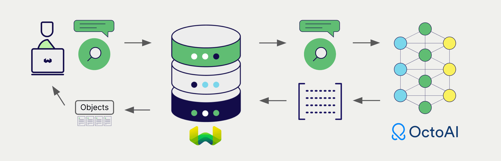

import OctoAIDeprecationNote from './_includes/octoai_deprecation.md';

<OctoAIDeprecationNote/>

# Weaviate での OctoAI 埋め込み

:::info `v1.25.0` で追加
:::

import Tabs from '@theme/Tabs';
import TabItem from '@theme/TabItem';
import FilteredTextBlock from '@site/src/components/Documentation/FilteredTextBlock';
import PyConnect from '!!raw-loader!../_includes/provider.connect.py';
import TSConnect from '!!raw-loader!../_includes/provider.connect.ts';
import PyCode from '!!raw-loader!../_includes/provider.vectorizer.py';
import TSCode from '!!raw-loader!../_includes/provider.vectorizer.ts';

Weaviate が OctoAI の API と統合されているため、OctoAI のモデル機能を Weaviate から直接利用できます。

OctoAI の埋め込みモデルを利用するように [Weaviate の ベクトル index を設定](#configure-the-vectorizer) すると、Weaviate は指定したモデルとお客様の OctoAI API キーを用いてさまざまな操作のための埋め込みを生成します。この機能を *vectorizer* と呼びます。

[インポート時](#data-import) に、Weaviate はテキストオブジェクトの埋め込みを生成し、index に保存します。[ベクトル](#vector-near-text-search) 検索および [ハイブリッド](#hybrid-search) 検索操作では、Weaviate はテキストクエリを埋め込みに変換します。

## 要件

### Weaviate の構成

ご利用の Weaviate インスタンスには、OctoAI ベクトライザー統合（`text2vec-octoai`）モジュールが設定されている必要があります。

  
Weaviate Cloud (WCD) ユーザー向け

この統合は、Weaviate Cloud (WCD) のサーバーレスインスタンスではデフォルトで有効になっています。

  
セルフホストユーザー向け

- モジュールが有効かどうかを確認するには、[クラスターメタデータ](/deploy/configuration/meta.md) を確認してください。  
- Weaviate でモジュールを有効にするには、[モジュールの設定方法](../../configuration/modules.md) ガイドに従ってください。

### API 認証情報

この統合を利用するには、有効な OctoAI API キーを Weaviate に提供する必要があります。[OctoAI](https://octo.ai/) にアクセスしてサインアップし、API キーを取得してください。

以下のいずれかの方法で API キーを Weaviate に渡します:

- Weaviate から参照できる環境変数 `OCTOAI_APIKEY` を設定する。  
- 下記の例のように、実行時に API キーを渡す。

<Tabs groupId="languages">

 <TabItem value="py" label="Python API v4">
    <FilteredTextBlock
      text={PyConnect}
      startMarker="# START OctoAIInstantiation"
      endMarker="# END OctoAIInstantiation"
      language="py"
    />
  </TabItem>

 <TabItem value="js" label="JS/TS API v3">
    <FilteredTextBlock
      text={TSConnect}
      startMarker="// START OctoAIInstantiation"
      endMarker="// END OctoAIInstantiation"
      language="ts"
    />
  </TabItem>

</Tabs>

## ベクトライザーの設定

OctoAI の埋め込みモデルを利用するには、次のように [Weaviate の index を設定](../../manage-collections/vector-config.mdx#specify-a-vectorizer) します:

<Tabs groupId="languages">
  <TabItem value="py" label="Python API v4">
    <FilteredTextBlock
      text={PyCode}
      startMarker="# START BasicVectorizerOctoAI"
      endMarker="# END BasicVectorizerOctoAI"
      language="py"
    />
  </TabItem>

  <TabItem value="js" label="JS/TS API v3">
    <FilteredTextBlock
      text={TSCode}
      startMarker="// START BasicVectorizerOctoAI"
      endMarker="// END BasicVectorizerOctoAI"
      language="ts"
    />
  </TabItem>

</Tabs>

### モデルの選択

以下の設定例のように、ベクトライザーで使用する [利用可能なモデル](#available-models) のいずれかを指定できます。

<Tabs groupId="languages">
  <TabItem value="py" label="Python API v4">
    <FilteredTextBlock
      text={PyCode}
      startMarker="# START VectorizerOctoAICustomModel"
      endMarker="# END VectorizerOctoAICustomModel"
      language="py"
    />
  </TabItem>

  <TabItem value="js" label="JS/TS API v3">
    <FilteredTextBlock
      text={TSCode}
      startMarker="// START VectorizerOctoAICustomModel"
      endMarker="// END VectorizerOctoAICustomModel"
      language="ts"
    />
  </TabItem>

</Tabs>

Weaviate で利用するモデルは、[ベクトライザーのパラメーター](#vectorizer-parameters) で [利用可能なモデル](#available-models) のいずれかを指定できます。モデルを指定しない場合は、[デフォルトモデル](#available-models) が使用されます。

import VectorizationBehavior from '/_includes/vectorization.behavior.mdx';

  
ベクトル化の動作

<VectorizationBehavior/>

### ベクトライザーのパラメーター

- `model`: モデル名。デフォルト - `"thenlper/gte-large"`。
- `vectorize_collection_name`: コレクション名をベクトル化するかどうか。デフォルト - `True`。
- `base_url`: デフォルトの OctoAI URL である `"https://text.octoai.run"` の代わりに使用する URL（プロキシなど）。

以下の例は、OctoAI 固有のオプションを設定する方法を示します。

<Tabs groupId="languages">
  <TabItem value="py" label="Python API v4">
    <FilteredTextBlock
      text={PyCode}
      startMarker="# START FullVectorizerOctoAI"
      endMarker="# END FullVectorizerOctoAI"
      language="py"
    />
  </TabItem>

  <TabItem value="js" label="JS/TS API v3">
    <FilteredTextBlock
      text={TSCode}
      startMarker="// START FullVectorizerOctoAI"
      endMarker="// END FullVectorizerOctoAI"
      language="ts"
    />
  </TabItem>

</Tabs>

モデルパラメーターの詳細については、[OctoAI API ドキュメント](https://octo.ai/docs/text-gen-solution/getting-started) をご覧ください。

## データのインポート

ベクトライザーを設定したら、[データをインポート](../../manage-objects/import.mdx)して Weaviate に取り込みます。Weaviate は、指定したモデルを使用してテキストオブジェクトの埋め込みを生成します。

<Tabs groupId="languages">

 <TabItem value="py" label="Python API v4">
    <FilteredTextBlock
      text={PyCode}
      startMarker="# START BatchImportExample"
      endMarker="# END BatchImportExample"
      language="py"
    />
  </TabItem>

 <TabItem value="js" label="JS/TS API v3">
    <FilteredTextBlock
      text={TSCode}
      startMarker="// START BatchImportExample"
      endMarker="// END BatchImportExample"
      language="ts"
    />
  </TabItem>

</Tabs>

:::tip 既存ベクトルの再利用
すでに互換性のあるモデルのベクトルをお持ちの場合は、それを直接 Weaviate に渡すことができます。同じモデルで埋め込みを生成済みの場合や、別のシステムからデータを移行する際に便利です。
:::

## 検索

ベクトライザーが設定されると、Weaviate は指定した OctoAI モデルを使用してベクトル検索およびハイブリッド検索を実行します。

### ベクトル（near text）検索

[ベクトル検索](../../search/similarity.md#search-with-text)を実行すると、Weaviate はテキストクエリを指定モデルで埋め込みに変換し、データベースから最も類似したオブジェクトを返します。

次のクエリは、`limit` で指定した数  n  件の最も類似したオブジェクトを返します。

<Tabs groupId="languages">

 <TabItem value="py" label="Python API v4">
    <FilteredTextBlock
      text={PyCode}
      startMarker="# START NearTextExample"
      endMarker="# END NearTextExample"
      language="py"
    />
  </TabItem>

 <TabItem value="js" label="JS/TS API v3">
    <FilteredTextBlock
      text={TSCode}
      startMarker="// START NearTextExample"
      endMarker="// END NearTextExample"
      language="ts"
    />
  </TabItem>

</Tabs>

### ハイブリッド検索

:::info ハイブリッド検索とは？
ハイブリッド検索は、ベクトル検索とキーワード（BM25）検索を行い、その結果を[組み合わせて](../../search/hybrid.md)データベースから最適なオブジェクトを返します。
:::

[ハイブリッド検索](../../search/hybrid.md)を実行すると、Weaviate はテキストクエリを指定モデルで埋め込みに変換し、データベースから最もスコアの高いオブジェクトを返します。

次のクエリは、`limit` で指定した数  n  件の最高スコアのオブジェクトを返します。

<Tabs groupId="languages">

 <TabItem value="py" label="Python API v4">
    <FilteredTextBlock
      text={PyCode}
      startMarker="# START HybridExample"
      endMarker="# END HybridExample"
      language="py"
    />
  </TabItem>

 <TabItem value="js" label="JS/TS API v3">
    <FilteredTextBlock
      text={TSCode}
      startMarker="// START HybridExample"
      endMarker="// END HybridExample"
      language="ts"
    />
  </TabItem>

</Tabs>

## 参考資料

### 利用可能なモデル

`text2vec-octoai` を使用すると、 OctoAI がホストする任意の埋め込みモデルを利用できます。

現在 OctoAI が [公開している](https://octo.ai/docs/text-gen-solution/getting-started) 埋め込みモデルは次のとおりです:

* `thenlper/gte-large`

## 追加リソース

### その他の統合

- [OctoAI 生成モデル + Weaviate](./generative.md).

### コード例

コレクションで統合を設定すると、 Weaviate におけるデータ管理および検索操作は他のコレクションとまったく同じように動作します。モデルに依存しない以下の例をご覧ください:

- [ 操作方法: コレクションを管理する ](../../manage-collections/index.mdx) および [ 操作方法: オブジェクトを管理する ](../../manage-objects/index.mdx) ガイドでは、データ操作 (すなわちコレクションおよびその中のオブジェクトの作成・参照・更新・削除) の方法を説明しています。
- [ 操作方法: クエリ & 検索 ](../../search/index.mdx) ガイドでは、 ベクトル ・キーワード・ハイブリッド検索に加え、 検索拡張生成 の実行方法を説明しています。

### 外部リソース

- OctoAI [ Embed API ドキュメント](https://octo.ai/docs/text-gen-solution/getting-started)

import DocsFeedback from '/_includes/docs-feedback.mdx';

<DocsFeedback/>

