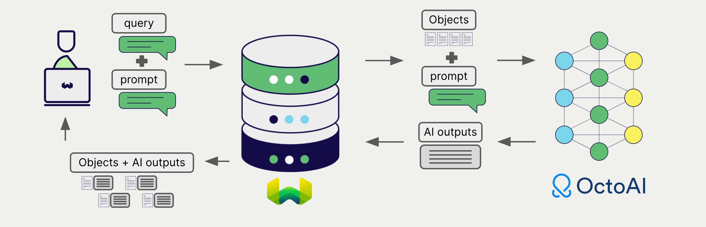
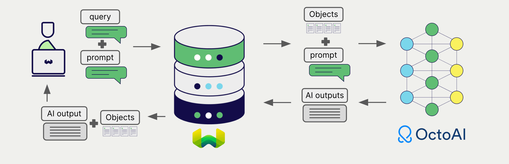

import OctoAIDeprecationNote from './_includes/octoai_deprecation.md';

<OctoAIDeprecationNote/>

# Weaviate と OctoAI の生成 AI

:::info `v1.25.0` で追加
:::

import Tabs from '@theme/Tabs';
import TabItem from '@theme/TabItem';
import FilteredTextBlock from '@site/src/components/Documentation/FilteredTextBlock';
import PyConnect from '!!raw-loader!../_includes/provider.connect.py';
import TSConnect from '!!raw-loader!../_includes/provider.connect.ts';
import PyCode from '!!raw-loader!../_includes/provider.generative.py';
import TSCode from '!!raw-loader!../_includes/provider.generative.ts';

Weaviate と OctoAI の API を統合することで、オープンソースと OctoAI のモデル機能に Weaviate から直接アクセスできます。

[Weaviate コレクションを設定](#configure-collection)して OctoAI の生成 AI モデルを使用すると、Weaviate は指定したモデルとお持ちの OctoAI API キーを用いて検索拡張生成 (RAG) を実行します。

具体的には、Weaviate が検索を行い、最も関連性の高いオブジェクトを取得したうえで、それらを OctoAI の生成モデルに渡して出力を生成します。

## 要件

### Weaviate 構成

ご利用の Weaviate インスタンスには、OctoAI 生成 AI 統合モジュール (`generative-octoai`) が有効化されている必要があります。

  
Weaviate Cloud (WCD) ユーザーの場合

この統合は Weaviate Cloud (WCD) のサーバーレスインスタンスではデフォルトで有効です。

  
セルフホストユーザーの場合

- モジュールが有効かどうかは [クラスターメタデータ](/deploy/configuration/meta.md) を確認してください。  
- Weaviate でモジュールを有効にする方法は、[モジュール設定ガイド](../../configuration/modules.md) をご覧ください。

### API 認証情報

この統合を使用するには、有効な OctoAI API キーを Weaviate に渡す必要があります。サインアップして API キーを取得するには、[OctoAI](https://octo.ai/docs/getting-started/how-to-create-an-octoai-access-token) にアクセスしてください。

Weaviate への API キーの渡し方は次のいずれかです。

- Weaviate から参照可能な環境変数 `OCTOAI_APIKEY` を設定する  
- 下記の例のように実行時に API キーを渡す

<Tabs groupId="languages">

 <TabItem value="py" label="Python API v4">
    <FilteredTextBlock
      text={PyConnect}
      startMarker="# START OctoAIInstantiation"
      endMarker="# END OctoAIInstantiation"
      language="py"
    />
  </TabItem>

 <TabItem value="js" label="JS/TS API v3">
    <FilteredTextBlock
      text={TSConnect}
      startMarker="// START OctoAIInstantiation"
      endMarker="// END OctoAIInstantiation"
      language="ts"
    />
  </TabItem>

</Tabs>

## コレクションの設定

import MutableGenerativeConfig from '/_includes/mutable-generative-config.md';

<MutableGenerativeConfig />

[Weaviate インデックスの設定](../../manage-collections/generative-reranker-models.mdx#specify-a-generative-model-integration)を以下のように行い、OctoAI の生成 AI モデルを使用します。

<Tabs groupId="languages">
  <TabItem value="py" label="Python API v4">
    <FilteredTextBlock
      text={PyCode}
      startMarker="# START BasicGenerativeOctoAI"
      endMarker="# END BasicGenerativeOctoAI"
      language="py"
    />
  </TabItem>

  <TabItem value="js" label="JS/TS API v3">
    <FilteredTextBlock
      text={TSCode}
      startMarker="// START BasicGenerativeOctoAI"
      endMarker="// END BasicGenerativeOctoAI"
      language="ts"
    />
  </TabItem>

</Tabs>

### モデルの選択

Weaviate に使用させる [利用可能なモデル](#available-models) のいずれかを、次の設定例のように指定できます。

<Tabs groupId="languages">
  <TabItem value="py" label="Python API v4">
    <FilteredTextBlock
      text={PyCode}
      startMarker="# START GenerativeOctoAICustomModel"
      endMarker="# END GenerativeOctoAICustomModel"
      language="py"
    />
  </TabItem>

  <TabItem value="js" label="JS/TS API v3">
    <FilteredTextBlock
      text={TSCode}
      startMarker="// START GenerativeOctoAICustomModel"
      endMarker="// END GenerativeOctoAICustomModel"
      language="ts"
    />
  </TabItem>

</Tabs>

[利用可能なモデル](#available-models) のいずれかを [指定](#generative-parameters) できます。指定しない場合は [デフォルトモデル](#available-models) が使用されます。

### 生成パラメーター

モデルの挙動をカスタマイズするには、以下の生成パラメーターを設定します。

<Tabs groupId="languages">
  <TabItem value="py" label="Python API v4">
    <FilteredTextBlock
      text={PyCode}
      startMarker="# START FullGenerativeOctoAI"
      endMarker="# END FullGenerativeOctoAI"
      language="py"
    />
  </TabItem>

  <TabItem value="js" label="JS/TS API v3">
    <FilteredTextBlock
      text={TSCode}
      startMarker="// START FullGenerativeOctoAI"
      endMarker="// END FullGenerativeOctoAI"
      language="ts"
    />
  </TabItem>

</Tabs>

モデルパラメーターの詳細については、[OctoAI API documentation](https://octo.ai/docs/text-gen-solution/rest-api) を参照してください。

## 検索拡張生成

生成 AI 統合を設定したら、[シングルプロンプト](#single-prompt) または [グループタスク](#grouped-task) の方法で RAG 操作を実行します。

### シングルプロンプト

検索結果の各オブジェクトに対してテキストを生成する場合は、シングルプロンプト方式を使用します。

以下の例では、`limit` パラメーターで指定された `n` 件の検索結果それぞれに対し出力を生成します。

シングルプロンプトクエリを作成する際、Weaviate から言語モデルへ渡したいオブジェクトプロパティを波かっこ `{}` で囲んでインターポレーションします。たとえば、オブジェクトの `title` プロパティを渡す場合はクエリ内に `{title}` を含めます。

<Tabs groupId="languages">

 <TabItem value="py" label="Python API v4">
    <FilteredTextBlock
      text={PyCode}
      startMarker="# START SinglePromptExample"
      endMarker="# END SinglePromptExample"
      language="py"
    />
  </TabItem>

 <TabItem value="js" label="JS/TS API v3">
    <FilteredTextBlock
      text={TSCode}
      startMarker="// START SinglePromptExample"
      endMarker="// END SinglePromptExample"
      language="ts"
    />
  </TabItem>

</Tabs>

### グループタスク

検索結果全体に対して 1 つのテキストを生成する場合は、グループタスク方式を使用します。

言い換えると、`n` 件の検索結果がある場合でも、生成モデルはグループ全体に対して 1 つの出力を生成します。

<Tabs groupId="languages">

 <TabItem value="py" label="Python API v4">
    <FilteredTextBlock
      text={PyCode}
      startMarker="# START GroupedTaskExample"
      endMarker="# END GroupedTaskExample"
      language="py"
    />
  </TabItem>

 <TabItem value="js" label="JS/TS API v3">
    <FilteredTextBlock
      text={TSCode}
      startMarker="// START GroupedTaskExample"
      endMarker="// END GroupedTaskExample"
      language="ts"
    />
  </TabItem>

</Tabs>

## 参照

### 利用可能なモデル

* `qwen1.5-32b-chat`
* `meta-llama-3-8b-instruct`
* `meta-llama-3-70b-instruct`
* `mixtral-8x22b-instruct`
* `nous-hermes-2-mixtral-8x7b-dpo`
* `mixtral-8x7b-instruct`
* `mixtral-8x22b-finetuned`
* `hermes-2-pro-mistral-7b`
* `mistral-7b-instruct` (default)
* `codellama-7b-instruct`
* `codellama-13b-instruct`
* `codellama-34b-instruct`
* `llama-2-13b-chat`
* `llama-2-70b-chat`

## 追加リソース

### その他の統合

- [OctoAI embedding models + Weaviate](./embeddings.md)

### コード例

コレクションで統合を設定すると、Weaviate のデータ管理および検索操作は他のコレクションと同様に動作します。以下のモデル非依存の例を参照してください。

- [How-to: Manage collections](../../manage-collections/index.mdx) および [How-to: Manage objects](../../manage-objects/index.mdx) ガイドでは、データ操作 (コレクションおよびその中のオブジェクトの作成、読み取り、更新、削除) 方法を示しています。
- [How-to: Query & Search](../../search/index.mdx) ガイドでは、ベクトル検索、キーワード検索、ハイブリッド検索に加え、検索拡張生成の実行方法を示しています。

### 参考資料

- OctoAI [API ドキュメント](https://octo.ai/docs/getting-started/inference-models)

import DocsFeedback from '/_includes/docs-feedback.mdx';

<DocsFeedback/>

