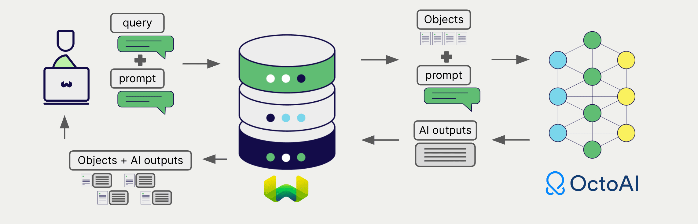

<!-- Note: for images, use https://docs.google.com/presentation/d/15opIcJuaIjEEcs_1Zm8B6pccox2p7_MHSjCnRv4dPfU/edit?usp=sharing -->

import OctoAIDeprecationNote from './_includes/octoai_deprecation.md';

<OctoAIDeprecationNote/>

:::info `v1.25.0` で追加
:::

OctoAI は自然言語処理と生成のための幅広いモデルを提供しています。 Weaviate は OctoAI の API とシームレスに統合されており、ユーザーは Weaviate Database から直接 OctoAI のモデルを活用できます。

これらの統合により、開発者は高度な AI ドリブンアプリケーションを簡単に構築できます。

## OctoAI との統合

### ベクトル検索の埋め込みモデル

OctoAI の埋め込みモデルはテキストデータをベクトル埋め込みに変換し、意味と文脈を捉えます。

[Weaviate は OctoAI の埋め込みモデルと統合しています](./embeddings.md) ので、データをシームレスにベクトライゼーションできます。この統合により、追加の前処理やデータ変換を行わずに、セマンティック検索やハイブリッド検索を実行できます。

[OctoAI 埋め込み統合ページ](./embeddings.md)

### RAG 用生成 AI モデル

OctoAI の生成 AI モデルは、与えられたプロンプトとコンテキストに基づいて人間のようなテキストを生成できます。

[Weaviate の生成 AI 統合](./generative.md) を使用すると、検索拡張生成 (RAG) を Weaviate Database から直接実行できます。これにより、Weaviate の効率的なストレージと高速検索機能が OctoAI の生成 AI モデルと組み合わさり、パーソナライズされた文脈に沿った応答を生成します。

[OctoAI 生成 AI 統合ページ](./generative.md)

## まとめ

これらの統合により、開発者は Weaviate 内で直接 OctoAI の強力なモデルを活用できます。

その結果、AI ドリブンアプリケーションの構築プロセスが簡素化され、開発を加速し、革新的なソリューションの創出に集中できます。

## はじめに

これらの統合を使用するには、有効な OctoAI API キーを Weaviate に提供する必要があります。 [OctoAI](https://octo.ai/) にアクセスしてサインアップし、API キーを取得してください。

次に、該当する統合ページで OctoAI モデルを使用するための Weaviate の設定方法を確認し、アプリケーションで活用しましょう。

- [テキスト埋め込み](./embeddings.md)
- [生成 AI](./generative.md)

## 質問とフィードバック

import DocsFeedback from '/_includes/docs-feedback.mdx';

<DocsFeedback/>

