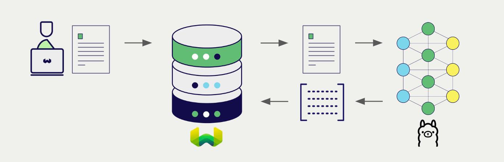
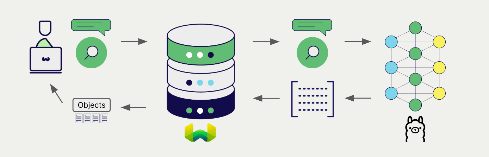

# Weaviate との Ollama 埋め込み

import Tabs from '@theme/Tabs';
import TabItem from '@theme/TabItem';
import FilteredTextBlock from '@site/src/components/Documentation/FilteredTextBlock';
import PyConnect from '!!raw-loader!../_includes/provider.connect.local.py';
import TSConnect from '!!raw-loader!../_includes/provider.connect.local.ts';
import PyCode from '!!raw-loader!../_includes/provider.vectorizer.py';
import TSCode from '!!raw-loader!../_includes/provider.vectorizer.ts';

 Weaviate の Ollama モデル統合を使用すると、Weaviate から直接モデルの機能にアクセスできます。

[ベクトルインデックスを設定](#configure-the-vectorizer) して Ollama の埋め込みモデルを指定すると、Weaviate がローカルの Ollama インスタンス経由で指定したモデルを使用して各種操作の埋め込みを生成します。この機能は *ベクトライザー* と呼ばれます。

[インポート時](#data-import) に、Weaviate はテキストオブジェクトの埋め込みを生成し、インデックスに保存します。[ベクトル](#vector-near-text-search) および [ハイブリッド](#hybrid-search) 検索操作では、Weaviate がテキストクエリを埋め込みに変換します。

## 要件

### Ollama

この統合には、選択したモデルが使用可能なローカル実行中の Ollama インスタンスが必要です。インストールおよびモデルダウンロードの手順については、[Ollama のドキュメント](https://ollama.com/) を参照してください。

### Weaviate の設定

ご利用の Weaviate インスタンスは、Ollama ベクトライザー統合 ( `text2vec-ollama` ) モジュールが有効になっている必要があります。

  
Weaviate Cloud ( WCD ) ユーザー向け

この統合は Weaviate Cloud ( WCD ) のサーバーレスインスタンスではデフォルトで有効になっています。  
 

Ollama を Weaviate Cloud で使用するには、Ollama サーバーが起動しており、Weaviate Cloud インスタンスからアクセス可能であることを確認してください。ご自身のマシンで Ollama を実行している場合、インターネットに公開する必要があるかもしれません。Ollama サーバーをインターネットに公開する際は、セキュリティへの影響を慎重に検討してください。  
 

このようなユースケースでは、自己ホスト型の Weaviate インスタンスや、他の API ベースの統合方法の利用を検討してください。

  
自己ホストユーザー向け

- モジュールが有効かどうかを確認するには、[クラスターメタデータ](/deploy/configuration/meta.md) をチェックしてください。  
- Weaviate でモジュールを有効化する手順は、[モジュール設定方法](../../configuration/modules.md) ガイドをご覧ください。

### 資格情報

この統合はローカルの Ollama コンテナに接続するため、追加の資格情報 (例：API キー) は不要です。以下の例のように通常どおり Weaviate へ接続してください。

<Tabs groupId="languages">

 <TabItem value="py" label="Python API v4">
    <FilteredTextBlock
      text={PyConnect}
      startMarker="# START BasicInstantiation"
      endMarker="# END BasicInstantiation"
      language="py"
    />
  </TabItem>

 <TabItem value="js" label="JS/TS API v3">
    <FilteredTextBlock
      text={TSConnect}
      startMarker="// START BasicInstantiation"
      endMarker="// END BasicInstantiation"
      language="ts"
    />
  </TabItem>

</Tabs>

## ベクトライザーの設定

Ollama 埋め込みモデルを使用するには、以下のように [Weaviate インデックスを設定](../../manage-collections/vector-config.mdx#specify-a-vectorizer) します。

<Tabs groupId="languages">
  <TabItem value="py" label="Python API v4">
    <FilteredTextBlock
      text={PyCode}
      startMarker="# START BasicVectorizerOllama"
      endMarker="# END BasicVectorizerOllama"
      language="py"
    />
  </TabItem>

  <TabItem value="js" label="JS/TS API v3">
    <FilteredTextBlock
      text={TSCode}
      startMarker="// START BasicVectorizerOllama"
      endMarker="// END BasicVectorizerOllama"
      language="ts"
    />
  </TabItem>

</Tabs>

モデルを指定しない場合は、[デフォルトモデル](#available-models) が使用されます。

import APIEndpoint from '/docs/weaviate/model-providers/_includes/ollama/api-endpoint.mdx';

<APIEndpoint/>

import VectorizationBehavior from '/_includes/vectorization.behavior.mdx';

  
ベクトル化の挙動

<VectorizationBehavior/>

## データ インポート

ベクトライザーの設定後、[データをインポート](../../manage-objects/import.mdx) して Weaviate に取り込みます。Weaviate は、指定したモデルを使用してテキストオブジェクトの埋め込みを生成します。

<Tabs groupId="languages">

 <TabItem value="py" label="Python API v4">
    <FilteredTextBlock
      text={PyCode}
      startMarker="# START BatchImportExample"
      endMarker="# END BatchImportExample"
      language="py"
    />
  </TabItem>

 <TabItem value="js" label="JS/TS API v3">
    <FilteredTextBlock
      text={TSCode}
      startMarker="// START BatchImportExample"
      endMarker="// END BatchImportExample"
      language="ts"
    />
  </TabItem>

</Tabs>

:::tip 既存ベクトルの再利用
すでに互換性のあるモデルベクトルをお持ちの場合は、それを直接 Weaviate に渡すこともできます。同じモデルでエンベディングを生成済みで、それらを Weaviate で利用したい場合、たとえば別システムからデータを移行する際などに便利です。
:::

## 検索

ベクトライザーを設定すると、Weaviate は指定した Ollama モデルを用いてベクトル検索とハイブリッド検索を実行します。

### ベクトル（near text）検索

[ベクトル検索](../../search/similarity.md#search-with-text) を実行すると、Weaviate はクエリテキストを指定したモデルで埋め込みに変換し、データベースから最も類似したオブジェクトを返します。

以下のクエリは、`limit` で指定した数 `n` 件の最も類似したオブジェクトをデータベースから返します。

<Tabs groupId="languages">

 <TabItem value="py" label="Python API v4">
    <FilteredTextBlock
      text={PyCode}
      startMarker="# START NearTextExample"
      endMarker="# END NearTextExample"
      language="py"
    />
  </TabItem>

 <TabItem value="js" label="JS/TS API v3">
    <FilteredTextBlock
      text={TSCode}
      startMarker="// START NearTextExample"
      endMarker="// END NearTextExample"
      language="ts"
    />
  </TabItem>

</Tabs>

### ハイブリッド検索

:::info ハイブリッド検索とは？
ハイブリッド検索は、ベクトル検索とキーワード（BM25）検索を実行し、その結果を[組み合わせて](../../search/hybrid.md) データベースから最適なオブジェクトを返します。
:::

[ハイブリッド検索](../../search/hybrid.md) を実行すると、Weaviate はクエリテキストを指定したモデルで埋め込みに変換し、データベースから最も高スコアのオブジェクトを返します。

以下のクエリは、`limit` で指定した数 `n` 件の最高スコアのオブジェクトをデータベースから返します。

<Tabs groupId="languages">

 <TabItem value="py" label="Python API v4">
    <FilteredTextBlock
      text={PyCode}
      startMarker="# START HybridExample"
      endMarker="# END HybridExample"
      language="py"
    />
  </TabItem>

 <TabItem value="js" label="JS/TS API v3">
    <FilteredTextBlock
      text={TSCode}
      startMarker="// START HybridExample"
      endMarker="// END HybridExample"
      language="ts"
    />
  </TabItem>

</Tabs>

## 参考

<!-- #### Example configuration -->

<!-- Hiding "full" examples as no other parameters exist than shown above -->

<!-- <Tabs groupId="languages">
  <TabItem value="py" label="Python API v4">
    <FilteredTextBlock
      text={PyCode}
      startMarker="# START FullVectorizerOllama"
      endMarker="# END FullVectorizerOllama"
      language="py"
    />
  </TabItem>

  <TabItem value="js" label="JS/TS API v3">
    <FilteredTextBlock
      text={TSCode}
      startMarker="// START FullVectorizerOllama"
      endMarker="// END FullVectorizerOllama"
      language="ts"
    />
  </TabItem>

</Tabs> -->

### 利用可能なモデル

利用可能なモデルの一覧については、[Ollama ドキュメント](https://ollama.com/library) をご覧ください。この一覧には大規模言語モデルと埋め込みモデルの両方が含まれています。埋め込みモデルを識別するには、名前または説明に `embed` が含まれているかを確認してください。

`ollama pull <model-name>` で目的のモデルをダウンロードします。

モデルを指定しない場合、デフォルトモデル (`nomic-embed-text`) が使用されます。

## 参考リソース

### その他の統合

- [Ollama 生成モデル + Weaviate](./generative.md)

### コード例

統合をコレクションで設定すると、 Weaviate のデータ管理および検索操作は他のコレクションとまったく同じように動作します。以下のモデル非依存の例をご覧ください:

- [How-to: コレクションの管理](../../manage-collections/index.mdx) と [How-to: オブジェクトを管理する](../../manage-objects/index.mdx) のガイドでは、データ操作 (コレクションおよびその中のオブジェクトの作成・読み取り・更新・削除) の方法を示しています。
- [How-to: クエリ & 検索](../../search/index.mdx) のガイドでは、ベクトル・キーワード・ハイブリッド検索や 検索拡張生成 を実行する方法を示しています。

### 外部リソース

- [Ollama モデル](https://ollama.com/library)
- [Ollama リポジトリ](https://github.com/ollama/ollama)
- [Ollama サーバーのホストとポートを変更する方法](https://github.com/ollama/ollama/blob/main/docs/faq.md#how-can-i-expose-ollama-on-my-network)

import DocsFeedback from '/_includes/docs-feedback.mdx';

<DocsFeedback/>

