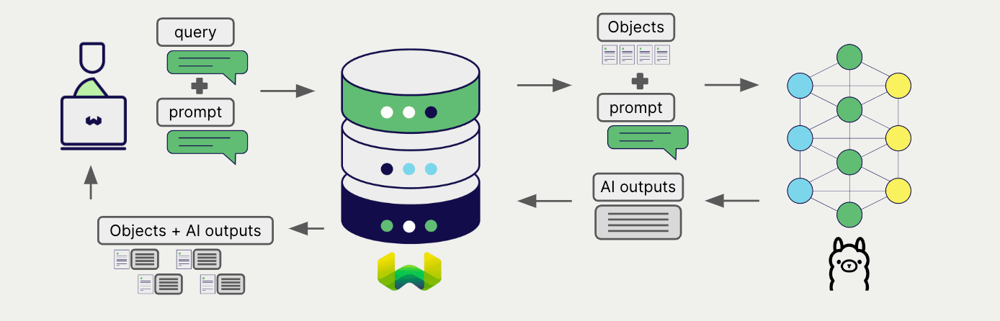
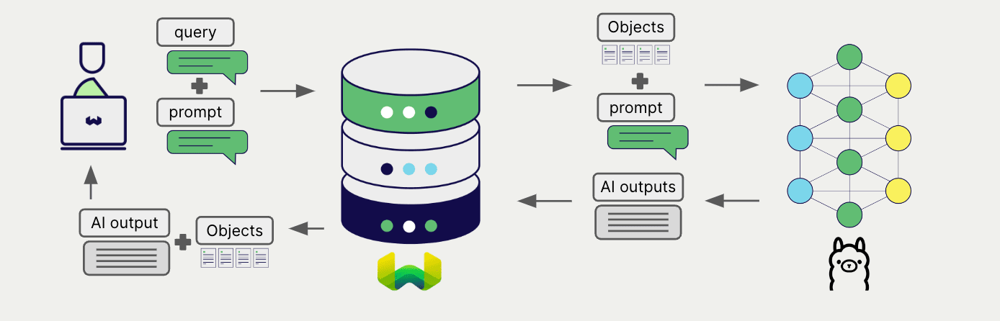

# Weaviate と Ollama の生成 AI

import Tabs from '@theme/Tabs';
import TabItem from '@theme/TabItem';
import FilteredTextBlock from '@site/src/components/Documentation/FilteredTextBlock';
import PyConnect from '!!raw-loader!../_includes/provider.connect.local.py';
import TSConnect from '!!raw-loader!../_includes/provider.connect.local.ts';
import PyCode from '!!raw-loader!../_includes/provider.generative.py';
import TSCode from '!!raw-loader!../_includes/provider.generative.ts';

 Weaviate と  Ollama のモデルを統合すると、 Weaviate から直接それらのモデル機能にアクセスできます。

[ Weaviate コレクションを設定](#configure-collection)して、 Ollama の生成 AI モデルを利用します。 Weaviate は指定したモデルを介してローカルの  Ollama インスタンスと連携し、検索拡張生成 ( RAG ) を実行します。

具体的には、 Weaviate が検索を実行し、最も関連性の高いオブジェクトを取得した後、それらを  Ollama の生成モデルに渡して出力を生成します。

## 要件

### Ollama

この統合には、選択したモデルが利用可能なローカル実行中の  Ollama インスタンスが必要です。インストールとモデルのダウンロード方法については、[ Ollama ドキュメント](https://ollama.com/)を参照してください。

### Weaviate 設定

お使いの  Weaviate インスタンスには、 Ollama 生成 AI 統合 ( `generative-ollama` ) モジュールが有効になっている必要があります。

  
 Weaviate Cloud ( WCD ) ユーザーの方へ

この統合は  Weaviate Cloud ( WCD ) の serverless インスタンスでデフォルトで有効になっています。
 

 Weaviate Cloud で  Ollama を使用するには、 Ollama サーバーが稼働しており、 Weaviate Cloud インスタンスからアクセス可能であることを確認してください。ご自身のマシンで  Ollama を実行している場合は、インターネットに公開する必要があるかもしれません。 Ollama サーバーをインターネットに公開する際のセキュリティ上の影響を慎重にご検討ください。
 

このようなユースケースでは、セルフホストの  Weaviate インスタンスや、その他の API ベースの統合方法の利用をご検討ください。

  
セルフホストユーザーの方へ

- [クラスターメタデータ](/deploy/configuration/meta.md)を確認し、モジュールが有効かどうかを確かめてください。  
-  Weaviate でモジュールを有効にするには、[モジュール設定方法](../../configuration/modules.md)ガイドに従ってください。

お使いの  Weaviate インスタンスから  Ollama エンドポイントへアクセスできる必要があります。 Docker を使用している場合は、コンテナ内からホストマシンへアクセスするために、[ `host.docker.internal` を使用して Ollama エンドポイントを指定](#configure-collection)してください。

### 資格情報

この統合はローカルの  Ollama コンテナに接続するため、追加の資格情報 (例: API キー) は不要です。以下の例のように通常どおり  Weaviate へ接続してください。

<Tabs groupId="languages">

 <TabItem value="py" label="Python API v4">
    <FilteredTextBlock
      text={PyConnect}
      startMarker="# START BasicInstantiation"
      endMarker="# END BasicInstantiation"
      language="py"
    />
  </TabItem>

 <TabItem value="js" label="JS/TS API v3">
    <FilteredTextBlock
      text={TSConnect}
      startMarker="// START BasicInstantiation"
      endMarker="// END BasicInstantiation"
      language="ts"
    />
  </TabItem>

</Tabs>

## コレクションの設定 {#configure-collection}

import MutableGenerativeConfig from '/_includes/mutable-generative-config.md';

<MutableGenerativeConfig />

[ Weaviate インデックスを設定](../../manage-collections/generative-reranker-models.mdx#specify-a-generative-model-integration)して、 Ollama 生成モデルを使用するには以下のようにします。

<Tabs groupId="languages">
  <TabItem value="py" label="Python API v4">
    <FilteredTextBlock
      text={PyCode}
      startMarker="# START BasicGenerativeOllama"
      endMarker="# END BasicGenerativeOllama"
      language="py"
    />
  </TabItem>

  <TabItem value="js" label="JS/TS API v3">
    <FilteredTextBlock
      text={TSCode}
      startMarker="// START BasicGenerativeOllama"
      endMarker="// END BasicGenerativeOllama"
      language="ts"
    />
  </TabItem>

</Tabs>

import APIEndpoint from '/docs/weaviate/model-providers/_includes/ollama/api-endpoint.mdx';

<APIEndpoint/>

モデルを指定しない場合は、[デフォルトモデル](#available-models)が使用されます。

## 実行時のモデル選択

コレクション作成時にデフォルトのモデルプロバイダーを設定するだけでなく、クエリ実行時に上書きすることもできます。

<Tabs groupId="languages">
  <TabItem value="py" label="Python API v4">
    <FilteredTextBlock
      text={PyCode}
      startMarker="# START RuntimeModelSelectionOllama"
      endMarker="# END RuntimeModelSelectionOllama"
      language="py"
    />
  </TabItem>
  <TabItem value="js" label="JS/TS Client v3">
    <FilteredTextBlock
      text={TSCode}
      startMarker="// START RuntimeModelSelectionOllama"
      endMarker="// END RuntimeModelSelectionOllama"
      language="ts"
    />
  </TabItem>
</Tabs>

## 検索拡張生成 (RAG)

生成 AI 連携を設定したら、RAG 操作を [単一プロンプト](#single-prompt) 方法または [グループ化タスク](#grouped-task) 方法で実行できます。

### 単一プロンプト

検索結果内の各オブジェクトに対してテキストを生成するには、単一プロンプト方式を使用します。

以下の例では、`limit` パラメーターで指定した `n` 件の検索結果それぞれに対して出力を生成します。

単一プロンプトクエリを作成する際、Weaviate が言語モデルに渡すオブジェクトのプロパティを中括弧 `{}` で挿入します。たとえばオブジェクトの `title` プロパティを渡したい場合、クエリ内に `{title}` を含めます。

<Tabs groupId="languages">

 <TabItem value="py" label="Python API v4">
    <FilteredTextBlock
      text={PyCode}
      startMarker="# START SinglePromptExample"
      endMarker="# END SinglePromptExample"
      language="py"
    />
  </TabItem>

 <TabItem value="js" label="JS/TS API v3">
    <FilteredTextBlock
      text={TSCode}
      startMarker="// START SinglePromptExample"
      endMarker="// END SinglePromptExample"
      language="ts"
    />
  </TabItem>

</Tabs>

### グループ化タスク

検索結果の集合全体に対して 1 つのテキストを生成するには、グループ化タスク方式を使用します。

言い換えると、`n` 件の検索結果があっても、生成モデルはその全体に対して 1 つの出力を生成します。

<Tabs groupId="languages">

 <TabItem value="py" label="Python API v4">
    <FilteredTextBlock
      text={PyCode}
      startMarker="# START GroupedTaskExample"
      endMarker="# END GroupedTaskExample"
      language="py"
    />
  </TabItem>

 <TabItem value="js" label="JS/TS API v3">
    <FilteredTextBlock
      text={TSCode}
      startMarker="// START GroupedTaskExample"
      endMarker="// END GroupedTaskExample"
      language="ts"
    />
  </TabItem>

</Tabs>

### 画像を含む RAG

単一プロンプトとグループ化タスクのどちらでも、入力の一部として画像を渡すことができます。 

<Tabs groupId="languages">

 <TabItem value="py" label="Python API v4">
    <FilteredTextBlock
      text={PyCode}
      startMarker="# START WorkingWithImagesOllama"
      endMarker="# END WorkingWithImagesOllama"
      language="py"
    />
  </TabItem>
  <TabItem value="js" label="JS/TS API v3">
    <FilteredTextBlock
        text={TSCode}
        startMarker="// START WorkingWithImagesOllama"
        endMarker="// END WorkingWithImagesOllama"
        language="ts"
      />
  </TabItem>
</Tabs>

## 参考資料

<!-- Hiding "full" examples as no other parameters exist than shown above -->
<!-- <Tabs groupId="languages">
  <TabItem value="py" label="Python API v4">
    <FilteredTextBlock
      text={PyCode}
      startMarker="# START FullGenerativeOllama"
      endMarker="# END FullGenerativeOllama"
      language="py"
    />
  </TabItem>

  <TabItem value="js" label="JS/TS API v3">
    <FilteredTextBlock
      text={TSCode}
      startMarker="// START FullGenerativeOllama"
      endMarker="// END FullGenerativeOllama"
      language="ts"
    />
  </TabItem>

</Tabs> -->

### 利用可能なモデル

[ Ollama ドキュメント](https://ollama.com/library) で利用可能なモデルの一覧をご覧いただけます。 この一覧には生成モデルと埋め込みモデルの両方が含まれている点にご注意ください。 `generative-ollama` モジュールには生成モデルを指定してください。

目的のモデルは `ollama pull <model-name>` でダウンロードできます。

モデルを指定しない場合は、デフォルトで `llama3` が使用されます。

## 追加リソース

### その他の統合

- [ Ollama 埋め込みモデル + Weaviate](./embeddings.md).

### コード例

コレクションで統合を設定すると、 Weaviate でのデータ管理および検索操作は他のコレクションと同様に動作します。 以下のモデル非依存の例をご覧ください:

- [How-to: コレクションの管理](../../manage-collections/index.mdx) と [How-to: オブジェクトの管理](../../manage-objects/index.mdx) ガイドでは、データ操作 (つまり、コレクションおよびその中のオブジェクトの作成・読み取り・更新・削除) の方法を説明しています。
- [How-to: クエリ &amp; 検索](../../search/index.mdx) ガイドでは、ベクトル、キーワード、ハイブリッド検索に加えて 検索拡張生成 を実行する方法を説明しています。

### 参考資料

- [ Ollama モデル](https://ollama.com/library)
- [ Ollama レポジトリ](https://github.com/ollama/ollama)
- [ Ollama サーバーのホストとポートを変更する方法](https://github.com/ollama/ollama/blob/main/docs/faq.md#how-can-i-expose-ollama-on-my-network)

import DocsFeedback from '/_includes/docs-feedback.mdx';

<DocsFeedback/>

