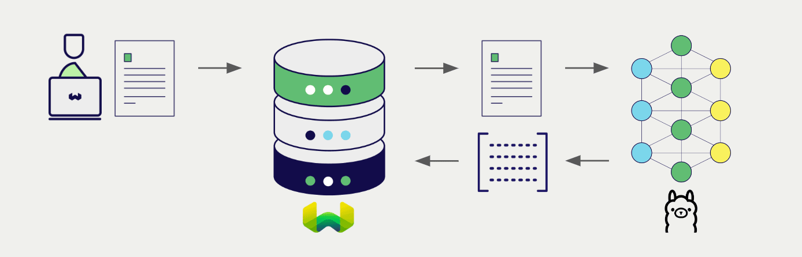

<!-- Note: for images, use https://docs.google.com/presentation/d/15opIcJuaIjEEcs_1Zm8B6pccox2p7_MHSjCnRv4dPfU/edit?usp=sharing -->

Ollama ライブラリを使用すると、幅広いモデルを自身のデバイス上で簡単に実行できます。Weaviate は Ollama ライブラリとシームレスに統合されており、ユーザーは Weaviate Database から直接互換性のあるモデルを活用できます。

これらの統合により、開発者は高度な AI 駆動アプリケーションを容易に構築できます。

## Ollama との統合

Weaviate は、ローカルでホストされている Ollama API にアクセスすることで、互換性のある Ollama モデルと統合します。

### ベクトル検索向け埋め込みモデル

Ollama の埋め込みモデルはテキストデータをベクトル埋め込みに変換し、意味とコンテキストを捉えます。

[Weaviate は Ollama の埋め込みモデルと統合](./embeddings.md)してデータのシームレスなベクトル化を実現します。この統合により、追加の前処理やデータ変換を行わずに、セマンティック検索やハイブリッド検索を実行できます。

[Ollama 埋め込み統合ページ](./embeddings.md)

### RAG 向け生成 AI モデル

Ollama の生成 AI モデルは、与えられたプロンプトとコンテキストに基づいて人間らしいテキストを生成します。

[Weaviate の生成 AI 統合](./generative.md)により、Weaviate Database から直接検索拡張生成 (RAG) を実行できます。これにより、Weaviate の効率的なストレージと高速検索機能を、Ollama の生成 AI モデルと組み合わせて、パーソナライズされたコンテキスト認識の応答を生成します。

[Ollama 生成 AI 統合ページ](./generative.md)

## まとめ

これらの統合により、開発者は Weaviate 内から強力な Ollama モデルを活用できます。

その結果、AI 駆動アプリケーションの構築プロセスが簡素化され、開発を加速し、革新的なソリューションの創出に集中できます。

## はじめる

これらの統合を利用するには、Ollama モデルをホストするためにローカルで Weaviate インスタンスを起動する必要があります。

該当する統合ページに進み、Ollama モデルを使用するための Weaviate の設定方法を確認してください。

- [テキスト埋め込み](./embeddings.md)
- [生成 AI](./generative.md)

## 質問とフィードバック

import DocsFeedback from '/_includes/docs-feedback.mdx';

<DocsFeedback/>

