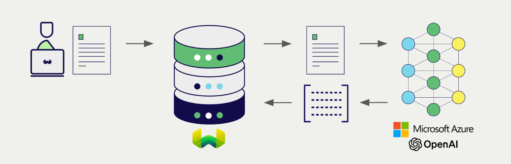
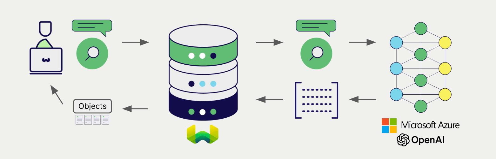

# Weaviate における Azure OpenAI 埋め込み

import Tabs from '@theme/Tabs';
import TabItem from '@theme/TabItem';
import FilteredTextBlock from '@site/src/components/Documentation/FilteredTextBlock';
import PyConnect from '!!raw-loader!../_includes/provider.connect.py';
import TSConnect from '!!raw-loader!../_includes/provider.connect.ts';
import GoConnect from '!!raw-loader!/_includes/code/howto/go/docs/model-providers/1-connect/main.go';
import PyCode from '!!raw-loader!../_includes/provider.vectorizer.py';
import TSCode from '!!raw-loader!../_includes/provider.vectorizer.ts';
import GoCode from '!!raw-loader!/_includes/code/howto/go/docs/model-providers/2-usage-text/main.go';

Weaviate と Azure OpenAI の API 連携により、Azure OpenAI のモデル機能を Weaviate から直接利用できます。

[Weaviate のベクトルインデックスを設定](#configure-the-vectorizer)して Azure OpenAI 埋め込みモデルを使用すると、指定したモデルと Azure OpenAI API キーを使って Weaviate がさまざまな処理の埋め込みを生成します。この機能は *ベクトライザー* と呼ばれます。

[インポート時](#data-import)には、Weaviate がテキストオブジェクトの埋め込みを生成し、インデックスに保存します。[ベクトル](#vector-near-text-search) および [ハイブリッド](#hybrid-search) 検索操作では、Weaviate がテキストクエリを埋め込みに変換します。

## 要件

### Weaviate 設定

お使いの Weaviate インスタンスには、Azure OpenAI ベクトライザー統合（`text2vec-openai`）モジュールが有効になっている必要があります。

  
Weaviate Cloud (WCD) ユーザー向け

この統合は Weaviate Cloud (WCD) のサーバーレスインスタンスではデフォルトで有効になっています。

  
セルフホストユーザー向け

- [クラスターのメタデータ](/deploy/configuration/meta.md)を確認し、モジュールが有効かどうかを確かめてください。  
- [モジュール設定方法](../../configuration/modules.md)に従い、Weaviate でモジュールを有効化してください。

### API 資格情報

この連携には、Weaviate に有効な Azure OpenAI API キーを提供する必要があります。API キーは [Azure OpenAI](https://azure.microsoft.com/en-us/products/ai-services/openai-service) でサインアップして取得してください。

以下のいずれかの方法で Weaviate に API キーを渡します。

- Weaviate が利用できる `AZURE_APIKEY` 環境変数を設定する  
- 下記の例のように、実行時に API キーを渡す

<Tabs groupId="languages">

 <TabItem value="py" label="Python API v4">
    <FilteredTextBlock
      text={PyConnect}
      startMarker="# START AzureOpenAIInstantiation"
      endMarker="# END AzureOpenAIInstantiation"
      language="py"
    />
  </TabItem>

 <TabItem value="js" label="JS/TS API v3">
    <FilteredTextBlock
      text={TSConnect}
      startMarker="// START AzureOpenAIInstantiation"
      endMarker="// END AzureOpenAIInstantiation"
      language="ts"
    />
  </TabItem>

  <TabItem value="go" label="Go">
    <FilteredTextBlock
      text={GoConnect}
      startMarker="// START AzureOpenAIInstantiation"
      endMarker="// END AzureOpenAIInstantiation"
      language="goraw"
    />
  </TabItem>

</Tabs>

## ベクトライザーの設定

Azure OpenAI 埋め込みモデルを使用するために、以下のように [Weaviate インデックスを設定](../../manage-collections/vector-config.mdx#specify-a-vectorizer)します。

モデルを選択するには、Azure リソース名を指定してください。

<Tabs groupId="languages">
  <TabItem value="py" label="Python API v4">
    <FilteredTextBlock
      text={PyCode}
      startMarker="# START BasicVectorizerAzureOpenAI"
      endMarker="# END BasicVectorizerAzureOpenAI"
      language="py"
    />
  </TabItem>

  <TabItem value="js" label="JS/TS API v3">
    <FilteredTextBlock
      text={TSCode}
      startMarker="// START BasicVectorizerAzureOpenAI"
      endMarker="// END BasicVectorizerAzureOpenAI"
      language="ts"
    />
  </TabItem>

  <TabItem value="go" label="Go">
    <FilteredTextBlock
      text={GoCode}
      startMarker="// START BasicVectorizerAzureOpenAI"
      endMarker="// END BasicVectorizerAzureOpenAI"
      language="goraw"
    />
  </TabItem>

</Tabs>

import VectorizationBehavior from '/_includes/vectorization.behavior.mdx';

  
ベクトル化の動作

<VectorizationBehavior/>

### ベクトライザーのパラメーター

次の例では、 Azure OpenAI 固有のオプションを設定する方法を示します。

- `resource_name` （必須）: 使用する Azure OpenAI リソースの名前です。  
- `deployment_id` （必須）: Azure OpenAI リソースのデプロイメント ID です。  
- `base_url` （任意）: Azure OpenAI API のベース URL です。  

<Tabs groupId="languages">
  <TabItem value="py" label="Python API v4">
    <FilteredTextBlock
      text={PyCode}
      startMarker="# START FullVectorizerAzureOpenAI"
      endMarker="# END FullVectorizerAzureOpenAI"
      language="py"
    />
  </TabItem>

  <TabItem value="js" label="JS/TS API v3">
    <FilteredTextBlock
      text={TSCode}
      startMarker="// START FullVectorizerAzureOpenAI"
      endMarker="// END FullVectorizerAzureOpenAI"
      language="ts"
    />
  </TabItem>

  <TabItem value="go" label="Go">
    <FilteredTextBlock
      text={GoCode}
      startMarker="// START FullVectorizerAzureOpenAI"
      endMarker="// END FullVectorizerAzureOpenAI"
      language="goraw"
    />
  </TabItem>
</Tabs>

これらのパラメーターの詳細については、 [Azure OpenAI API ドキュメント](https://learn.microsoft.com/en-us/azure/ai-services/openai/) を参照してください。

## ヘッダーのパラメーター

実行時にリクエストの追加ヘッダーとして、 API キーおよびいくつかの任意パラメーターを指定できます。利用可能なヘッダーは次のとおりです。  

- `X-Azure-Api-Key`: Azure API キーです。  
- `X-Azure-Deployment-Id`: Azure のデプロイメント ID です。  
- `X-Azure-Resource-Name`: Azure のリソース名です。  

実行時に指定した追加ヘッダーは、既存の Weaviate 設定を上書きします。  

ヘッダーは上記の [API 資格情報の例](#api-credentials) に示すとおりに指定してください。

## データのインポート

ベクトライザーの設定後、 [データをインポート](../../manage-objects/import.mdx) して Weaviate に取り込みます。 Weaviate は指定したモデルを使用してテキストオブジェクトの埋め込みを生成します。

<Tabs groupId="languages">

 <TabItem value="py" label="Python API v4">
    <FilteredTextBlock
      text={PyCode}
      startMarker="# START BatchImportExample"
      endMarker="# END BatchImportExample"
      language="py"
    />
  </TabItem>

 <TabItem value="js" label="JS/TS API v3">
    <FilteredTextBlock
      text={TSCode}
      startMarker="// START BatchImportExample"
      endMarker="// END BatchImportExample"
      language="ts"
    />
  </TabItem>

  <TabItem value="go" label="Go">
    <FilteredTextBlock
      text={GoCode}
      startMarker="// START BatchImportExample"
      endMarker="// END BatchImportExample"
      language="goraw"
    />
  </TabItem>

</Tabs>

:::tip 既存ベクトルの再利用
互換性のあるモデルベクトルを既にお持ちの場合は、それを直接 Weaviate に渡すことができます。これは、同じモデルで既に埋め込みを生成しており、別のシステムからデータを移行する際などに Weaviate でそれらを再利用したい場合に便利です。
:::

## 検索

ベクトライザーを設定すると、 Weaviate は指定した Azure OpenAI モデルを使用してベクトル検索とハイブリッド検索を実行します。

### ベクトル（near text）検索

ベクトル検索を実行すると、 Weaviate はクエリテキストを指定したモデルで埋め込みに変換し、データベースから最も類似したオブジェクトを返します。  

以下のクエリは、 `limit` で指定した件数 `n` の最も類似したオブジェクトをデータベースから返します。

<Tabs groupId="languages">

 <TabItem value="py" label="Python API v4">
    <FilteredTextBlock
      text={PyCode}
      startMarker="# START NearTextExample"
      endMarker="# END NearTextExample"
      language="py"
    />
  </TabItem>

 <TabItem value="js" label="JS/TS API v3">
    <FilteredTextBlock
      text={TSCode}
      startMarker="// START NearTextExample"
      endMarker="// END NearTextExample"
      language="ts"
    />
  </TabItem>

  <TabItem value="go" label="Go">
    <FilteredTextBlock
      text={GoCode}
      startMarker="// START NearTextExample"
      endMarker="// END NearTextExample"
      language="goraw"
    />
  </TabItem>

</Tabs>

### ハイブリッド検索

:::info ハイブリッド検索とは？
ハイブリッド検索では、ベクトル検索とキーワード（ BM25 ）検索を実行し、その結果を[結合](../../search/hybrid.md)してデータベースから最も一致するオブジェクトを返します。
:::

[ハイブリッド検索](../../search/hybrid.md)を実行すると、 Weaviate は指定したモデルを用いてテキストクエリを埋め込みに変換し、データベースからスコアの高いオブジェクトを返します。

以下のクエリは、`limit` で指定した数 `n` のスコアが最も高いオブジェクトをデータベースから返します。

<Tabs groupId="languages">

 <TabItem value="py" label="Python API v4">
    <FilteredTextBlock
      text={PyCode}
      startMarker="# START HybridExample"
      endMarker="# END HybridExample"
      language="py"
    />
  </TabItem>

 <TabItem value="js" label="JS/TS API v3">
    <FilteredTextBlock
      text={TSCode}
      startMarker="// START HybridExample"
      endMarker="// END HybridExample"
      language="ts"
    />
  </TabItem>

  <TabItem value="go" label="Go">
    <FilteredTextBlock
      text={GoCode}
      startMarker="// START HybridExample"
      endMarker="// END HybridExample"
      language="goraw"
    />
  </TabItem>

</Tabs>

## 参考情報

### 利用可能なモデル

利用可能なモデルとリージョンごとの提供状況については、[Azure OpenAI ドキュメント](https://learn.microsoft.com/en-us/azure/ai-services/openai/concepts/models#embeddings-models)を参照してください。

## 追加リソース

### その他の統合

- [Azure OpenAI 生成モデル + Weaviate](./generative.md)

### コード例

コレクションで統合設定を行うと、 Weaviate でのデータ管理および検索操作は他のコレクションと同じように機能します。以下のモデル非依存の例をご覧ください。

- [ハウツー：コレクションを管理](../../manage-collections/index.mdx) と [ハウツー：オブジェクトを管理](../../manage-objects/index.mdx) ガイドでは、データ操作（コレクションおよびその中のオブジェクトの作成、読み取り、更新、削除）の方法を説明しています。
- [ハウツー：クエリ & 検索](../../search/index.mdx) ガイドでは、ベクトル、キーワード、ハイブリッド検索および 検索拡張生成 の実行方法を説明しています。

### 外部リソース

- Azure OpenAI [API ドキュメント](https://learn.microsoft.com/en-us/azure/ai-services/openai/)
- Azure OpenAI [モデルと提供状況](https://learn.microsoft.com/en-us/azure/ai-services/openai/concepts/models#embeddings-models)

## ご質問とフィードバック

import DocsFeedback from '/_includes/docs-feedback.mdx';

<DocsFeedback/>

