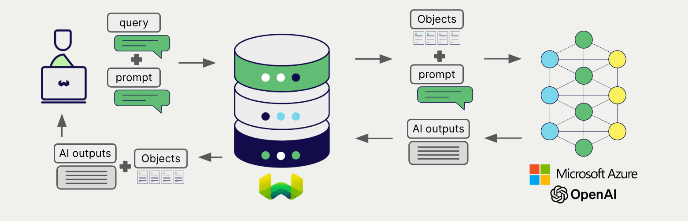

# Weaviate での Azure OpenAI 生成 AI

import Tabs from '@theme/Tabs';
import TabItem from '@theme/TabItem';
import FilteredTextBlock from '@site/src/components/Documentation/FilteredTextBlock';
import PyConnect from '!!raw-loader!../_includes/provider.connect.py';
import TSConnect from '!!raw-loader!../_includes/provider.connect.ts';
import PyCode from '!!raw-loader!../_includes/provider.generative.py';
import TSCode from '!!raw-loader!../_includes/provider.generative.ts';

Weaviate の Azure OpenAI の API との統合により、モデルの機能に Weaviate から直接アクセスできます。

[Weaviate コレクションを設定](#configure-collection)して、Azure OpenAI で生成 AI モデルを利用します。Weaviate は、指定したモデルと Azure OpenAI API キーを使用して 検索拡張生成 (RAG) を実行します。

より具体的には、Weaviate が検索を実行し、最も関連性の高いオブジェクトを取得してから、それらを Azure OpenAI の生成モデルに渡して出力を生成します。

## 必要条件

### Weaviate の設定

ご使用の Weaviate インスタンスは、Azure OpenAI 生成 AI 統合 (`generative-openai`) モジュールが有効化されている必要があります。

  
Weaviate Cloud (WCD) ユーザー向け

この統合は、Weaviate Cloud (WCD) の serverless インスタンスではデフォルトで有効です。

  
セルフホストユーザー向け

- [cluster metadata](/deploy/configuration/meta.md) を確認し、モジュールが有効になっているかどうかを確認します。  
- Weaviate でモジュールを有効化するには、[モジュールの設定方法](../../configuration/modules.md) ガイドに従ってください。

### API 資格情報

この統合を利用するには、有効な Azure OpenAI API キーを Weaviate に提供する必要があります。サインアップと API キーの取得は [Azure OpenAI](https://azure.microsoft.com/en-us/products/ai-services/openai-service) で行ってください。

次のいずれかの方法で API キーを Weaviate に渡します。

- `AZURE_APIKEY` 環境変数を設定し、Weaviate から参照できるようにします。  
- 以下の例のように、実行時に API キーを指定します。

<Tabs groupId="languages">

 <TabItem value="py" label="Python API v4">
    <FilteredTextBlock
      text={PyConnect}
      startMarker="# START AzureOpenAIInstantiation"
      endMarker="# END AzureOpenAIInstantiation"
      language="py"
    />
  </TabItem>

 <TabItem value="js" label="JS/TS API v3">
    <FilteredTextBlock
      text={TSConnect}
      startMarker="// START AzureOpenAIInstantiation"
      endMarker="// END AzureOpenAIInstantiation"
      language="ts"
    />
  </TabItem>

</Tabs>

## コレクションの設定

import MutableGenerativeConfig from '/_includes/mutable-generative-config.md';

<MutableGenerativeConfig />

[Weaviate インデックスを設定](../../manage-collections/generative-reranker-models.mdx#specify-a-generative-model-integration)して、OpenAI Azure の生成モデルを使用します。

モデルを選択するには、Azure のリソース名を指定します。

<Tabs groupId="languages">
  <TabItem value="py" label="Python API v4">
    <FilteredTextBlock
      text={PyCode}
      startMarker="# START BasicGenerativeAzureOpenAI"
      endMarker="# END BasicGenerativeAzureOpenAI"
      language="py"
    />
  </TabItem>

  <TabItem value="js" label="JS/TS API v3">
    <FilteredTextBlock
      text={TSCode}
      startMarker="// START BasicGenerativeAzureOpenAI"
      endMarker="// END BasicGenerativeAzureOpenAI"
      language="ts"
    />
  </TabItem>

</Tabs>

### 生成パラメーター

以下の生成パラメーターを設定して、モデルの動作をカスタマイズします。

<Tabs groupId="languages">
  <TabItem value="py" label="Python API v4">
    <FilteredTextBlock
      text={PyCode}
      startMarker="# START FullGenerativeAzureOpenAI"
      endMarker="# END FullGenerativeAzureOpenAI"
      language="py"
    />
  </TabItem>

  <TabItem value="js" label="JS/TS API v3">
    <FilteredTextBlock
      text={TSCode}
      startMarker="// START FullGenerativeAzureOpenAI"
      endMarker="// END FullGenerativeAzureOpenAI"
      language="ts"
    />
  </TabItem>

</Tabs>

詳細については、[Azure OpenAI API のドキュメント](https://learn.microsoft.com/en-us/azure/ai-services/openai/) を参照してください。

## ヘッダー パラメーター

リクエストの追加ヘッダーを使用して、API キーおよびいくつかのオプションパラメーターを実行時に指定できます。  
利用可能なヘッダーは次のとおりです:

- `X-Azure-Api-Key`: Azure API キー。  
- `X-Azure-Deployment-Id`: Azure デプロイメント ID。  
- `X-Azure-Resource-Name`: Azure リソース名。

実行時に指定した追加ヘッダーは、既存の Weaviate 設定を上書きします。

上記の [API 認証情報の例](#api-credentials) に示すとおりにヘッダーを指定してください。

## 検索拡張生成

生成 AI 統合を設定したら、[単一プロンプト](#single-prompt) または [グループタスク](#grouped-task) の方法で RAG 操作を実行します。

### 単一プロンプト

検索結果内の各オブジェクトに対してテキストを生成するには、単一プロンプト方式を使用します。

以下の例では、`n` 件の検索結果それぞれに対して出力を生成します。ここで `n` は `limit` パラメーターで指定します。

単一プロンプト クエリを作成するときは、`{}` を使って言語モデルに渡したいオブジェクトプロパティを埋め込みます。たとえば、オブジェクトの `title` プロパティを渡す場合は、クエリ内に `{title}` を含めます。

<Tabs groupId="languages">

 <TabItem value="py" label="Python API v4">
    <FilteredTextBlock
      text={PyCode}
      startMarker="# START SinglePromptExample"
      endMarker="# END SinglePromptExample"
      language="py"
    />
  </TabItem>

 <TabItem value="js" label="JS/TS API v3">
    <FilteredTextBlock
      text={TSCode}
      startMarker="// START SinglePromptExample"
      endMarker="// END SinglePromptExample"
      language="ts"
    />
  </TabItem>

</Tabs>

### グループタスク

検索結果のセット全体に対して 1 つのテキストを生成するには、グループタスク方式を使用します。

つまり、`n` 件の検索結果がある場合でも、生成モデルはグループ全体に対して 1 つの出力を生成します。

<Tabs groupId="languages">

 <TabItem value="py" label="Python API v4">
    <FilteredTextBlock
      text={PyCode}
      startMarker="# START GroupedTaskExample"
      endMarker="# END GroupedTaskExample"
      language="py"
    />
  </TabItem>

 <TabItem value="js" label="JS/TS API v3">
    <FilteredTextBlock
      text={TSCode}
      startMarker="// START GroupedTaskExample"
      endMarker="// END GroupedTaskExample"
      language="ts"
    />
  </TabItem>

</Tabs>

## 参照

### 利用可能なモデル

利用可能なモデルとリージョン別の提供状況については、[Azure OpenAI ドキュメント](https://learn.microsoft.com/en-us/azure/ai-services/openai/concepts/models) を参照してください。

## 追加リソース

### その他の統合

- [Azure OpenAI 埋め込みモデル + Weaviate](./embeddings.md)

### コード例

コレクションで統合を設定すると、Weaviate におけるデータ管理および検索操作は他のコレクションと同じように動作します。以下のモデル非依存の例をご覧ください:

- [How-to: コレクションを管理する](../../manage-collections/index.mdx) と [How-to: オブジェクトを管理する](../../manage-objects/index.mdx) では、データ操作 (コレクションおよびその内部のオブジェクトの作成、読み取り、更新、削除) の方法を説明しています。
- [How-to: クエリ & 検索](../../search/index.mdx) では、ベクトル、キーワード、ハイブリッド検索などの検索操作および検索拡張生成の実行方法を説明しています。

### 参考文献

- Azure OpenAI [API ドキュメント](https://learn.microsoft.com/en-us/azure/ai-services/openai/)
- Azure OpenAI [モデルと提供状況](https://learn.microsoft.com/en-us/azure/ai-services/openai/concepts/models)

## 質問とフィードバック

import DocsFeedback from '/_includes/docs-feedback.mdx';

<DocsFeedback/>

