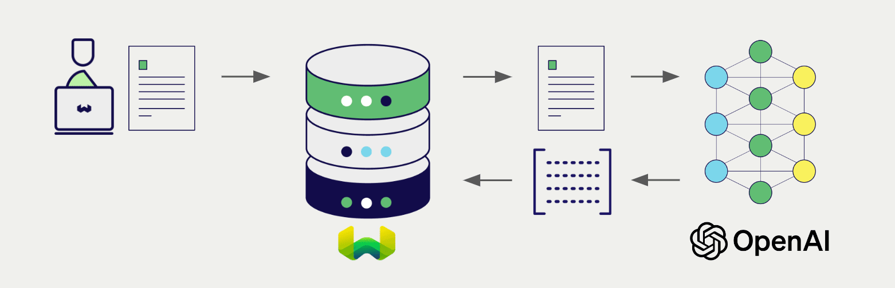

# Weaviate での OpenAI 埋め込み

:::info Azure OpenAI 連携ドキュメントをお探しですか？
Azure OpenAI 連携ドキュメントについては、代わりに [こちらのページ](../openai-azure/embeddings.md) をご覧ください。
:::

import Tabs from '@theme/Tabs';
import TabItem from '@theme/TabItem';
import FilteredTextBlock from '@site/src/components/Documentation/FilteredTextBlock';
import PyConnect from '!!raw-loader!../_includes/provider.connect.py';
import TSConnect from '!!raw-loader!../_includes/provider.connect.ts';
import GoConnect from '!!raw-loader!/_includes/code/howto/go/docs/model-providers/1-connect/main.go';
import PyCode from '!!raw-loader!../_includes/provider.vectorizer.py';
import TSCode from '!!raw-loader!../_includes/provider.vectorizer.ts';
import GoCode from '!!raw-loader!/_includes/code/howto/go/docs/model-providers/2-usage-text/main.go';

Weaviate の OpenAI API 連携により、Weaviate から直接 OpenAI モデルの機能にアクセスできます。

[Weaviate ベクトルインデックスを設定](#configure-the-vectorizer) して OpenAI 埋め込みモデルを使用すると、Weaviate は指定したモデルとお客様の OpenAI API キーを用いて各種操作の埋め込みを生成します。この機能は *ベクトライザー* と呼ばれます。

[インポート時](#data-import) に、Weaviate はテキストオブジェクトの埋め込みを生成し、インデックスに保存します。また、[vector](#vector-near-text-search) 検索や [hybrid](#hybrid-search) 検索を行う際には、Weaviate がテキストクエリを埋め込みへ変換します。

## 要件

### Weaviate の設定

お使いの Weaviate インスタンスには、OpenAI ベクトライザー連携 (`text2vec-openai`) モジュールが有効化されている必要があります。

  
Weaviate Cloud (WCD) ユーザー向け

この連携は、Weaviate Cloud (WCD) のサーバーレスインスタンスではデフォルトで有効になっています。

  
セルフホストユーザー向け

- モジュールが有効かどうかは、[クラスターメタデータ](/deploy/configuration/meta.md) で確認できます。  
- Weaviate でモジュールを有効化するには、[モジュール設定方法](../../configuration/modules.md) ガイドを参照してください。

<!-- Docs note: the `OPENAI_ORGANIZATION` environment variable is not documented, as it is not the recommended way to provide the OpenAI organization parameter. -->

### API 資格情報

この連携を使用するには、有効な OpenAI API キーを Weaviate に提供する必要があります。API キーは [OpenAI](https://openai.com/) で取得できます。

以下のいずれかの方法で Weaviate に API キーを渡してください。

- `OPENAI_APIKEY` 環境変数を設定して Weaviate から参照できるようにする  
- 下記の例のように、実行時に API キーを渡す

<Tabs groupId="languages">

 <TabItem value="py" label="Python API v4">
    <FilteredTextBlock
      text={PyConnect}
      startMarker="# START OpenAIInstantiation"
      endMarker="# END OpenAIInstantiation"
      language="py"
    />
  </TabItem>

 <TabItem value="js" label="JS/TS API v3">
    <FilteredTextBlock
      text={TSConnect}
      startMarker="// START OpenAIInstantiation"
      endMarker="// END OpenAIInstantiation"
      language="ts"
    />
  </TabItem>

  <TabItem value="go" label="Go">
    <FilteredTextBlock
      text={GoConnect}
      startMarker="// START OpenAIInstantiation"
      endMarker="// END OpenAIInstantiation"
      language="goraw"
    />
  </TabItem>

</Tabs>

## ベクトライザーの設定 {#configure-the-vectorizer}

[Weaviate インデックスを設定](../../manage-collections/vector-config.mdx#specify-a-vectorizer) して OpenAI 埋め込みモデルを利用するには、以下のようにします。

<Tabs groupId="languages">
  <TabItem value="py" label="Python API v4">
    <FilteredTextBlock
      text={PyCode}
      startMarker="# START BasicVectorizerOpenAI"
      endMarker="# END BasicVectorizerOpenAI"
      language="py"
    />
  </TabItem>

  <TabItem value="js" label="JS/TS API v3">
    <FilteredTextBlock
      text={TSCode}
      startMarker="// START BasicVectorizerOpenAI"
      endMarker="// END BasicVectorizerOpenAI"
      language="ts"
    />
  </TabItem>

  <TabItem value="go" label="Go">
    <FilteredTextBlock
      text={GoCode}
      startMarker="// START BasicVectorizerOpenAI"
      endMarker="// END BasicVectorizerOpenAI"
      language="goraw"
    />
  </TabItem>

</Tabs>

### モデルの選択

以下の設定例に示すように、ベクトライザーで使用する [利用可能なモデル](#available-models) のいずれかを指定できます。

#### `text-embedding-3` モデル ファミリーの場合

`text-embedding-3-large` などの `v3` モデルでは、モデル名と必要に応じて次元数（例: `1024`）を指定します。

<Tabs groupId="languages">
  <TabItem value="py" label="Python API v4">
    <FilteredTextBlock
      text={PyCode}
      startMarker="# START VectorizerOpenAICustomModelV3"
      endMarker="# END VectorizerOpenAICustomModelV3"
      language="py"
    />
  </TabItem>

  <TabItem value="js" label="JS/TS API v3">
    <FilteredTextBlock
      text={TSCode}
      startMarker="// START VectorizerOpenAICustomModelV3"
      endMarker="// END VectorizerOpenAICustomModelV3"
      language="ts"
    />
  </TabItem>

  <TabItem value="go" label="Go">
    <FilteredTextBlock
      text={GoCode}
      startMarker="// START VectorizerOpenAICustomModelV3"
      endMarker="// END VectorizerOpenAICustomModelV3"
      language="goraw"
    />
  </TabItem>

</Tabs>

#### 旧モデル ファミリーの場合（例: `ada`）

`text-embedding-ada-002` などの旧モデルでは、モデル名（`ada`）、タイプ（`text`）、モデル バージョン（`002`）を指定します。

<Tabs groupId="languages">
  <TabItem value="py" label="Python API v4">
    <FilteredTextBlock
      text={PyCode}
      startMarker="# START VectorizerOpenAICustomModelLegacy"
      endMarker="# END VectorizerOpenAICustomModelLegacy"
      language="py"
    />
  </TabItem>

  <TabItem value="js" label="JS/TS API v3">
    <FilteredTextBlock
      text={TSCode}
      startMarker="// START VectorizerOpenAICustomModelLegacy"
      endMarker="// END VectorizerOpenAICustomModelLegacy"
      language="ts"
    />
  </TabItem>

  <TabItem value="go" label="Go">
    <FilteredTextBlock
      text={GoCode}
      startMarker="// START VectorizerOpenAICustomModelLegacy"
      endMarker="// END VectorizerOpenAICustomModelLegacy"
      language="goraw"
    />
  </TabItem>

</Tabs>

Weaviate が使用する [利用可能なモデル](#available-models) のいずれかを[指定](#vectorizer-parameters)できます。モデルを指定しない場合は、[既定のモデル](#available-models) が使用されます。

import VectorizationBehavior from '/_includes/vectorization.behavior.mdx';

  
ベクトル化の挙動

<VectorizationBehavior/>

### ベクトライザー パラメーター

- `model`: OpenAI のモデル名またはファミリーです。
- `dimensions`: モデルの次元数です。
- `modelVersion`: モデルのバージョン文字列です。
- `type`: モデルのタイプで、`text` か `code` のいずれかです。
- `baseURL`: 既定の OpenAI URL の代わりに使用する URL（例: プロキシ）です。

#### (`model` & `dimensions`) または (`model` & `modelVersion`)

`text-embedding-3-large` のような `v3` モデルでは、モデル名と必要に応じて次元数（例: `1024`）を指定します。

`text-embedding-ada-002` のような旧モデルでは、モデル名（`ada`）、タイプ（`text`）およびモデル バージョン（`002`）を指定します。

#### 設定例

以下の例では、OpenAI 固有のオプションの設定方法を示します。

<Tabs groupId="languages">
  <TabItem value="py" label="Python API v4">
    <FilteredTextBlock
      text={PyCode}
      startMarker="# START FullVectorizerOpenAI"
      endMarker="# END FullVectorizerOpenAI"
      language="py"
    />
  </TabItem>

  <TabItem value="js" label="JS/TS API v3">
    <FilteredTextBlock
      text={TSCode}
      startMarker="// START FullVectorizerOpenAI"
      endMarker="// END FullVectorizerOpenAI"
      language="ts"
    />
  </TabItem>

  <TabItem value="go" label="Go">
    <FilteredTextBlock
      text={GoCode}
      startMarker="// START FullVectorizerOpenAI"
      endMarker="// END FullVectorizerOpenAI"
      language="goraw"
    />
  </TabItem>

</Tabs>

モデル パラメーターの詳細については、[OpenAI API ドキュメント](https://platform.openai.com/docs/api-reference/embeddings) を参照してください。

## ヘッダー・パラメーター

実行時に追加ヘッダーをリクエストに含めることで、API キーやいくつかのオプションパラメーターを指定できます。使用可能なヘッダーは次のとおりです。

- `X-OpenAI-Api-Key`: OpenAI API キー  
- `X-OpenAI-Baseurl`: 既定の OpenAI URL の代わりに使用するベース URL（例: プロキシ）  
- `X-OpenAI-Organization`: OpenAI 組織 ID  

実行時に指定した追加ヘッダーは、既存の Weaviate 設定を上書きします。

ヘッダーの指定方法は、上記の [API 資格情報の例](#api-credentials) をご覧ください。

## データインポート

ベクトライザーを設定した後、Weaviate に [データをインポート](../../manage-objects/import.mdx) します。Weaviate は指定されたモデルを使用してテキストオブジェクトの埋め込みを生成します。

<Tabs groupId="languages">

 <TabItem value="py" label="Python API v4">
    <FilteredTextBlock
      text={PyCode}
      startMarker="# START BatchImportExample"
      endMarker="# END BatchImportExample"
      language="py"
    />
  </TabItem>

 <TabItem value="js" label="JS/TS API v3">
    <FilteredTextBlock
      text={TSCode}
      startMarker="// START BatchImportExample"
      endMarker="// END BatchImportExample"
      language="ts"
    />
  </TabItem>

  <TabItem value="go" label="Go">
    <FilteredTextBlock
      text={GoCode}
      startMarker="// START BatchImportExample"
      endMarker="// END BatchImportExample"
      language="goraw"
    />
  </TabItem>

</Tabs>

:::tip 既存ベクトルの再利用
既に互換性のあるモデルベクトルをお持ちの場合は、それを直接 Weaviate に渡すことができます。たとえば同じモデルで埋め込みを生成済みで、他のシステムからデータを移行する際などに便利です。
:::

## 検索

ベクトライザーが設定されると、Weaviate は指定された OpenAI モデルを使用してベクトル検索およびハイブリッド検索を実行します。

### ベクトル（near text）検索

[ベクトル検索](../../search/similarity.md#search-with-text) を実行すると、Weaviate はテキストクエリを指定モデルで埋め込みに変換し、データベースから最も類似したオブジェクトを返します。

次のクエリは、`limit` で指定した数 `n` の最も類似したオブジェクトを返します。

<Tabs groupId="languages">

 <TabItem value="py" label="Python API v4">
    <FilteredTextBlock
      text={PyCode}
      startMarker="# START NearTextExample"
      endMarker="# END NearTextExample"
      language="py"
    />
  </TabItem>

 <TabItem value="js" label="JS/TS API v3">
    <FilteredTextBlock
      text={TSCode}
      startMarker="// START NearTextExample"
      endMarker="// END NearTextExample"
      language="ts"
    />
  </TabItem>

 <TabItem value="go" label="Go">
    <FilteredTextBlock
      text={GoCode}
      startMarker="// START NearTextExample"
      endMarker="// END NearTextExample"
      language="goraw"
    />
  </TabItem>

</Tabs>

### ハイブリッド検索

:::info ハイブリッド検索とは？
ハイブリッド検索は、ベクトル検索とキーワード（BM25）検索を行い、その結果を [結合](../../search/hybrid.md) してデータベースから最適なオブジェクトを返します。
:::

[ハイブリッド検索](../../search/hybrid.md) を実行すると、Weaviate はテキストクエリを指定モデルで埋め込みに変換し、データベースから最もスコアの高いオブジェクトを返します。

次のクエリは、`limit` で指定した数 `n` の最もスコアが高いオブジェクトを返します。

<Tabs groupId="languages">

 <TabItem value="py" label="Python API v4">
    <FilteredTextBlock
      text={PyCode}
      startMarker="# START HybridExample"
      endMarker="# END HybridExample"
      language="py"
    />
  </TabItem>

 <TabItem value="js" label="JS/TS API v3">
    <FilteredTextBlock
      text={TSCode}
      startMarker="// START HybridExample"
      endMarker="// END HybridExample"
      language="ts"
    />
  </TabItem>

  <TabItem value="go" label="Go">
    <FilteredTextBlock
      text={GoCode}
      startMarker="// START HybridExample"
      endMarker="// END HybridExample"
      language="goraw"
    />
  </TabItem>

</Tabs>

## 参考資料

### 利用可能なモデル

`text2vec-openai` では、任意の OpenAI 埋め込みモデルを使用できます。ドキュメント埋め込みには、次の [埋め込みモデルファミリー](https://platform.openai.com/docs/models/embeddings) から選択してください。

* `text-embedding-3`
    * 利用可能な次元:
        * `text-embedding-3-large`: `256`, `1024`, `3072` (デフォルト)
        * `text-embedding-3-small`: `512`, `1536` (デフォルト)
* `ada`
* `babbage`
* `davinci`

  
非推奨モデル

以下のモデルは利用可能ですが、非推奨です:
* Codex
* babbage-001
* davinci-001
* curie

[出典](https://platform.openai.com/docs/deprecations)

## 追加リソース

### 他の統合

- [OpenAI 生成モデル + Weaviate](./generative.md)

### コード例

コレクションで統合を設定すると、 Weaviate におけるデータ管理と検索操作は他のコレクションと同様に機能します。モデル非依存の例を以下に示します。

- [ハウツー: コレクションを管理](../../manage-collections/index.mdx) および [ハウツー: オブジェクトを管理](../../manage-objects/index.mdx) ガイドでは、データ操作（コレクションとその内部のオブジェクトの作成・読み取り・更新・削除）方法を説明しています。
- [ハウツー: クエリ & 検索](../../search/index.mdx) ガイドでは、検索操作（ ベクトル 、キーワード、ハイブリッド）および 検索拡張生成 の実行方法を説明しています。

### 外部リソース

- OpenAI [Embed API ドキュメント](https://platform.openai.com/docs/api-reference/embeddings)

## 質問とフィードバック

import DocsFeedback from '/_includes/docs-feedback.mdx';

<DocsFeedback/>

