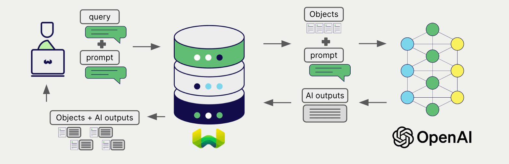
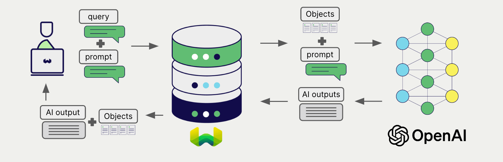

# Weaviate と OpenAI 生成 AI

:::info Azure OpenAI の統合ドキュメントをお探しですか？
Azure OpenAI の統合ドキュメントについては[こちらのページ](../openai-azure/generative.md)をご覧ください。
:::

import Tabs from '@theme/Tabs';
import TabItem from '@theme/TabItem';
import FilteredTextBlock from '@site/src/components/Documentation/FilteredTextBlock';
import PyConnect from '!!raw-loader!../_includes/provider.connect.py';
import TSConnect from '!!raw-loader!../_includes/provider.connect.ts';
import PyCode from '!!raw-loader!../_includes/provider.generative.py';
import TSCode from '!!raw-loader!../_includes/provider.generative.ts';

Weaviate が OpenAI の API と統合されているため、Weaviate から直接これらのモデルの機能にアクセスできます。

OpenAI の生成 AI モデルを使用するには、[Weaviate コレクションを設定](#configure-collection)してください。Weaviate は指定したモデルとお客様の OpenAI API キーを用いて検索拡張生成 (RAG) を実行します。

具体的には、Weaviate が検索を実行し、最も関連性の高いオブジェクトを取得した後、それらを OpenAI の生成モデルに渡して出力を生成します。

## 要件

### Weaviate の設定

お使いの Weaviate インスタンスは、OpenAI 生成 AI 統合 (`generative-openai`) モジュールが有効になっている必要があります。

  
Weaviate Cloud (WCD) ユーザー向け

この統合は Weaviate Cloud (WCD) のサーバーレスインスタンスではデフォルトで有効になっています。

  
セルフホストユーザー向け

- モジュールが有効かを確認するには、[クラスタメタデータ](/deploy/configuration/meta.md)をチェックしてください。  
- モジュールを有効にするには、[モジュール設定方法](../../configuration/modules.md)ガイドに従ってください。

<!-- Docs note: the `OPENAI_ORGANIZATION` environment variable is not documented, as it is not the recommended way to provide the OpenAI organization parameter. -->

### API 資格情報

この統合を利用するには、有効な OpenAI API キーを Weaviate に提供する必要があります。[OpenAI](https://openai.com/) でサインアップし、API キーを取得してください。

次のいずれかの方法で API キーを Weaviate に渡します。

- Weaviate が参照できる `OPENAI_APIKEY` 環境変数を設定する  
- 以下の例のように、実行時に API キーを渡す

<Tabs groupId="languages">

 <TabItem value="py" label="Python API v4">
    <FilteredTextBlock
      text={PyConnect}
      startMarker="# START OpenAIInstantiation"
      endMarker="# END OpenAIInstantiation"
      language="py"
    />
  </TabItem>

 <TabItem value="js" label="JS/TS API v3">
    <FilteredTextBlock
      text={TSConnect}
      startMarker="// START OpenAIInstantiation"
      endMarker="// END OpenAIInstantiation"
      language="ts"
    />
  </TabItem>

</Tabs>

## コレクションの設定

import MutableGenerativeConfig from '/_includes/mutable-generative-config.md';

<MutableGenerativeConfig />

OpenAI 生成 AI モデルを使用するには、次のように[Weaviate インデックスを設定](../../manage-collections/generative-reranker-models.mdx#specify-a-generative-model-integration)します。

<Tabs groupId="languages">
  <TabItem value="py" label="Python API v4">
    <FilteredTextBlock
      text={PyCode}
      startMarker="# START BasicGenerativeOpenAI"
      endMarker="# END BasicGenerativeOpenAI"
      language="py"
    />
  </TabItem>

  <TabItem value="js" label="JS/TS API v3">
    <FilteredTextBlock
      text={TSCode}
      startMarker="// START BasicGenerativeOpenAI"
      endMarker="// END BasicGenerativeOpenAI"
      language="ts"
    />
  </TabItem>

</Tabs>

### モデルの選択

以下の設定例のように、Weaviate で使用する[利用可能なモデル](#available-models)のいずれかを指定できます。

<Tabs groupId="languages">
  <TabItem value="py" label="Python API v4">
    <FilteredTextBlock
      text={PyCode}
      startMarker="# START GenerativeOpenAICustomModel"
      endMarker="# END GenerativeOpenAICustomModel"
      language="py"
    />
  </TabItem>

  <TabItem value="js" label="JS/TS API v3">
    <FilteredTextBlock
      text={TSCode}
      startMarker="// START GenerativeOpenAICustomModel"
      endMarker="// END GenerativeOpenAICustomModel"
      language="ts"
    />
  </TabItem>

</Tabs>

[利用可能なモデル](#available-models)のいずれかを[指定](#generative-parameters)することができます。モデルを指定しない場合は[デフォルトモデル](#available-models)が使用されます。

### 生成パラメーター

モデルの挙動をカスタマイズするために、以下の生成パラメーターを設定します。

<Tabs groupId="languages">
  <TabItem value="py" label="Python API v4">
    <FilteredTextBlock
      text={PyCode}
      startMarker="# START FullGenerativeOpenAI"
      endMarker="# END FullGenerativeOpenAI"
      language="py"
    />
  </TabItem>

  <TabItem value="js" label="JS/TS API v3">
    <FilteredTextBlock
      text={TSCode}
      startMarker="// START FullGenerativeOpenAI"
      endMarker="// END FullGenerativeOpenAI"
      language="ts"
    />
  </TabItem>

</Tabs>

モデルパラメーターの詳細については、[OpenAI API ドキュメント](https://platform.openai.com/docs/api-reference/chat) をご覧ください。

## 実行時のモデル選択

コレクション作成時にデフォルトのモデルプロバイダーを設定する以外に、クエリ実行時に上書きすることもできます。

<Tabs groupId="languages">
  <TabItem value="py" label="Python API v4">
    <FilteredTextBlock
      text={PyCode}
      startMarker="# START RuntimeModelSelectionOpenAI"
      endMarker="# END RuntimeModelSelectionOpenAI"
      language="py"
    />
  </TabItem>
  <TabItem value="js" label="JS/TS Client v3">
    <FilteredTextBlock
      text={TSCode}
      startMarker="// START RuntimeModelSelectionOpenAI"
      endMarker="// END RuntimeModelSelectionOpenAI"
      language="ts"
    />
  </TabItem>
</Tabs>

## ヘッダーパラメーター

リクエストの追加ヘッダーを介して、実行時に API キーおよびいくつかのオプションパラメーターを渡すことができます。利用可能なヘッダーは次のとおりです。

- `X-OpenAI-Api-Key`: OpenAI の API キー。
- `X-OpenAI-Baseurl`: デフォルトの OpenAI URL の代わりに使用するベース URL (たとえばプロキシ)。
- `X-OpenAI-Organization`: OpenAI の組織 ID。

実行時に指定された追加ヘッダーは、既存の Weaviate 設定を上書きします。

上記の [API 資格情報の例](#api-credentials) に示すようにヘッダーを渡してください。

## 検索拡張生成

生成 AI 統合を設定した後、[シングル プロンプト](#single-prompt) または [グループ タスク](#grouped-task) の方法で RAG 操作を実行します。

### シングル プロンプト

検索結果に含まれる各オブジェクトに対してテキストを生成する場合は、シングル プロンプト方式を使用します。

以下の例では、`limit` パラメーターで指定した `n` 件の検索結果それぞれについて出力を生成します。

シングル プロンプト クエリを作成する際は、波かっこ `{}` を使用して、Weaviate から言語モデルへ渡したいオブジェクトプロパティを差し込みます。たとえばオブジェクトの `title` プロパティを渡したい場合、クエリ内に `{title}` を含めてください。

<Tabs groupId="languages">

 <TabItem value="py" label="Python API v4">
    <FilteredTextBlock
      text={PyCode}
      startMarker="# START SinglePromptExample"
      endMarker="# END SinglePromptExample"
      language="py"
    />
  </TabItem>

 <TabItem value="js" label="JS/TS API v3">
    <FilteredTextBlock
      text={TSCode}
      startMarker="// START SinglePromptExample"
      endMarker="// END SinglePromptExample"
      language="ts"
    />
  </TabItem>

</Tabs>

### グループ タスク

検索結果全体に対して 1 つのテキストを生成する場合は、グループ タスク方式を使用します。

言い換えれば、`n` 件の検索結果がある場合でも、生成モデルはそのグループ全体に対して 1 つの出力を生成します。

<Tabs groupId="languages">

 <TabItem value="py" label="Python API v4">
    <FilteredTextBlock
      text={PyCode}
      startMarker="# START GroupedTaskExample"
      endMarker="# END GroupedTaskExample"
      language="py"
    />
  </TabItem>

 <TabItem value="js" label="JS/TS API v3">
    <FilteredTextBlock
      text={TSCode}
      startMarker="// START GroupedTaskExample"
      endMarker="// END GroupedTaskExample"
      language="ts"
    />
  </TabItem>

</Tabs>

### 画像を用いた RAG

単一プロンプトでもグループタスクでも、検索拡張生成を行う際に入力の一部として画像を渡すことができます。 

<Tabs groupId="languages">

 <TabItem value="py" label="Python API v4">
    <FilteredTextBlock
      text={PyCode}
      startMarker="# START WorkingWithImagesOpenAI"
      endMarker="# END WorkingWithImagesOpenAI"
      language="py"
    />
  </TabItem>
  <TabItem value="js" label="JS/TS API v3">
  <FilteredTextBlock
      text={TSCode}
      startMarker="// START WorkingWithImagesOpenAI"
      endMarker="// END WorkingWithImagesOpenAI"
      language="ts"
    />
  </TabItem>
</Tabs>

## 参考

### 利用可能なモデル

* [gpt-3.5-turbo](https://platform.openai.com/docs/models/gpt-3-5) (デフォルト)
* [gpt-3.5-turbo-16k](https://platform.openai.com/docs/models/gpt-3-5)
* [gpt-3.5-turbo-1106](https://platform.openai.com/docs/models/gpt-3-5)
* [gpt-4](https://platform.openai.com/docs/models/gpt-4-and-gpt-4-turbo)
* [gpt-4-1106-preview](https://platform.openai.com/docs/models/gpt-4-and-gpt-4-turbo)
* [gpt-4-32k](https://platform.openai.com/docs/models/gpt-4-and-gpt-4-turbo)
* [gpt-4o](https://platform.openai.com/docs/models#gpt-4o)
* [gpt-4o-mini](https://platform.openai.com/docs/models#gpt-4o-mini) (v1.26.7 で追加)

  
旧モデル

以下のモデルも利用可能ですが、推奨されません。

* [davinci 002](https://platform.openai.com/docs/models/overview)
* [davinci 003](https://platform.openai.com/docs/models/overview)

## 追加リソース

### その他の統合

- [OpenAI 埋め込みモデル + Weaviate](./embeddings.md)

### コード例

コレクションでインテグレーションを設定すると、Weaviate におけるデータ管理および検索操作は他のコレクションと同様に機能します。以下のモデル非依存の例をご覧ください。

- [How-to: コレクションを管理する](../../manage-collections/index.mdx) および [How-to: オブジェクトを管理する](../../manage-objects/index.mdx) では、データ操作（コレクションやその内部のオブジェクトの作成・読み取り・更新・削除）の方法を説明しています。
- [How-to: クエリ & 検索](../../search/index.mdx) では、 ベクトル・キーワード・ハイブリッド検索のほか、検索拡張生成の方法を説明しています。

### 参考

- OpenAI [Chat API ドキュメント](https://platform.openai.com/docs/api-reference/chat)

## 質問とフィードバック

import DocsFeedback from '/_includes/docs-feedback.mdx';

<DocsFeedback/>

