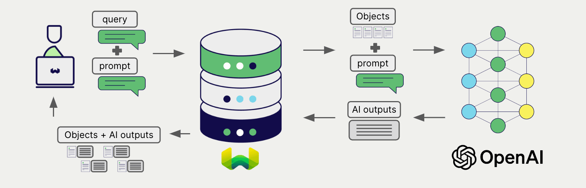

<!-- Note: for images, use https://docs.google.com/presentation/d/15opIcJuaIjEEcs_1Zm8B6pccox2p7_MHSjCnRv4dPfU/edit?usp=sharing -->

:::info Azure OpenAI 統合ドキュメントをお探しですか？
Azure OpenAI の統合ドキュメントについては、代わりに [こちらのページ](../openai-azure/index.md) をご覧ください。
:::

OpenAI は、自然言語処理と生成のために幅広いモデルを提供しています。Weaviate は OpenAI の API とシームレスに統合されており、ユーザーは Weaviate Database から直接 OpenAI のモデルを活用できます。

これらの統合により、開発者は高度な AI 駆動アプリケーションを簡単に構築できます。

## OpenAI との統合

### ベクトル検索用 Embedding モデル

OpenAI の embedding モデルは、テキストデータを意味とコンテキストを捉えたベクトル埋め込みへ変換します。

[Weaviate は OpenAI の embedding モデルと統合](./embeddings.md) しており、データのシームレスなベクトライゼーションを実現します。この統合により、追加の前処理やデータ変換を行わずに、セマンティック検索やハイブリッド検索を実行できます。

[OpenAI embedding 統合ページ](./embeddings.md)

### RAG 用生成 AI モデル

OpenAI の生成 AI モデルは、与えられたプロンプトとコンテキストに基づき、人間らしいテキストを生成します。

[Weaviate の生成 AI 統合](./generative.md) を利用すると、Weaviate Database から直接 検索拡張生成 (RAG) を実行できます。これにより、Weaviate の効率的なストレージと高速検索機能に OpenAI の生成 AI モデルを組み合わせ、パーソナライズされたコンテキスト重視の応答を生成できます。

[OpenAI 生成 AI 統合ページ](./generative.md)

## まとめ

これらの統合により、開発者は Weaviate 内で直接 OpenAI の強力なモデルを活用できます。

その結果、AI 駆動アプリケーションの構築プロセスが簡素化され、開発スピードが向上し、革新的なソリューションの創出に専念できます。

## 開始方法

これらの統合を利用するには、有効な OpenAI API キーを Weaviate に提供する必要があります。OpenAI に [サインアップ](https://openai.com/) して API キーを取得してください。

その後、該当する統合ページに移動し、OpenAI モデルを Weaviate に設定してアプリケーションで利用する方法を学びましょう。

- [テキスト Embeddings](./embeddings.md)
- [生成 AI](./generative.md)

## 質問とフィードバック

import DocsFeedback from '/_includes/docs-feedback.mdx';

<DocsFeedback/>

