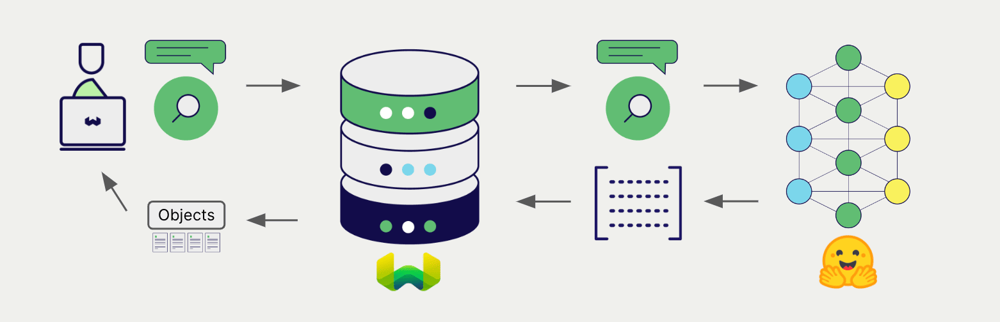

# ローカルホスト CLIP 埋め込み + Weaviate


import Tabs from '@theme/Tabs';
import TabItem from '@theme/TabItem';
import FilteredTextBlock from '@site/src/components/Documentation/FilteredTextBlock';
import PyConnect from '!!raw-loader!../_includes/provider.connect.local.py';
import TSConnect from '!!raw-loader!../_includes/provider.connect.local.ts';
import PyCode from '!!raw-loader!../_includes/provider.vectorizer.py';
import TSCode from '!!raw-loader!../_includes/provider.vectorizer.ts';

Weaviate と Hugging Face Transformers ライブラリの連携により、CLIP モデルの機能を Weaviate から直接利用できます。

[Weaviate ベクトルインデックスを設定](#configure-the-vectorizer)し、[Weaviate インスタンスを設定](#weaviate-configuration)してモデルイメージを指定すると、CLIP 推論コンテナ内の指定モデルを用いて各種操作の埋め込みを生成します。この機能は *vectorizer* と呼ばれます。

[インポート時](#data-import) に Weaviate はマルチモーダルオブジェクトの埋め込みを生成し、インデックスに保存します。[ベクトル](#vector-near-text-search) および [ハイブリッド](#hybrid-search) 検索操作では、1 つ以上のモダリティを含むクエリを埋め込みに変換します。[マルチモーダル検索操作](#vector-near-media-search) にも対応しています。


## 要件

### Weaviate の設定

ご利用の Weaviate インスタンスは、CLIP マルチモーダル ベクトライザー統合 (`multi2vec-clip`) モジュールが有効になっている必要があります。

<details>
  <summary>Weaviate Cloud (WCD) ユーザー向け</summary>

この統合は Hugging Face モデルを含むコンテナを起動する必要があるため、Weaviate Cloud (WCD) のサーバーレスインスタンスでは利用できません。

</details>

#### 統合モジュールを有効化する

- [クラスターメタデータ](/deploy/configuration/meta.md) を確認し、モジュールが有効になっているか確認します。
- Weaviate でモジュールを有効にする方法は、[モジュール設定方法](../../configuration/modules.md) ガイドをご覧ください。

#### 統合を設定する

本統合を使用するには、CLIP モデルのコンテナイメージと、そのコンテナ化モデルの推論エンドポイントを設定します。

以下の例は、Weaviate で CLIP 統合を設定する方法を示しています。

<Tabs groupId="languages">
<TabItem value="docker" label="Docker">

#### Docker オプション 1: 事前構成済み `docker-compose.yml` ファイルを使用

[Weaviate Docker インストールコンフィギュレーター](/deploy/installation-guides/docker-installation.md#configurator) の手順に従い、選択したモデルを含む事前構成済み `docker-compose.yml` ファイルをダウンロードしてください。
<br/>

#### Docker オプション 2: 手動で設定を追加

または、以下の例のように `docker-compose.yml` ファイルへ手動で設定を追加します。

```yaml
services:
  weaviate:
    # Other Weaviate configuration
    environment:
      CLIP_INFERENCE_API: http://multi2vec-clip:8080  # Set the inference API endpoint
  multi2vec-clip:  # Set the name of the inference container
    image: cr.weaviate.io/semitechnologies/multi2vec-clip:sentence-transformers-clip-ViT-B-32-multilingual-v1
    environment:
      ENABLE_CUDA: 0  # Set to 1 to enable
```

- `CLIP_INFERENCE_API` 環境変数は推論 API エンドポイントを指定します  
- `multi2vec-clip` は推論コンテナの名前です  
- `image` はコンテナイメージです  
- `ENABLE_CUDA` 環境変数で GPU 使用を有効化します  

使用するモデルを指定するには、`image` に [利用可能なモデル一覧](#available-models) の中からイメージを設定してください。

</TabItem>
<TabItem value="k8s" label="Kubernetes">

Weaviate Helm チャートの values ファイルの `modules` セクションに `multi2vec-clip` モジュールを追加または更新して、Hugging Face Transformers 連携を設定します。たとえば、`values.yaml` ファイルを次のように変更します。

```yaml
modules:

  multi2vec-clip:

    enabled: true
    tag: sentence-transformers-clip-ViT-B-32-multilingual-v1
    repo: semitechnologies/multi2vec-clip
    registry: cr.weaviate.io
    envconfig:
      enable_cuda: true
```

より多くの設定オプションを含む `values.yaml` ファイルの例は、[Weaviate Helm チャート](https://github.com/weaviate/weaviate-helm/blob/master/weaviate/values.yaml) を参照してください。

使用するモデルを指定するには、`tag` に [利用可能なモデル一覧](#available-models) の中からタグを設定してください。

</TabItem>
</Tabs>

### 認証情報

本統合は CLIP モデルを含むローカルコンテナを実行するため、追加の認証情報 (例: API キー) は不要です。以下の例のように通常どおり Weaviate へ接続してください。

<Tabs groupId="languages">

 <TabItem value="py" label="Python API v4">
    <FilteredTextBlock
      text={PyConnect}
      startMarker="# START BasicInstantiation"
      endMarker="# END BasicInstantiation"
      language="py"
    />
  </TabItem>

 <TabItem value="js" label="JS/TS API v3">
    <FilteredTextBlock
      text={TSConnect}
      startMarker="// START BasicInstantiation"
      endMarker="// END BasicInstantiation"
      language="ts"
    />
  </TabItem>

</Tabs>

## ベクトライザーの設定

CLIP 埋め込みモデルを使用するには、次のように [Weaviate インデックスを設定](../../manage-collections/vector-config.mdx#specify-a-vectorizer) します。

<Tabs groupId="languages">
  <TabItem value="py" label="Python API v4">
    <FilteredTextBlock
      text={PyCode}
      startMarker="# START BasicMMVectorizerCLIP"
      endMarker="# END BasicMMVectorizerCLIP"
      language="py"
    />
  </TabItem>

  <TabItem value="js" label="JS/TS API v3">
    <FilteredTextBlock
      text={TSCode}
      startMarker="// START BasicMMVectorizerCLIP"
      endMarker="// END BasicMMVectorizerCLIP"
      language="ts"
    />
  </TabItem>

</Tabs>

:::note コンテナイメージを選択してモデルを指定
モデルを選択するには、それをホストする [コンテナイメージ](#configure-the-integration) を指定してください。
:::

import VectorizationBehavior from '/_includes/vectorization.behavior.mdx';

<details>
  <summary>ベクトル化の動作</summary>

<VectorizationBehavior/>

</details>


### ベクトライザーのパラメーター

#### 推論 URL パラメーター

オプションとして、スタックに複数の推論コンテナが含まれている場合は、コレクションで使用する推論コンテナを指定できます。

パラメーターを指定しない場合、 Weaviate の設定で定義されたデフォルトの推論 URL が使用されます。

単一の推論コンテナを指定する場合は、 `inferenceUrl` を設定してください。

<Tabs groupId="languages">
  <TabItem value="py" label="Python API v4">
    <FilteredTextBlock
      text={PyCode}
      startMarker="# START FullMMVectorizerCLIP"
      endMarker="# END FullMMVectorizerCLIP"
      language="py"
    />
  </TabItem>

  <TabItem value="js" label="JS/TS API v3">
    <FilteredTextBlock
      text={TSCode}
      startMarker="// START FullMMVectorizerCLIP"
      endMarker="// END FullMMVectorizerCLIP"
      language="ts"
    />
  </TabItem>
</Tabs>

## データインポート

ベクトライザーを設定したら、 Weaviate に [データをインポート](../../manage-objects/import.mdx) します。 Weaviate は指定されたモデルを使用してオブジェクトの埋め込みを生成します。

<Tabs groupId="languages">

 <TabItem value="py" label="Python API v4">
    <FilteredTextBlock
      text={PyCode}
      startMarker="# START MMBatchImportExample"
      endMarker="# END MMBatchImportExample"
      language="py"
    />
  </TabItem>

 <TabItem value="js" label="JS/TS API v3">
    <FilteredTextBlock
      text={TSCode}
      startMarker="// START MMBatchImportExample"
      endMarker="// END MMBatchImportExample"
      language="ts"
    />
  </TabItem>

</Tabs>

:::tip 既存のベクトルを再利用する
すでに互換性のあるモデルベクトルをお持ちの場合は、それを直接 Weaviate に渡すことができます。同じモデルで既に埋め込みを生成しており、データを他のシステムから移行する際などに便利です。
:::

## 検索

ベクトライザーが設定されると、 Weaviate は指定した CLIP モデルを使ってベクトル検索およびハイブリッド検索を実行します。



### ベクトル（near text）検索

[ベクトル検索](../../search/similarity.md#search-with-text) を実行すると、 Weaviate はテキストクエリを指定したモデルで埋め込みに変換し、データベースから最も類似したオブジェクトを返します。

以下のクエリは、 `limit` で設定した数 `n` の最も類似したオブジェクトを返します。

<Tabs groupId="languages">

 <TabItem value="py" label="Python API v4">
    <FilteredTextBlock
      text={PyCode}
      startMarker="# START NearTextExample"
      endMarker="# END NearTextExample"
      language="py"
    />
  </TabItem>

 <TabItem value="js" label="JS/TS API v3">
    <FilteredTextBlock
      text={TSCode}
      startMarker="// START NearTextExample"
      endMarker="// END NearTextExample"
      language="ts"
    />
  </TabItem>

</Tabs>

### ハイブリッド検索

:::info ハイブリッド検索とは？
ハイブリッド検索はベクトル検索とキーワード（BM25）検索を行い、その結果を [組み合わせて](../../search/hybrid.md) データベースから最適なオブジェクトを返します。
:::

[ハイブリッド検索](../../search/hybrid.md) を実行すると、 Weaviate はテキストクエリを指定したモデルで埋め込みに変換し、データベースから最もスコアの高いオブジェクトを返します。

以下のクエリは、 `limit` で設定した数 `n` の最もスコアの高いオブジェクトを返します。

<Tabs groupId="languages">

 <TabItem value="py" label="Python API v4">
    <FilteredTextBlock
      text={PyCode}
      startMarker="# START HybridExample"
      endMarker="# END HybridExample"
      language="py"
    />
  </TabItem>

 <TabItem value="js" label="JS/TS API v3">
    <FilteredTextBlock
      text={TSCode}
      startMarker="// START HybridExample"
      endMarker="// END HybridExample"
      language="ts"
    />
  </TabItem>

</Tabs>

### ベクトル（near media）検索

[近傍画像検索](../../search/similarity.md#search-with-image) のようなメディア検索を実行すると、Weaviate は指定されたモデルを用いてクエリを埋め込みに変換し、データベースから最も類似したオブジェクトを返します。

near image 検索などの near media 検索を行う場合は、メディアクエリを base64 文字列に変換し、検索クエリに渡してください。

次のクエリは、入力画像に最も類似したオブジェクトを `limit` で指定した数（ n ）だけ返します。

<Tabs groupId="languages">

 <TabItem value="py" label="Python API v4">
    <FilteredTextBlock
      text={PyCode}
      startMarker="# START NearImageExample"
      endMarker="# END NearImageExample"
      language="py"
    />
  </TabItem>

 <TabItem value="js" label="JS/TS API v3">
    <FilteredTextBlock
      text={TSCode}
      startMarker="// START NearImageExample"
      endMarker="// END NearImageExample"
      language="ts"
    />
  </TabItem>

</Tabs>

## 参考

### 利用可能なモデル

このインテグレーション用にビルド済み Docker イメージの一覧を以下に示します。

| モデル名 | イメージ名 | 備考 |
| --- | --- | --- |
| google/siglip2-so400m-patch16-512 |  `cr.weaviate.io/semitechnologies/multi2vec-clip:google-siglip2-so400m-patch16-512` | 512×512 入力サイズの SigLIP 2 モデル。`multi2vec-clip` `v1.4.0` で追加。（多言語、1152d） |
| google/siglip2-so400m-patch16-384 |  `cr.weaviate.io/semitechnologies/multi2vec-clip:google-siglip2-so400m-patch16-384` | 384×384 入力サイズの SigLIP 2 モデル。`multi2vec-clip` `v1.4.0` で追加。（多言語、1152d） |
| sentence-transformers-clip-ViT-B-32 | `cr.weaviate.io/semitechnologies/multi2vec-clip:sentence-transformers-clip-ViT-B-32` | テキストは英語である必要があります。（英語、768d） |
| sentence-transformers-clip-ViT-B-32-multilingual-v1 | `cr.weaviate.io/semitechnologies/multi2vec-clip:sentence-transformers-clip-ViT-B-32-multilingual-v1` | テキストに多数の言語をサポート。詳細は sbert.net を参照。（多言語、768d） |
| openai-clip-vit-base-patch16 | `cr.weaviate.io/semitechnologies/multi2vec-clip:openai-clip-vit-base-patch16` | 画像エンコーダとして ViT-B/16 Transformer、テキストエンコーダとしてマスクド Self-Attention Transformer を使用するベースモデル。 |
| ViT-B-16-laion2b_s34b_b88k | `cr.weaviate.io/semitechnologies/multi2vec-clip:ViT-B-16-laion2b_s34b_b88k` | LAION-2B データセットで学習された ViT-B/16 Transformer 画像エンコーダを採用。OpenCLIP 使用。 |
| ViT-B-32-quickgelu-laion400m_e32 | `cr.weaviate.io/semitechnologies/multi2vec-clip:ViT-B-32-quickgelu-laion400m_e32` | LAION-400M データセットで学習された ViT-B/32 Transformer 画像エンコーダを採用。OpenCLIP 使用。 |
| xlm-roberta-base-ViT-B-32-laion5b_s13b_b90k | `cr.weaviate.io/semitechnologies/multi2vec-clip:xlm-roberta-base-ViT-B-32-laion5b_s13b_b90k` | LAION-5B データセットで学習された ViT-B/32 xlm-roberta ベースモデルを採用。OpenCLIP 使用。 |

新しいモデルは随時追加されます。最新のモデル一覧は、[multi2vec-clip](https://hub.docker.com/r/semitechnologies/multi2vec-clip/tags) コンテナの Docker Hub タグをご覧ください。

## 高度な設定

### 推論コンテナを個別に実行する

代替手段として、推論コンテナを Weaviate とは別に実行できます。以下の手順に従ってください。

- `multi2vec-clip` を有効にし、[Weaviate の設定](#weaviate-configuration) では `multi2vec-clip` コンテナのパラメータを省略します  
- 推論コンテナを（Docker などで）別途起動します  
- `CLIP_INFERENCE_API` または [`inferenceUrl`](#configure-the-vectorizer) で推論コンテナの URL を指定します  

例として、Docker でコンテナを起動します。

```shell
docker run -itp "8000:8080" semitechnologies/multi2vec-clip:sentence-transformers-clip-ViT-B-32-multilingual-v1
```

その後、`CLIP_INFERENCE_API="http://localhost:8000"` を設定します。Weaviate が同じ `docker-compose.yml` 内の同一 Docker ネットワークに属している場合は、`CLIP_INFERENCE_API=http://multi2vec-clip:8080` のように Docker のネットワーク/DNS 名を使用できます。

## さらに詳しく

### 他のインテグレーション

- [Transformers テキスト埋め込みモデル + Weaviate](./embeddings.md)
- [Transformers reranker モデル + Weaviate](./reranker.md)

### コード例

インテグレーションをコレクションに設定すると、Weaviate のデータ管理および検索操作は他のコレクションと同様に機能します。モデル非依存の例を以下に示します。

- [How-to: Manage collections](../../manage-collections/index.mdx) および [How-to: Manage objects](../../manage-objects/index.mdx) ガイドでは、データ操作（コレクションおよびその内部オブジェクトの作成・取得・更新・削除）方法を説明しています。  
- [How-to: Query & Search](../../search/index.mdx) ガイドでは、ベクトル検索、キーワード検索、ハイブリッド検索、検索拡張生成の実行方法を説明しています。  

### モデルライセンス

各対応モデルには独自のライセンスがあります。詳細は、使用するモデルの [Hugging Face Model Hub](https://huggingface.co/models) ページでライセンスを確認してください。

各ライセンスの条件がご自身の利用目的に適しているかどうかを判断する責任は、利用者にあります。

### 外部リソース

- Hugging Face [Model Hub](https://huggingface.co/models)

## 質問とフィードバック

import DocsFeedback from '/_includes/docs-feedback.mdx';

<DocsFeedback/>

