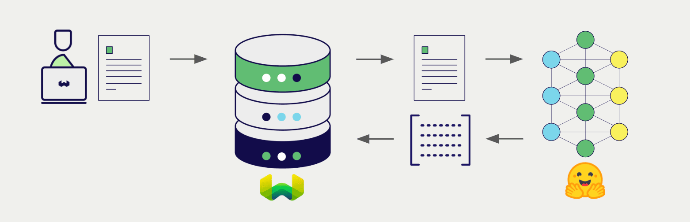

# ローカルホスト Transformers テキスト埋め込み + Weaviate


import Tabs from '@theme/Tabs';
import TabItem from '@theme/TabItem';
import FilteredTextBlock from '@site/src/components/Documentation/FilteredTextBlock';
import PyConnect from '!!raw-loader!../_includes/provider.connect.local.py';
import TSConnect from '!!raw-loader!../_includes/provider.connect.local.ts';
import PyCode from '!!raw-loader!../_includes/provider.vectorizer.py';
import TSCode from '!!raw-loader!../_includes/provider.vectorizer.ts';

Weaviate の Hugging Face Transformers ライブラリとの統合により、Weaviate からモデルの機能に直接アクセスできます。

[Weaviate ベクトル インデックスを構成する](#configure-the-vectorizer) で Transformers 統合を使用し、[Weaviate インスタンスを構成する](#weaviate-configuration) 際にモデル イメージを指定すると、Weaviate は Transformers 推論コンテナ内の指定モデルを用いて各種操作の埋め込みを生成します。この機能は *ベクトライザー* と呼ばれます。

[インポート時](#data-import) には、Weaviate がテキスト オブジェクトの埋め込みを生成してインデックスに保存します。また、[ベクトル](#vector-near-text-search) や [ハイブリッド](#hybrid-search) 検索では、Weaviate がテキスト クエリを埋め込みに変換します。



## 要件

### Weaviate 構成

ご利用の Weaviate インスタンスには、Hugging Face Transformers ベクトライザー統合 (`text2vec-transformers`) モジュールが有効になっている必要があります。

<details>
  <summary>Weaviate Cloud (WCD) 利用者向け</summary>

この統合は Hugging Face モデル用のコンテナを起動する必要があるため、Weaviate Cloud (WCD) のサーバーレス インスタンスでは利用できません。

</details>

#### 統合モジュールの有効化

- [クラスタ メタデータ](/deploy/configuration/meta.md) を確認し、モジュールが有効になっているかどうかを確認します。  
- [モジュールの設定方法](../../configuration/modules.md) ガイドに従い、Weaviate でモジュールを有効化します。

#### 統合の構成

この統合を使用するには、Hugging Face Transformers モデルのコンテナ イメージと、コンテナ化されたモデルの推論エンドポイントを構成します。

以下は、Weaviate で Hugging Face Transformers 統合を構成する例です。

<Tabs groupId="languages">
<TabItem value="docker" label="Docker">

#### Docker オプション 1: 事前構成済み `docker-compose.yml` を使用

[Weaviate Docker インストール コンフィギュレーター](/deploy/installation-guides/docker-installation.md#configurator) の手順に従い、選択したモデル入りの事前構成済み `docker-compose.yml` ファイルをダウンロードしてください。
<br/>

#### Docker オプション 2: 手動で設定を追加

または、下記の例のように `docker-compose.yml` ファイルへ手動で設定を追加します。

```yaml
services:
  weaviate:
    # Other Weaviate configuration
    environment:
      ENABLE_MODULES: text2vec-transformers # Enable this module
      TRANSFORMERS_INFERENCE_API: http://text2vec-transformers:8080  # Set the inference API endpoint
  text2vec-transformers:  # Set the name of the inference container
    image: cr.weaviate.io/semitechnologies/transformers-inference:sentence-transformers-multi-qa-MiniLM-L6-cos-v1
    environment:
      ENABLE_CUDA: 0  # Set to 1 to enable
```

- `TRANSFORMERS_INFERENCE_API` 環境変数は推論 API エンドポイントを指定します  
- `text2vec-transformers` は推論コンテナの名前です  
- `image` はコンテナ イメージです  
- `ENABLE_CUDA` 環境変数で GPU 使用を有効化します  

使用するモデルを指定するには、`image` を [利用可能なモデル一覧](#available-models) から選択してください。

</TabItem>
<TabItem value="k8s" label="Kubernetes">

Weaviate Helm チャートの `values.yaml` ファイル内 `modules` セクションに `text2vec-transformers` モジュールを追加または更新して、Hugging Face Transformers 統合を構成します。例として、`values.yaml` を以下のように修正します。

```yaml
modules:

  text2vec-transformers:

    enabled: true
    tag: sentence-transformers-paraphrase-multilingual-MiniLM-L12-v2
    repo: semitechnologies/transformers-inference
    registry: cr.weaviate.io
    envconfig:
      enable_cuda: true
```

[DPR](https://huggingface.co/docs/transformers/en/model_doc/dpr) モデルをご利用の場合は、`passageQueryServices` 以下のパラメーターも設定してください。

より多くの設定オプションを含む `values.yaml` の例については、[Weaviate Helm チャート](https://github.com/weaviate/weaviate-helm/blob/master/weaviate/values.yaml) を参照してください。

使用するモデルを指定するには、`tag` を [利用可能なモデル一覧](#available-models) から選択してください。

</TabItem>
</Tabs>

### 資格情報

この統合はローカル コンテナで Transformers モデルを実行するため、追加の資格情報 (API キーなど) は不要です。以下の例のように通常どおり Weaviate に接続してください。

<Tabs groupId="languages">

 <TabItem value="py" label="Python API v4">
    <FilteredTextBlock
      text={PyConnect}
      startMarker="# START BasicInstantiation"
      endMarker="# END BasicInstantiation"
      language="py"
    />
  </TabItem>

 <TabItem value="js" label="JS/TS API v3">
    <FilteredTextBlock
      text={TSConnect}
      startMarker="// START BasicInstantiation"
      endMarker="// END BasicInstantiation"
      language="ts"
    />
  </TabItem>

</Tabs>

## ベクトライザーの構成

[Weaviate インデックスを構成](../../manage-collections/vector-config.mdx#specify-a-vectorizer) して、Transformer 推論コンテナを使用するには次のようにします。

<Tabs groupId="languages">
  <TabItem value="py" label="Python API v4">
    <FilteredTextBlock
      text={PyCode}
      startMarker="# START BasicVectorizerTransformers"
      endMarker="# END BasicVectorizerTransformers"
      language="py"
    />
  </TabItem>

  <TabItem value="js" label="JS/TS API v3">
    <FilteredTextBlock
      text={TSCode}
      startMarker="// START BasicVectorizerTransformers"
      endMarker="// END BasicVectorizerTransformers"
      language="ts"
    />
  </TabItem>

</Tabs>

:::note コンテナ イメージを選択してモデルを指定
モデルを選択するには、それをホストする [コンテナ イメージ](#configure-the-integration) を選択してください。
:::

import VectorizationBehavior from '/_includes/vectorization.behavior.mdx';

<details>
  <summary>ベクトル化動作</summary>

<VectorizationBehavior/>

</details>


### ベクトライザーのパラメーター

以下の例では、Transformers 固有のオプションを設定する方法を示します。

#### 推論 URL のパラメーター

スタックに複数の推論コンテナが含まれている場合、使用する推論コンテナをコレクションごとに指定できます。

パラメーターを指定しない場合は、Weaviate 構成で設定されたデフォルトの推論 URL が使用されます。

単一の推論コンテナを指定するには `inferenceUrl` を使用します。

[DPR](https://huggingface.co/docs/transformers/en/model_doc/dpr) モデルを使用している場合は、`passageInferenceUrl` と `queryInferenceUrl` を指定します。

#### 追加パラメーター

- `poolingStrategy` – 入力がモデルのコンテキストウィンドウを超えた場合に使用するプーリング戦略。  
  - デフォルト: `masked_mean`。許可される値: `masked_mean` または `cls`。（[詳細はこちら](https://arxiv.org/abs/1908.10084)）

<Tabs groupId="languages">
  <TabItem value="py" label="Python API v4">
    <FilteredTextBlock
      text={PyCode}
      startMarker="# START FullVectorizerTransformers"
      endMarker="# END FullVectorizerTransformers"
      language="py"
    />
  </TabItem>

  <TabItem value="js" label="JS/TS API v3">
    <FilteredTextBlock
      text={TSCode}
      startMarker="// START FullVectorizerTransformers"
      endMarker="// END FullVectorizerTransformers"
      language="ts"
    />
  </TabItem>

</Tabs>

## データインポート

ベクトライザーを設定したら、Weaviate に[データをインポート](../../manage-objects/import.mdx)します。Weaviate は指定されたモデルを使用してテキストオブジェクトの埋め込みを生成します。

<Tabs groupId="languages">

 <TabItem value="py" label="Python API v4">
    <FilteredTextBlock
      text={PyCode}
      startMarker="# START BatchImportExample"
      endMarker="# END BatchImportExample"
      language="py"
    />
  </TabItem>

 <TabItem value="js" label="JS/TS API v3">
    <FilteredTextBlock
      text={TSCode}
      startMarker="// START BatchImportExample"
      endMarker="// END BatchImportExample"
      language="ts"
    />
  </TabItem>

</Tabs>

:::tip 既存ベクトルの再利用
既に互換性のあるモデルベクトルをお持ちの場合、それを直接 Weaviate に渡すことができます。これは、同じモデルを使って既に埋め込みを生成しており、それらを Weaviate で利用したい場合、たとえば他のシステムからデータを移行するときに便利です。
:::

## 検索

ベクトライザーが設定されると、Weaviate は Transformers 推論コンテナを使用してベクトル検索およびハイブリッド検索を実行します。


### ベクトル（near text）検索

[ベクトル検索](../../search/similarity.md#search-with-text)を実行すると、Weaviate はテキストクエリを指定モデルで埋め込みに変換し、データベースから最も類似したオブジェクトを返します。

次のクエリは、`limit` で設定した数 `n` 件の最も類似したオブジェクトをデータベースから返します。

<Tabs groupId="languages">

 <TabItem value="py" label="Python API v4">
    <FilteredTextBlock
      text={PyCode}
      startMarker="# START NearTextExample"
      endMarker="# END NearTextExample"
      language="py"
    />
  </TabItem>

 <TabItem value="js" label="JS/TS API v3">
    <FilteredTextBlock
      text={TSCode}
      startMarker="// START NearTextExample"
      endMarker="// END NearTextExample"
      language="ts"
    />
  </TabItem>

</Tabs>

### ハイブリッド検索

:::info ハイブリッド検索とは？
ハイブリッド検索は、ベクトル検索とキーワード（BM25）検索を実行し、その後[結果を組み合わせて](../../search/hybrid.md)データベースから最適なオブジェクトを返します。
:::

[ハイブリッド検索](../../search/hybrid.md)を実行すると、Weaviate はテキストクエリを指定モデルで埋め込みに変換し、データベースから最もスコアの高いオブジェクトを返します。

次のクエリは、`limit` で設定した数 `n` 件の最もスコアの高いオブジェクトをデータベースから返します。

<Tabs groupId="languages">

 <TabItem value="py" label="Python API v4">
    <FilteredTextBlock
      text={PyCode}
      startMarker="# START HybridExample"
      endMarker="# END HybridExample"
      language="py"
    />
  </TabItem>

 <TabItem value="js" label="JS/TS API v3">
    <FilteredTextBlock
      text={TSCode}
      startMarker="// START HybridExample"
      endMarker="// END HybridExample"
      language="ts"
    />
  </TabItem>

</Tabs>


## 参照

### 利用可能なモデル

このインテグレーション用に事前構築された Docker イメージの一覧は、以下のタブに掲載されています。 GPU が利用できない場合は、 CPU 推論用に ONNX 対応イメージのご使用を推奨します。

[独自の Docker イメージをビルドすることもできます](./embeddings-custom-image.md)

<Tabs groupId="languages">
<TabItem value="main" label="Single container models">

:::info
これらのモデルは GPU アクセラレーションの恩恵を受けます。 利用可能な環境では、[ Docker もしくは Kubernetes の設定](#weaviate-configuration)で CUDA アクセラレーションを有効にしてください。
:::

<details>
  <summary>全リストを表示</summary>

|モデル名|イメージ名|
|---|---|
|`distilbert-base-uncased` ([Info](https://huggingface.co/distilbert-base-uncased))|`cr.weaviate.io/semitechnologies/transformers-inference:distilbert-base-uncased`|
|`sentence-transformers/paraphrase-multilingual-MiniLM-L12-v2` ([Info](https://huggingface.co/sentence-transformers/paraphrase-multilingual-MiniLM-L12-v2))|`cr.weaviate.io/semitechnologies/transformers-inference:sentence-transformers-paraphrase-multilingual-MiniLM-L12-v2`|
|`sentence-transformers/multi-qa-MiniLM-L6-cos-v1` ([Info](https://huggingface.co/sentence-transformers/multi-qa-MiniLM-L6-cos-v1))|`cr.weaviate.io/semitechnologies/transformers-inference:sentence-transformers-multi-qa-MiniLM-L6-cos-v1`|
|`sentence-transformers/multi-qa-mpnet-base-cos-v1` ([Info](https://huggingface.co/sentence-transformers/multi-qa-mpnet-base-cos-v1))|`cr.weaviate.io/semitechnologies/transformers-inference:sentence-transformers-multi-qa-mpnet-base-cos-v1`|
|`sentence-transformers/all-mpnet-base-v2` ([Info](https://huggingface.co/sentence-transformers/all-mpnet-base-v2))|`cr.weaviate.io/semitechnologies/transformers-inference:sentence-transformers-all-mpnet-base-v2`|
|`sentence-transformers/all-MiniLM-L12-v2` ([Info](https://huggingface.co/sentence-transformers/all-MiniLM-L12-v2))|`cr.weaviate.io/semitechnologies/transformers-inference:sentence-transformers-all-MiniLM-L12-v2`|
|`sentence-transformers/paraphrase-multilingual-mpnet-base-v2` ([Info](https://huggingface.co/sentence-transformers/paraphrase-multilingual-mpnet-base-v2))|`cr.weaviate.io/semitechnologies/transformers-inference:sentence-transformers-paraphrase-multilingual-mpnet-base-v2`|
|`sentence-transformers/all-MiniLM-L6-v2` ([Info](https://huggingface.co/sentence-transformers/all-MiniLM-L6-v2))|`cr.weaviate.io/semitechnologies/transformers-inference:sentence-transformers-all-MiniLM-L6-v2`|
|`sentence-transformers/multi-qa-distilbert-cos-v1` ([Info](https://huggingface.co/sentence-transformers/multi-qa-distilbert-cos-v1))|`cr.weaviate.io/semitechnologies/transformers-inference:sentence-transformers-multi-qa-distilbert-cos-v1`|
|`sentence-transformers/gtr-t5-base` ([Info](https://huggingface.co/sentence-transformers/gtr-t5-base))|`cr.weaviate.io/semitechnologies/transformers-inference:sentence-transformers-gtr-t5-base`|
|`sentence-transformers/gtr-t5-large` ([Info](https://huggingface.co/sentence-transformers/gtr-t5-large))|`cr.weaviate.io/semitechnologies/transformers-inference:sentence-transformers-gtr-t5-large`|
|`google/flan-t5-base` ([Info](https://huggingface.co/google/flan-t5-base))|`cr.weaviate.io/semitechnologies/transformers-inference:google-flan-t5-base`|
|`google/flan-t5-large` ([Info](https://huggingface.co/google/flan-t5-large))|`cr.weaviate.io/semitechnologies/transformers-inference:google-flan-t5-large`|
|`BAAI/bge-small-en-v1.5` ([Info](https://huggingface.co/BAAI/bge-small-en-v1.5))|`cr.weaviate.io/semitechnologies/transformers-inference:baai-bge-small-en-v1.5`|
|`BAAI/bge-base-en-v1.5` ([Info](https://huggingface.co/BAAI/bge-base-en-v1.5))|`cr.weaviate.io/semitechnologies/transformers-inference:baai-bge-base-en-v1.5`|

</details>

</TabItem>
<TabItem value="dpr" label="DPR models">

:::info
[DPR](https://huggingface.co/docs/transformers/en/model_doc/dpr) モデルでは、パッセージエンコーダー用とクエリーエンコーダー用の 2 つの推論コンテナを使用します。 これらのモデルは GPU アクセラレーションの恩恵を受けます。 利用可能な環境では、[ Docker もしくは Kubernetes の設定](#weaviate-configuration)で CUDA アクセラレーションを有効にしてください。
:::

<details>
  <summary>全リストを表示</summary>

|モデル名|イメージ名|
|---|---|
|`facebook/dpr-ctx_encoder-single-nq-base` ([Info](https://huggingface.co/facebook/dpr-ctx_encoder-single-nq-base))|`cr.weaviate.io/semitechnologies/transformers-inference:facebook-dpr-ctx_encoder-single-nq-base`|
|`facebook/dpr-question_encoder-single-nq-base` ([Info](https://huggingface.co/facebook/dpr-question_encoder-single-nq-base))|`cr.weaviate.io/semitechnologies/transformers-inference:facebook-dpr-question_encoder-single-nq-base`|
|`vblagoje/dpr-ctx_encoder-single-lfqa-wiki` ([Info](https://huggingface.co/vblagoje/dpr-ctx_encoder-single-lfqa-wiki))|`cr.weaviate.io/semitechnologies/transformers-inference:vblagoje-dpr-ctx_encoder-single-lfqa-wiki`|
|`vblagoje/dpr-question_encoder-single-lfqa-wiki` ([Info](https://huggingface.co/vblagoje/dpr-question_encoder-single-lfqa-wiki))|`cr.weaviate.io/semitechnologies/transformers-inference:vblagoje-dpr-question_encoder-single-lfqa-wiki`|
|Bar-Ilan University NLP Lab Models|
|`biu-nlp/abstract-sim-sentence` ([Info](https://huggingface.co/biu-nlp/abstract-sim-sentence))|`cr.weaviate.io/semitechnologies/transformers-inference:biu-nlp-abstract-sim-sentence`|
|`biu-nlp/abstract-sim-query` ([Info](https://huggingface.co/biu-nlp/abstract-sim-query))|`cr.weaviate.io/semitechnologies/transformers-inference:biu-nlp-abstract-sim-query`|

</details>

</TabItem>
<TabItem value="snowflake" label="Snowflake">

:::info
Snowflake の [Arctic](https://huggingface.co/collections/Snowflake/arctic-embed-661fd57d50fab5fc314e4c18) 埋め込みモデルも利用できます。 これらのモデルは GPU アクセラレーションの恩恵を受けます。 利用可能な環境では、[ Docker もしくは Kubernetes の設定](#weaviate-configuration)で CUDA アクセラレーションを有効にしてください。
:::

<details>
  <summary>全リストを表示</summary>

|モデル名|イメージ名|
|---|---|
|`Snowflake/snowflake-arctic-embed-xs` ([Info](https://huggingface.co/Snowflake/snowflake-arctic-embed-xs))|`cr.weaviate.io/semitechnologies/transformers-inference:snowflake-snowflake-arctic-embed-xs`|
|`Snowflake/snowflake-arctic-embed-s` ([Info](https://huggingface.co/Snowflake/snowflake-arctic-embed-s))|`cr.weaviate.io/semitechnologies/transformers-inference:snowflake-snowflake-arctic-embed-s`|
|`Snowflake/snowflake-arctic-embed-m` ([Info](https://huggingface.co/Snowflake/snowflake-arctic-embed-m))|`cr.weaviate.io/semitechnologies/transformers-inference:snowflake-snowflake-arctic-embed-m`|
|`Snowflake/snowflake-arctic-embed-l` ([Info](https://huggingface.co/Snowflake/snowflake-arctic-embed-l))|`cr.weaviate.io/semitechnologies/transformers-inference:snowflake-snowflake-arctic-embed-l`|

</details>

</TabItem>
<TabItem value="onnx" label="ONNX (CPU)">

:::info
ONNX 対応イメージは、[ONNX Runtime](https://onnxruntime.ai/docs/) を使用して CPU 上で高速に推論を行います。 ARM64 と AMD64 (AVX2) ハードウェア向けに量子化されています。

イメージ名の末尾が `-onnx` であることが目印です。
:::

<details>
  <summary>全リストを表示</summary>

|モデル名|イメージ名|
|---|---|
|`sentence-transformers/all-MiniLM-L6-v2` ([Info](https://huggingface.co/sentence-transformers/all-MiniLM-L6-v2))|`cr.weaviate.io/semitechnologies/transformers-inference:sentence-transformers-all-MiniLM-L6-v2-onnx`|
|`BAAI/bge-small-en-v1.5` ([Info](https://huggingface.co/BAAI/bge-small-en-v1.5))|`cr.weaviate.io/semitechnologies/transformers-inference:baai-bge-small-en-v1.5-onnx`|
|`BAAI/bge-base-en-v1.5` ([Info](https://huggingface.co/BAAI/bge-base-en-v1.5))|`cr.weaviate.io/semitechnologies/transformers-inference:baai-bge-base-en-v1.5-onnx`|
|`BAAI/bge-m3` ([Info](https://huggingface.co/BAAI/bge-m3))|`cr.weaviate.io/semitechnologies/transformers-inference:baai-bge-m3-onnx`|
|`Snowflake/snowflake-arctic-embed-xs` ([Info](https://huggingface.co/Snowflake/snowflake-arctic-embed-xs))|`cr.weaviate.io/semitechnologies/transformers-inference:snowflake-snowflake-arctic-embed-xs-onnx`|
|`Snowflake/snowflake-arctic-embed-s` ([Info](https://huggingface.co/Snowflake/snowflake-arctic-embed-s))|`cr.weaviate.io/semitechnologies/transformers-inference:snowflake-snowflake-arctic-embed-s-onnx`|
|`Snowflake/snowflake-arctic-embed-m` ([Info](https://huggingface.co/Snowflake/snowflake-arctic-embed-m))|`cr.weaviate.io/semitechnologies/transformers-inference:snowflake-snowflake-arctic-embed-m-onnx`|
|`Snowflake/snowflake-arctic-embed-l` ([Info](https://huggingface.co/Snowflake/snowflake-arctic-embed-l))|`cr.weaviate.io/semitechnologies/transformers-inference:snowflake-snowflake-arctic-embed-l-onnx`|

</details>

</TabItem>
</Tabs>

新しいモデルは随時追加しています。 最新のモデル一覧については、[transformers-inference](https://hub.docker.com/r/semitechnologies/transformers-inference/tags) コンテナの Docker Hub タグをご覧ください。

## 高度な設定

### 推論コンテナを個別に実行する

別の方法として、推論コンテナを Weaviate とは独立して実行することも可能です。 以下の手順に従ってください。

- `text2vec-transformers` を有効にし、[Weaviate の設定](#weaviate-configuration)では `text2vec-transformers` コンテナのパラメーターを省略します  
- たとえば Docker を使用して推論コンテナを別プロセスで実行します  
- 推論コンテナの URL を設定するために、`TRANSFORMERS_INFERENCE_API` または [`inferenceUrl`](#configure-the-vectorizer) を使用します  

たとえば、Docker でコンテナを実行します。

```shell
docker run -itp "8000:8080" semitechnologies/transformers-inference:sentence-transformers-multi-qa-MiniLM-L6-cos-v1
```

その後、`TRANSFORMERS_INFERENCE_API="http://localhost:8000"` を設定します。 Weaviate が同じ Docker ネットワーク、つまり同じ `docker-compose.yml` の一部として実行されている場合は、`TRANSFORMERS_INFERENCE_API=http://text2vec-transformers:8080` のように Docker のネットワーク/DNS 名を利用できます。

## さらなるリソース

### その他の統合

- [Transformers マルチモーダル埋め込みモデル + Weaviate](./embeddings-multimodal.md)
- [Transformers リランカーモデル + Weaviate](./reranker.md)

### チャンク化

この統合では、モデルに渡す前にテキストがモデルの最大 token 長を超えている場合、自動的にチャンク化します。その後、プールされた ベクトル を返します。

具体的な実装については [HuggingFaceVectorizer.vectorizer()](https://github.com/weaviate/text2vec-transformers-models/blob/main/vectorizer.py) を参照してください。

### コード例

コレクションで統合を設定すると、Weaviate におけるデータ管理および検索操作は他のコレクションと同一の方法で動作します。モデルに依存しない以下の例をご覧ください。

- [How-to: コレクションを管理する](../../manage-collections/index.mdx) および [How-to: オブジェクトを管理する](../../manage-objects/index.mdx) ガイドでは、データ操作（つまりコレクションとその内部のオブジェクトの作成、読み取り、更新、削除）の方法を示しています。
- [How-to: クエリ & 検索](../../search/index.mdx) ガイドでは、 ベクトル 、キーワード、ハイブリッド検索のほか、検索拡張生成の実行方法を示しています。

### モデルライセンス

互換性のある各モデルには、それぞれのライセンスがあります。詳細については、使用するモデルのライセンスを [Hugging Face Model Hub](https://huggingface.co/models) で確認してください。

使用目的に対してそのライセンス条件が適切かどうかを評価する責任は、利用者にあります。

### カスタムモデル

カスタムモデルで統合を実行するには、[カスタムイメージガイド](./embeddings-custom-image.md) を参照してください。

### 外部リソース

- Hugging Face [Model Hub](https://huggingface.co/models)

## 質問とフィードバック

import DocsFeedback from '/_includes/docs-feedback.mdx';

<DocsFeedback/>

