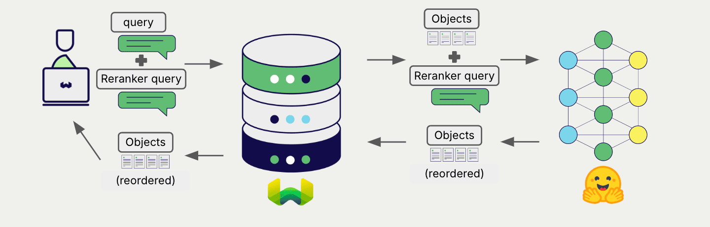

# Weaviate でのローカルホスト Transformers リランカー モデル


import Tabs from '@theme/Tabs';
import TabItem from '@theme/TabItem';
import FilteredTextBlock from '@site/src/components/Documentation/FilteredTextBlock';
import PyConnect from '!!raw-loader!../_includes/provider.connect.py';
import TSConnect from '!!raw-loader!../_includes/provider.connect.ts';
import PyCode from '!!raw-loader!../_includes/provider.reranker.py';
import TSCode from '!!raw-loader!../_includes/provider.reranker.ts';

Weaviate と Hugging Face の Transformers ライブラリを統合することで、そのモデルの機能を Weaviate から直接利用できます。

[Weaviate コレクションを設定](#configure-the-reranker) して Transformers 連携を有効にし、[Weaviate インスタンスを設定](#weaviate-configuration) してモデル イメージを指定すると、Transformers 推論コンテナー内の指定モデルを使用して検索結果をリランクします。

この 2 ステップの処理では、まず Weaviate が検索を実行し、その後で指定したモデルを使って結果をリランクします。



## 要件

### Weaviate の構成

お使いの Weaviate インスタンスには、Transformers リランカー連携モジュール（`reranker-transformers`）が有効になっている必要があります。

<details>
  <summary>Weaviate Cloud (WCD) ユーザー向け</summary>

この連携は Hugging Face モデルを含むコンテナーを起動する必要があるため、Weaviate Cloud (WCD) のサーバーレス インスタンスでは利用できません。

</details>

#### 統合モジュールを有効化する

- [クラスターメタデータ](/deploy/configuration/meta.md) を確認し、モジュールが有効になっているか調べます。  
- [モジュール設定方法](../../configuration/modules.md) のガイドに従い、Weaviate でモジュールを有効にします。

#### 統合の設定

この連携を利用するには、Hugging Face Transformers モデルのコンテナー イメージと、そのコンテナ化モデルの推論エンドポイントを設定します。

以下の例は、Weaviate で Hugging Face Transformers 連携を設定する方法を示しています。

<Tabs groupId="languages">
<TabItem value="docker" label="Docker">

#### Docker オプション 1: 事前設定済み `docker-compose.yml` ファイルを使用

[Weaviate Docker インストール コンフィギュレーター](/deploy/installation-guides/docker-installation.md#configurator) の手順に従い、選択したモデルを含む事前設定済み `docker-compose.yml` ファイルをダウンロードします。  
<br/>

#### Docker オプション 2: 手動で設定を追加

あるいは、下記例のように `docker-compose.yml` ファイルへ設定を手動で追加します。

```yaml
services:
  weaviate:
    # Other Weaviate configuration
    environment:
      RERANKER_INFERENCE_API: http://reranker-transformers:8080  # Set the inference API endpoint
  reranker-transformers:  # Set the name of the inference container
    image: cr.weaviate.io/semitechnologies/reranker-transformers:cross-encoder-ms-marco-MiniLM-L-6-v2
    environment:
      ENABLE_CUDA: 0  # Set to 1 to enable
```

- `RERANKER_INFERENCE_API` 環境変数は推論 API エンドポイントを設定します  
- `reranker-transformers` は推論コンテナーの名前です  
- `image` はコンテナー イメージです  
- `ENABLE_CUDA` 環境変数で GPU 使用を有効化します  

特定のモデルを使用する場合は、`image` に [利用可能なモデル一覧](#available-models) から選択したイメージを設定してください。

</TabItem>
<TabItem value="k8s" label="Kubernetes">

Weaviate Helm チャートの `values.yaml` ファイルの `modules` セクションに `reranker-transformers` モジュールを追加または更新して、Hugging Face Transformers 連携を設定します。例として、`values.yaml` を以下のように変更します。

```yaml
modules:

  reranker-transformers:

    enabled: true
    tag: cross-encoder-ms-marco-MiniLM-L-6-v2
    repo: semitechnologies/reranker-transformers
    registry: cr.weaviate.io
    envconfig:
      enable_cuda: true
```

より多くの設定オプションを含む `values.yaml` の例については、[Weaviate Helm チャート](https://github.com/weaviate/weaviate-helm/blob/master/weaviate/values.yaml) を参照してください。

特定のモデルを使用する場合は、`tag` に [利用可能なモデル一覧](#available-models) から選択したイメージを設定してください。

</TabItem>
</Tabs>

### 認証情報

この連携はローカル コンテナーで Transformers モデルを実行するため、追加の認証情報（API キーなど）は不要です。以下の例のように通常どおり Weaviate に接続してください。

<Tabs groupId="languages">

 <TabItem value="py" label="Python API v4">
    <FilteredTextBlock
      text={PyConnect}
      startMarker="# START BasicInstantiation"
      endMarker="# END BasicInstantiation"
      language="py"
    />
  </TabItem>

 <TabItem value="js" label="JS/TS API v3">
    <FilteredTextBlock
      text={TSConnect}
      startMarker="// START BasicInstantiation"
      endMarker="// END BasicInstantiation"
      language="ts"
    />
  </TabItem>

</Tabs>

## リランカーの設定

import MutableRerankerConfig from '/_includes/mutable-reranker-config.md';

<MutableRerankerConfig />

Transformers リランカー モデルを使用するように Weaviate コレクションを次のように設定します。

<Tabs groupId="languages">
  <TabItem value="py" label="Python API v4">
    <FilteredTextBlock
      text={PyCode}
      startMarker="# START RerankerTransformersBasic"
      endMarker="# END RerankerTransformersBasic"
      language="py"
    />
  </TabItem>

  <TabItem value="js" label="JS/TS API v3">
    <FilteredTextBlock
      text={TSCode}
      startMarker="// START RerankerTransformersBasic"
      endMarker="// END RerankerTransformersBasic"
      language="ts"
    />
  </TabItem>

</Tabs>

:::note モデル選択用コンテナーイメージ
モデルを選択するには、それをホストする [コンテナー イメージ](#configure-the-integration) を選択してください。
:::


## リランキング クエリ

リランカーを構成すると、 Weaviate は指定されたリランカー・モデルを使用して[ リランキング処理 ](../../search/rerank.md)を実行します。

より具体的には、 Weaviate は最初に検索を行い、その後に指定されたモデルを用いて結果をリランキングします。

Weaviate の任意の検索はリランカーと組み合わせることでリランキング処理を実行できます。


<Tabs groupId="languages">

 <TabItem value="py" label="Python API v4">
    <FilteredTextBlock
      text={PyCode}
      startMarker="# START RerankerQueryExample"
      endMarker="# END RerankerQueryExample"
      language="py"
    />
  </TabItem>

 <TabItem value="js" label="JS/TS API v3">
    <FilteredTextBlock
      text={TSCode}
      startMarker="// START RerankerQueryExample"
      endMarker="// END RerankerQueryExample"
      language="ts"
    />
  </TabItem>

</Tabs>

## 参考情報

### 利用可能なモデル

- `cross-encoder/ms-marco-MiniLM-L-6-v2`
- `cross-encoder/ms-marco-MiniLM-L-2-v2`
- `cross-encoder/ms-marco-TinyBERT-L-2-v2`

これらの事前学習済みモデルは Hugging Face でオープンソース公開されています。たとえば、 `cross-encoder/ms-marco-MiniLM-L-6-v2` モデルは、 [ MS-MARCO ](https://microsoft.github.io/msmarco/) 上で評価した際に、最も大きいモデル (L-12) とほぼ同じベンチマーク性能 (39.01 vs. 39.02) を提供します。

モデルのサポートは随時追加しています。利用可能なモデルの最新リストは、 [ reranker-transformers ](https://hub.docker.com/r/semitechnologies/reranker-transformers/tags) コンテナの Docker Hub タグを参照してください。

## 追加リソース

### その他の統合

- [Transformers 埋め込みモデル + Weaviate](./embeddings.md)
- [Transformers マルチモーダル埋め込みモデル + Weaviate](./embeddings-multimodal.md)

### コード例

コレクションで統合を設定すると、 Weaviate におけるデータ管理および検索操作は他のコレクションと同様に機能します。モデル非依存の次の例をご覧ください。

- [ ハウツー: コレクションの管理 ](../../manage-collections/index.mdx) および [ ハウツー: オブジェクトの管理 ](../../manage-objects/index.mdx) ガイドでは、データ操作 (コレクションおよびその中のオブジェクトの作成・読み取り・更新・削除) の方法を紹介しています。
- [ ハウツー: クエリ & 検索 ](../../search/index.mdx) ガイドでは、ベクトル、キーワード、ハイブリッド検索に加え、検索拡張生成の実行方法を説明しています。

## 質問とフィードバック

import DocsFeedback from '/_includes/docs-feedback.mdx';

<DocsFeedback/>

