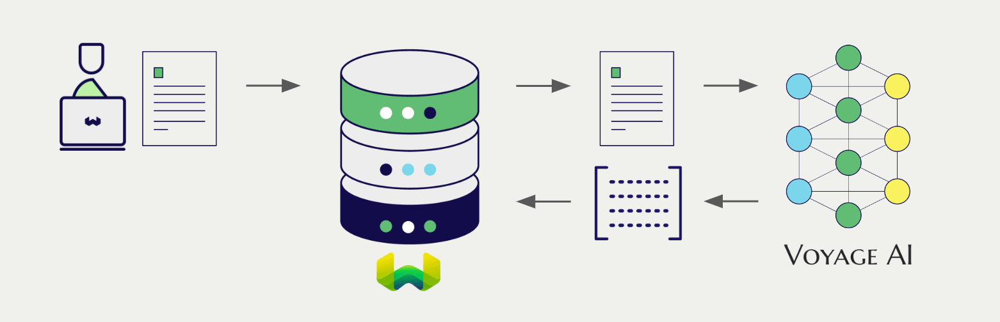
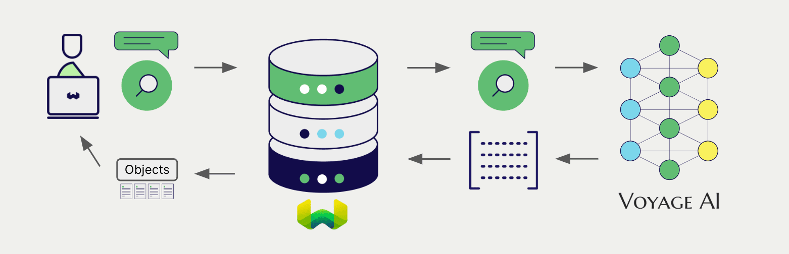

import Tabs from '@theme/Tabs';
import TabItem from '@theme/TabItem';
import FilteredTextBlock from '@site/src/components/Documentation/FilteredTextBlock';
import PyConnect from '!!raw-loader!../_includes/provider.connect.py';
import TSConnect from '!!raw-loader!../_includes/provider.connect.ts';
import PyCode from '!!raw-loader!../_includes/provider.vectorizer.py';
import TSCode from '!!raw-loader!../_includes/provider.vectorizer.ts';

# Weaviate での VoyageAI マルチモーダル埋め込み

:::info `v1.25.28`、`v1.26.12`、`1.27.8` で追加
:::

Weaviate と VoyageAI の API 連携により、Weaviate から直接モデルの機能へアクセスできます。

[Weaviate ベクトルインデックスを構成](#configure-the-vectorizer) して VoyageAI の埋め込みモデルを使用すると、指定したモデルとお持ちの VoyageAI API キーを用いて、さまざまな操作のための埋め込みを Weaviate が生成します。この機能は *ベクトライザー* と呼ばれます。

この統合は VoyageAI の「interleaving」入力モードをサポートしていません。このタイプの利用方法では、[このガイド](../../starter-guides/custom-vectors.mdx) で示すようにオブジェクトと共に自己生成したベクトルをインポートしてください。

[インポート時](#data-import) に、Weaviate はマルチモーダルオブジェクト埋め込みを生成し、インデックスへ保存します。[ベクトル](#vector-near-text-search) および [ハイブリッド](#hybrid-search) 検索操作では、Weaviate がテキストクエリを埋め込みへ変換します。[マルチモーダル検索操作](#vector-near-media-search) もサポートされています。

## 要件

### Weaviate の設定

ご利用の Weaviate インスタンスは VoyageAI ベクトライザー統合 (`multi2vec-voyageai`) モジュールが有効になっている必要があります。

  
Weaviate Cloud (WCD) のユーザー向け

この統合は Weaviate Cloud (WCD) のサーバーレスインスタンスでデフォルトで有効になっています。

  
セルフホストユーザー向け

- モジュールが有効かどうかを確認するには、[クラスターメタデータ](/deploy/configuration/meta.md) をご確認ください。
- Weaviate でモジュールを有効化する手順は、[モジュール設定方法](../../configuration/modules.md) ガイドをご覧ください。

### API 資格情報

この統合には、有効な VoyageAI API キーを Weaviate に提供する必要があります。[VoyageAI](https://voyageai.com/) でサインアップし、API キーを取得してください。

次のいずれかの方法で Weaviate に API キーを渡します。

- Weaviate が参照できる `VOYAGEAI_APIKEY` 環境変数を設定する。
- 以下の例のように実行時に API キーを渡す。

<Tabs groupId="languages">

 <TabItem value="py" label="Python API v4">
    <FilteredTextBlock
      text={PyConnect}
      startMarker="# START VoyageAIInstantiation"
      endMarker="# END VoyageAIInstantiation"
      language="py"
    />
  </TabItem>

 <TabItem value="js" label="JS/TS API v3">
    <FilteredTextBlock
      text={TSConnect}
      startMarker="// START VoyageAIInstantiation"
      endMarker="// END VoyageAIInstantiation"
      language="ts"
    />
  </TabItem>

</Tabs>

## ベクトライザーを構成する

VoyageAI の埋め込みモデルを使用するように、[Weaviate インデックスを構成](../../manage-collections/vector-config.mdx#specify-a-vectorizer) します。

<Tabs groupId="languages">
  <TabItem value="py" label="Python API v4">
    <FilteredTextBlock
      text={PyCode}
      startMarker="# START BasicMMVectorizerVoyageAI"
      endMarker="# END BasicMMVectorizerVoyageAI"
      language="py"
    />
  </TabItem>

  <TabItem value="js" label="JS/TS API v3">
    <FilteredTextBlock
      text={TSCode}
      startMarker="// START BasicMMVectorizerVoyageAI"
      endMarker="// END BasicMMVectorizerVoyageAI"
      language="ts"
    />
  </TabItem>

</Tabs>

### モデルを選択する

以下の設定例のように、[利用可能なモデル](#available-models) のいずれかをベクトライザーに指定できます。

<Tabs groupId="languages">
  <TabItem value="py" label="Python API v4">
    <FilteredTextBlock
      text={PyCode}
      startMarker="# START MMVectorizerVoyageAICustomModel"
      endMarker="# END MMVectorizerVoyageAICustomModel"
      language="py"
    />
  </TabItem>

  <TabItem value="js" label="JS/TS API v3">
    <FilteredTextBlock
      text={TSCode}
      startMarker="// START MMVectorizerVoyageAICustomModel"
      endMarker="// END MMVectorizerVoyageAICustomModel"
      language="ts"
    />
  </TabItem>

</Tabs>

Weaviate に使用させるモデルは、[ベクトライザーのパラメーター](#vectorizer-parameters) で [利用可能なモデル](#available-models) のいずれかを指定できます。指定がない場合は [デフォルトモデル](#available-models) が使用されます。

import VectorizationBehavior from '/_includes/vectorization.behavior.mdx';

  
ベクトル化の動作

<VectorizationBehavior/>

### ベクトライザーのパラメーター

以下の例は、 VoyageAI 固有のオプションを設定する方法を示します。

<Tabs groupId="languages">
  <TabItem value="py" label="Python API v4">
    <FilteredTextBlock
      text={PyCode}
      startMarker="# START FullMMVectorizerVoyageAI"
      endMarker="# END FullMMVectorizerVoyageAI"
      language="py"
    />
  </TabItem>

  <TabItem value="js" label="JS/TS API v3">
    <FilteredTextBlock
      text={TSCode}
      startMarker="// START FullMMVectorizerVoyageAI"
      endMarker="// END FullMMVectorizerVoyageAI"
      language="ts"
    />
  </TabItem>

</Tabs>

モデル パラメーターの詳細については、[VoyageAI API ドキュメント](https://docs.voyageai.com/docs/multimodal-embeddings) を参照してください。

## ヘッダー パラメーター

リクエストの追加ヘッダーを使って、実行時に API キーと任意パラメーターを提供できます。  
利用可能なヘッダーは次のとおりです:

- `X-VoyageAI-Api-Key`: VoyageAI の API キー。  
- `X-VoyageAI-Baseurl`: 既定の VoyageAI URL の代わりに使用するベース URL (例: プロキシ)。

実行時に追加ヘッダーを指定した場合、既存の Weaviate 設定を上書きします。

ヘッダーは上記の [API 資格情報の例](#api-credentials) のとおりに指定してください。

## データのインポート

ベクトライザーを設定した後、 Weaviate に [データをインポート](../../manage-objects/import.mdx) します。 Weaviate は、指定したモデルを使用してテキスト オブジェクトの埋め込みを生成します。

<Tabs groupId="languages">

 <TabItem value="py" label="Python API v4">
    <FilteredTextBlock
      text={PyCode}
      startMarker="# START MMBatchImportExample"
      endMarker="# END MMBatchImportExample"
      language="py"
    />
  </TabItem>

 <TabItem value="js" label="JS/TS API v3">
    <FilteredTextBlock
      text={TSCode}
      startMarker="// START MMBatchImportExample"
      endMarker="// END MMBatchImportExample"
      language="ts"
    />
  </TabItem>

</Tabs>

:::tip 既存ベクトルの再利用
すでに互換性のあるモデル ベクトルがある場合は、それを直接 Weaviate に渡すことができます。同じモデルで既に埋め込みを生成しており、それらを Weaviate で利用したい場合 (他システムからデータを移行する際など) に便利です。
:::

## 検索

ベクトライザーを設定すると、 Weaviate は指定した VoyageAI モデルを使用してベクトル検索とハイブリッド検索を実行します。

### ベクトル (near text) 検索

[ベクトル検索](../../search/similarity.md#search-with-text) を実行すると、 Weaviate はテキスト クエリを指定したモデルで埋め込みに変換し、データベースから最も類似したオブジェクトを返します。

次のクエリは、`limit` で指定した数 (`n`) の最も類似したオブジェクトをデータベースから返します。

<Tabs groupId="languages">

 <TabItem value="py" label="Python API v4">
    <FilteredTextBlock
      text={PyCode}
      startMarker="# START NearTextExample"
      endMarker="# END NearTextExample"
      language="py"
    />
  </TabItem>

 <TabItem value="js" label="JS/TS API v3">
    <FilteredTextBlock
      text={TSCode}
      startMarker="// START NearTextExample"
      endMarker="// END NearTextExample"
      language="ts"
    />
  </TabItem>

</Tabs>

### ハイブリッド検索

:::info ハイブリッド検索とは
ハイブリッド検索は、ベクトル検索とキーワード (BM25) 検索を実行し、その結果を [組み合わせる](../../search/hybrid.md) ことでデータベースから最適なオブジェクトを返します。
:::

[ハイブリッド検索](../../search/hybrid.md) を実行すると、 Weaviate はテキスト クエリを指定したモデルで埋め込みに変換し、データベースからスコアが最も高いオブジェクトを返します。

次のクエリは、`limit` で指定した数 (`n`) のスコアが最も高いオブジェクトをデータベースから返します。

<Tabs groupId="languages">

 <TabItem value="py" label="Python API v4">
    <FilteredTextBlock
      text={PyCode}
      startMarker="# START HybridExample"
      endMarker="# END HybridExample"
      language="py"
    />
  </TabItem>

 <TabItem value="js" label="JS/TS API v3">
    <FilteredTextBlock
      text={TSCode}
      startMarker="// START HybridExample"
      endMarker="// END HybridExample"
      language="ts"
    />
  </TabItem>

</Tabs>

### ベクトル (near media) 検索

[near image 検索](../../search/similarity.md#search-with-image) のようなメディア検索を実行すると、 Weaviate は指定したモデルを使用してクエリを埋め込みに変換し、データベースから最も類似したオブジェクトを返します。

near image 検索などの near media 検索を行うには、メディアクエリを base64 文字列に変換し、それを検索クエリに渡します。

以下のクエリは、`limit` で設定した n 件の入力画像に最も類似したオブジェクトをデータベースから返します。

<Tabs groupId="languages">

 <TabItem value="py" label="Python API v4">
    <FilteredTextBlock
      text={PyCode}
      startMarker="# START NearImageExample"
      endMarker="# END NearImageExample"
      language="py"
    />
  </TabItem>

 <TabItem value="js" label="JS/TS API v3">
    <FilteredTextBlock
      text={TSCode}
      startMarker="// START NearImageExample"
      endMarker="// END NearImageExample"
      language="ts"
    />
  </TabItem>

</Tabs>

## リファレンス

### 利用可能なモデル

- `voyage-multimodal-3` （デフォルト）

## 追加リソース

### その他の統合

- [VoyageAI テキスト埋め込みモデル + Weaviate](./embeddings.md).
- [VoyageAI reranker モデル + Weaviate](./reranker.md).

### コード例

統合をコレクションに設定すると、 Weaviate でのデータ管理および検索操作は他のコレクションと同じ手順で行えます。以下のモデル非依存の例をご覧ください。

- [How-to: コレクションを管理する](../../manage-collections/index.mdx) と [How-to: オブジェクトを管理する](../../manage-objects/index.mdx) では、コレクションおよびその中のオブジェクトの作成、読み取り、更新、削除といったデータ操作方法を説明しています。
- [How-to: クエリ & 検索](../../search/index.mdx) では、ベクトル検索、キーワード検索、ハイブリッド検索に加え、検索拡張生成の実行方法を説明しています。

### 外部リソース

- VoyageAI [Multimodal Embed API ドキュメント](https://docs.voyageai.com/docs/multimodal-embeddings)

## 質問とフィードバック

import DocsFeedback from '/_includes/docs-feedback.mdx';

<DocsFeedback/>

