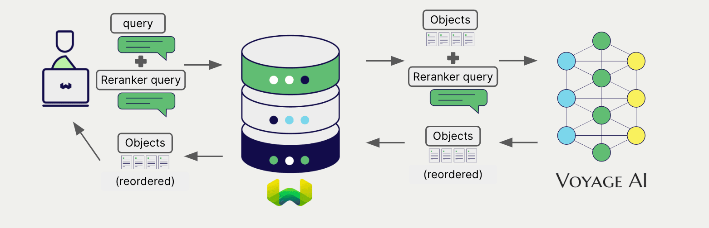

<!-- Note: for images, use https://docs.google.com/presentation/d/15opIcJuaIjEEcs_1Zm8B6pccox2p7_MHSjCnRv4dPfU/edit?usp=sharing -->

Voyage AI は自然言語処理向けに幅広いモデルを提供しています。 Weaviate は Voyage AI の API とシームレスに統合されており、ユーザーは Weaviate Database から直接 Voyage AI のモデルを利用できます。

これらの統合により、開発者は高度な AI ドリブンアプリケーションを簡単に構築できます。

## Voyage AI との統合

### ベクトル検索向け埋め込みモデル

Voyage AI の埋め込みモデルはテキストデータをベクトル埋め込みへ変換し、意味と文脈を捉えます。

[Weaviate は Voyage AI の埋め込みモデル](./embeddings.md) と [マルチモーダル埋め込みモデル](./embeddings-multimodal.md) に対応しており、データをシームレスにベクトル化できます。この統合により、追加の前処理やデータ変換を行わずにセマンティック検索やハイブリッド検索を実行できます。

- [Voyage AI 埋め込み統合ページ](./embeddings.md)
- [Voyage AI マルチモーダル埋め込み統合ページ](./embeddings-multimodal.md)

### リランカー モデル

Voyage AI のリランカーモデルは検索結果の関連性と順位を改善するよう設計されています。

[Weaviate のリランカー統合](./reranker.md) を利用すると、Voyage AI のリランカーモデルで検索結果を簡単に洗練できます。

[Voyage AI リランカー統合ページ](./reranker.md)

## まとめ

これらの統合により、開発者は Weaviate 内から直接 Voyage AI の強力なモデルを活用できます。

その結果、AI ドリブンアプリケーションの開発プロセスが簡素化され、開発スピードが向上し、革新的なソリューションの創出に専念できます。

## はじめに

これらの統合を利用するには、有効な Voyage AI の API キーを Weaviate に設定する必要があります。 [Voyage AI](https://www.voyageai.com/) にアクセスしてサインアップし、API キーを取得してください。

その後、該当する統合ページで Voyage AI のモデルを Weaviate に設定する方法を確認し、アプリケーションで使い始めましょう。

- [テキスト埋め込み](./embeddings.md)
- [マルチモーダル埋め込み](./embeddings-multimodal.md)
- [リランカー](./reranker.md)

## 質問とフィードバック

import DocsFeedback from '/_includes/docs-feedback.mdx';

<DocsFeedback/>

