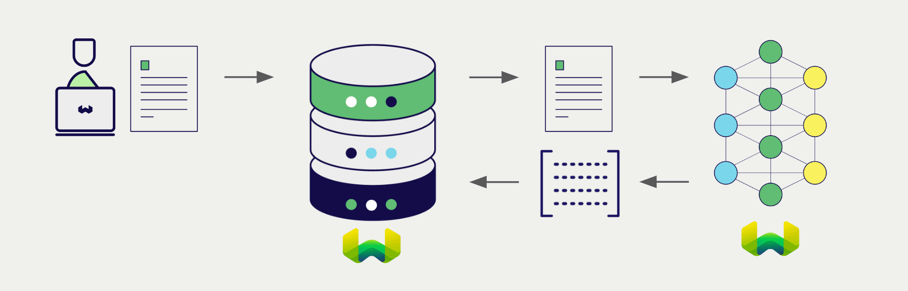
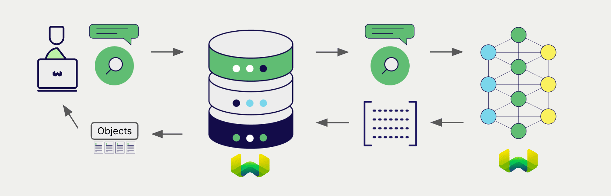

:::info `1.27.10`, `1.28.3`, `1.29.0` で追加
:::

# Weaviate Embeddings

import Tabs from '@theme/Tabs';
import TabItem from '@theme/TabItem';
import FilteredTextBlock from '@site/src/components/Documentation/FilteredTextBlock';
import PyConnect from '!!raw-loader!../_includes/provider.connect.weaviate.py';
import TSConnect from '!!raw-loader!../_includes/provider.connect.weaviate.ts';
import GoConnect from '!!raw-loader!/_includes/code/howto/go/docs/model-providers/1-connect-weaviate-embeddings/main.go';
import JavaConnect from '!!raw-loader!/_includes/code/howto/java/src/test/java/io/weaviate/docs/model_providers/ConnectWeaviateEmbeddingsTest.java';
import PyCode from '!!raw-loader!../_includes/provider.vectorizer.py';
import TSCode from '!!raw-loader!../_includes/provider.vectorizer.ts';
import GoCode from '!!raw-loader!/_includes/code/howto/go/docs/model-providers/2-usage-text/main.go';
import JavaCode from '!!raw-loader!/_includes/code/howto/java/src/test/java/io/weaviate/docs/model_providers/UsageWeaviateTextEmbeddingsArcticEmbedLV20.java';
import JavaImportQueries from '!!raw-loader!/_includes/code/howto/java/src/test/java/io/weaviate/docs/model_providers/ImportAndQueries.java';

Weaviate Embeddings のモデルは Weaviate Cloud インスタンスから直接アクセスできます。

[Weaviate ベクトルインデックスを設定](#configure-the-vectorizer) すると、指定したモデルとお客様の Weaviate API キーを用いて Weaviate が各種操作のために埋め込みを生成します。この機能は *ベクトライザー* と呼ばれます。

[インポート時](#data-import) に Weaviate はテキストオブジェクトの埋め込みを生成し、インデックスに保存します。[ベクトル](#vector-near-text-search) および [ハイブリッド](#hybrid-search) 検索操作では、Weaviate がテキストクエリを埋め込みに変換します。

## 必要条件

import Requirements from '/_includes/weaviate-embeddings-requirements.mdx';

<Requirements />

### Weaviate の設定

Weaviate Embeddings ベクトライザーは Weaviate Cloud インスタンスでのみご利用いただけます。現時点では、自己ホスト環境では Weaviate Embeddings をご利用いただけません。

### API 資格情報

Weaviate Embeddings は Weaviate Cloud と統合されています。お客様の Weaviate Cloud 資格情報が、Weaviate Cloud インスタンスによる Weaviate Embeddings へのアクセス認可に使用されます。

<Tabs groupId="languages">

 <TabItem value="py" label="Python API v4">
    <FilteredTextBlock
      text={PyConnect}
      startMarker="# START WeaviateInstantiation"
      endMarker="# END WeaviateInstantiation"
      language="py"
    />
  </TabItem>

 <TabItem value="js" label="JS/TS API v3">
    <FilteredTextBlock
      text={TSConnect}
      startMarker="// START WeaviateInstantiation"
      endMarker="// END WeaviateInstantiation"
      language="ts"
    />
  </TabItem>

  <TabItem value="go" label="Go">
    <FilteredTextBlock
      text={GoConnect}
      startMarker="// START WeaviateInstantiation"
      endMarker="// END WeaviateInstantiation"
      language="goraw"
    />
  </TabItem>

  <TabItem value="java" label="Java">
    <FilteredTextBlock
      text={JavaConnect}
      startMarker="// START WeaviateInstantiation"
      endMarker="// END WeaviateInstantiation"
      language="javaraw"
    />
  </TabItem>

</Tabs>

## ベクトライザーの設定

次のように [Weaviate インデックスを設定](../../manage-collections/vector-config.mdx#specify-a-vectorizer) して、Weaviate Embeddings モデルを使用します。

<Tabs groupId="languages">
  <TabItem value="py" label="Python API v4">
    <FilteredTextBlock
      text={PyCode}
      startMarker="# START BasicVectorizerWeaviate"
      endMarker="# END BasicVectorizerWeaviate"
      language="py"
    />
  </TabItem>

  <TabItem value="js" label="JS/TS API v3">
    <FilteredTextBlock
      text={TSCode}
      startMarker="// START BasicVectorizerWeaviate"
      endMarker="// END BasicVectorizerWeaviate"
      language="ts"
    />
  </TabItem>

  <TabItem value="go" label="Go">
    <FilteredTextBlock
      text={GoCode}
      startMarker="// START BasicVectorizerWeaviate"
      endMarker="// END BasicVectorizerWeaviate"
      language="goraw"
    />
  </TabItem>

  <TabItem value="java" label="Java">
    <FilteredTextBlock
      text={JavaCode}
      startMarker="// START BasicVectorizerWeaviate"
      endMarker="// END BasicVectorizerWeaviate"
      language="java"
    />
  </TabItem>

</Tabs>

### モデルの選択

以下の設定例に示すように、ベクトライザーで使用する [利用可能なモデル](#available-models) のいずれかを指定できます。

<Tabs groupId="languages">
  <TabItem value="py" label="Python API v4">
    <FilteredTextBlock
      text={PyCode}
      startMarker="# START VectorizerWeaviateCustomModel"
      endMarker="# END VectorizerWeaviateCustomModel"
      language="py"
    />
  </TabItem>

  <TabItem value="js" label="JS/TS API v3">
    <FilteredTextBlock
      text={TSCode}
      startMarker="// START VectorizerWeaviateCustomModel"
      endMarker="// END VectorizerWeaviateCustomModel"
      language="ts"
    />
  </TabItem>

  <TabItem value="go" label="Go">
    <FilteredTextBlock
      text={GoCode}
      startMarker="// START VectorizerWeaviateCustomModel"
      endMarker="// END VectorizerWeaviateCustomModel"
      language="goraw"
    />
  </TabItem>

  <TabItem value="java" label="Java">
    <FilteredTextBlock
      text={JavaCode}
      startMarker="// START VectorizerWeaviateCustomModel"
      endMarker="// END VectorizerWeaviateCustomModel"
      language="java"
    />
  </TabItem>

</Tabs>

Weaviate に対して使用する [利用可能なモデル](#available-models) のいずれかを[指定](#vectorizer-parameters)できます。モデルを指定しない場合は、[デフォルトモデル](#available-models) が使用されます。

import VectorizationBehavior from '/_includes/vectorization.behavior.mdx';

  
ベクトル化の挙動

<VectorizationBehavior/>

### ベクトライザーのパラメーター

import WeaviateEmbeddingsVectorizerParameters from '/_includes/weaviate-embeddings-vectorizer-parameters.mdx';

<WeaviateEmbeddingsVectorizerParameters />

## データのインポート

ベクトライザーの設定後、Weaviate に[データをインポート](../../manage-objects/import.mdx)します。Weaviate は、指定されたモデルを使用してテキストオブジェクトの埋め込み (embedding) を生成します。

<Tabs groupId="languages">

  <TabItem value="py" label="Python API v4">
    <FilteredTextBlock
      text={PyCode}
      startMarker="# START BatchImportExample"
      endMarker="# END BatchImportExample"
      language="py"
    />
  </TabItem>

  <TabItem value="js" label="JS/TS API v3">
    <FilteredTextBlock
      text={TSCode}
      startMarker="// START BatchImportExample"
      endMarker="// END BatchImportExample"
      language="ts"
    />
  </TabItem>

  <TabItem value="go" label="Go">
    <FilteredTextBlock
      text={GoCode}
      startMarker="// START BatchImportExample"
      endMarker="// END BatchImportExample"
      language="goraw"
    />
  </TabItem>

  <TabItem value="java" label="Java">
    <FilteredTextBlock
      text={JavaImportQueries}
      startMarker="// START BatchImportExample"
      endMarker="// END BatchImportExample"
      language="java"
    />
  </TabItem>

</Tabs>

:::tip 既存ベクトルの再利用
互換性のあるモデルの ベクトル が既にある場合は、それを直接 Weaviate に渡すことができます。同じモデルで埋め込みをすでに生成しており、別のシステムからデータを移行する際に Weaviate で再利用したい場合などに便利です。
:::

## 検索

ベクトライザーが設定されると、Weaviate は指定された WED モデルを使用して ベクトル 検索およびハイブリッド検索を実行します。

### ベクトル (near text) 検索

[ベクトル検索](../../search/similarity.md#search-with-text) を実行すると、Weaviate はテキストクエリを指定されたモデルで埋め込みに変換し、データベースから最も類似したオブジェクトを返します。

`limit` で設定した値に基づき、以下のクエリはデータベースから `n` 件の最も類似したオブジェクトを返します。

<Tabs groupId="languages">

  <TabItem value="py" label="Python API v4">
    <FilteredTextBlock
      text={PyCode}
      startMarker="# START NearTextExample"
      endMarker="# END NearTextExample"
      language="py"
    />
  </TabItem>

  <TabItem value="js" label="JS/TS API v3">
    <FilteredTextBlock
      text={TSCode}
      startMarker="// START NearTextExample"
      endMarker="// END NearTextExample"
      language="ts"
    />
  </TabItem>

 <TabItem value="go" label="Go">
    <FilteredTextBlock
      text={GoCode}
      startMarker="// START NearTextExample"
      endMarker="// END NearTextExample"
      language="goraw"
    />
  </TabItem>

  <TabItem value="java" label="Java">
    <FilteredTextBlock
      text={JavaImportQueries}
      startMarker="// START NearTextExample"
      endMarker="// END NearTextExample"
      language="java"
    />
  </TabItem>

</Tabs>

### ハイブリッド検索

:::info ハイブリッド検索とは？
ハイブリッド検索では、ベクトル検索とキーワード ( BM25 ) 検索を実行し、その結果を[組み合わせて](../../search/hybrid.md)データベースから最適なオブジェクトを返します。
:::

ハイブリッド検索を実行すると、Weaviate は指定されたモデルを使用してテキストクエリをエンベディングに変換し、データベースからスコアの高いオブジェクトを返します。

以下のクエリは、`limit` で指定された `n` 個のスコアが最も高いオブジェクトをデータベースから返します。

<Tabs groupId="languages">

 <TabItem value="py" label="Python API v4">
    <FilteredTextBlock
      text={PyCode}
      startMarker="# START HybridExample"
      endMarker="# END HybridExample"
      language="py"
    />
  </TabItem>

 <TabItem value="js" label="JS/TS API v3">
    <FilteredTextBlock
      text={TSCode}
      startMarker="// START HybridExample"
      endMarker="// END HybridExample"
      language="ts"
    />
  </TabItem>

 <TabItem value="go" label="Go">
    <FilteredTextBlock
      text={GoCode}
      startMarker="// START HybridExample"
      endMarker="// END HybridExample"
      language="goraw"
    />
  </TabItem>

  <TabItem value="java" label="Java">
    <FilteredTextBlock
      text={JavaImportQueries}
      startMarker="// START HybridExample"
      endMarker="// END HybridExample"
      language="java"
    />
  </TabItem>
</Tabs>

## 参考資料

### 利用可能なモデル

import WeaviateEmbeddingsModels from '/_includes/weaviate-embeddings-models.mdx';

<WeaviateEmbeddingsModels />

## さらに詳しい情報

### コード例

コレクションでインテグレーションを設定すると、Weaviate でのデータ管理および検索操作は他のコレクションと同じ方法で行えます。以下のモデル非依存の例をご覧ください:

- [How-to: Manage collections](../../manage-collections/index.mdx) と [How-to: Manage objects](../../manage-objects/index.mdx) のガイドでは、データ操作（コレクションおよび内部のオブジェクトの作成、読み取り、更新、削除）の方法を示しています。
- [How-to: Query & Search](../../search/index.mdx) のガイドでは、検索操作（ベクトル、キーワード、ハイブリッド）および 検索拡張生成 の方法を示しています。

### 参考資料

- Weaviate Embeddings [ドキュメント](/cloud/embeddings)

## 質問とフィードバック

import DocsFeedback from '/_includes/docs-feedback.mdx';

<DocsFeedback/>

