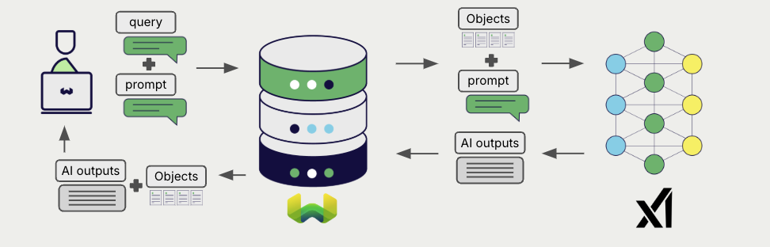

# Weaviate での xAI 生成 AI

:::info `v1.30.0` で追加
:::

import Tabs from '@theme/Tabs';
import TabItem from '@theme/TabItem';
import FilteredTextBlock from '@site/src/components/Documentation/FilteredTextBlock';
import PyConnect from '!!raw-loader!../_includes/provider.connect.py';
import TSConnect from '!!raw-loader!../_includes/provider.connect.ts';
import PyCode from '!!raw-loader!../_includes/provider.generative.py';
import TSCode from '!!raw-loader!../_includes/provider.generative.ts';

Weaviate と xAI の API の統合により、xAI のモデル機能へ Weaviate から直接アクセスできます。

[Weaviate コレクションを設定](#configure-collection)して、xAI の生成 AI モデルを使用してください。Weaviate は指定したモデルを用いて 検索拡張生成 (RAG) を実行し、xAI API キーを使用します。

より具体的には、Weaviate が検索を実行し、最も関連性の高いオブジェクトを取得した後、それらを xAI 上の生成モデルへ渡して出力を生成します。



## 要件

### Weaviate の設定

ご利用の Weaviate インスタンスには、xAI 生成 (`generative-xai`) モジュールが設定されている必要があります。

<details>
  <summary>Weaviate Cloud (WCD) ユーザー向け</summary>

この統合は Weaviate Cloud (WCD) のサーバーレスインスタンスではデフォルトで有効になっています。

</details>

<details>
  <summary>セルフホストユーザー向け</summary>

- モジュールが有効かどうかを確認するには、[クラスターメタデータ](/deploy/configuration/meta.md)をチェックしてください。  
- Weaviate でモジュールを有効にするには、[モジュール設定方法](../../configuration/modules.md)ガイドに従ってください。

</details>

### API 認証情報

この統合を利用するには、有効な API キーを Weaviate に提供する必要があります。サインアップし API キーを取得するには [xAI](https://console.x.ai/) にアクセスしてください。

以下のいずれかの方法で API キーを Weaviate に渡します。

- Weaviate から参照可能な `XAI_APIKEY` 環境変数を設定する  
- 以下の例のように、実行時に API キーを渡す  

<Tabs groupId="languages">

 <TabItem value="py" label="Python API v4">
    <FilteredTextBlock
      text={PyConnect}
      startMarker="# START XaiInstantiation"
      endMarker="# END XaiInstantiation"
      language="py"
    />
  </TabItem>

 <TabItem value="js" label="JS/TS API v3">
    <FilteredTextBlock
      text={TSConnect}
      startMarker="// START XaiInstantiation"
      endMarker="// END XaiInstantiation"
      language="ts"
    />
  </TabItem>

</Tabs>

## コレクションの設定

import MutableGenerativeConfig from '/_includes/mutable-generative-config.md';

<MutableGenerativeConfig />

[Weaviate インデックスを設定](../../manage-collections/generative-reranker-models.mdx#specify-a-generative-model-integration)して、xAI の生成 AI モデルを使用するには次のようにします。

<Tabs groupId="languages">
  <TabItem value="py" label="Python API v4">
    <FilteredTextBlock
      text={PyCode}
      startMarker="# START BasicGenerativexAI"
      endMarker="# END BasicGenerativexAI"
      language="py"
    />
  </TabItem>

  <TabItem value="js" label="JS/TS API v3">
    <FilteredTextBlock
      text={TSCode}
      startMarker="// START BasicGenerativexAI"
      endMarker="// END BasicGenerativexAI"
      language="ts"
    />
  </TabItem>

</Tabs>

### モデルを選択

Weaviate で使用する [利用可能なモデル](#available-models) のいずれかを、次の設定例のように指定できます。

<Tabs groupId="languages">
  <TabItem value="py" label="Python API v4">
    <FilteredTextBlock
      text={PyCode}
      startMarker="# START GenerativexAICustomModel"
      endMarker="# END GenerativexAICustomModel"
      language="py"
    />
  </TabItem>

  <TabItem value="js" label="JS/TS API v3">
    <FilteredTextBlock
      text={TSCode}
      startMarker="// START GenerativexAICustomModel"
      endMarker="// END GenerativexAICustomModel"
      language="ts"
    />
  </TabItem>

</Tabs>

[利用可能なモデル](#available-models) のいずれかを[指定](#generative-parameters)できます。モデルを指定しない場合は [デフォルトモデル](#available-models) が使用されます。

### 生成パラメーター

モデルの挙動をカスタマイズするために、以下の生成パラメーターを設定します。

<Tabs groupId="languages">
  <TabItem value="py" label="Python API v4">
    <FilteredTextBlock
      text={PyCode}
      startMarker="# START FullGenerativexAI"
      endMarker="# END FullGenerativexAI"
      language="py"
    />
  </TabItem>

  <TabItem value="js" label="JS/TS API v3">
    <FilteredTextBlock
      text={TSCode}
      startMarker="// START FullGenerativexAI"
      endMarker="// END FullGenerativexAI"
      language="ts"
    />
  </TabItem>

</Tabs>

モデルパラメーターの詳細については、[xAI API ドキュメント](https://docs.x.ai/docs/guides/chat#parameters)を参照してください。

## 実行時のモデル選択

コレクションを作成する際にデフォルトのモデルプロバイダーを設定するだけでなく、クエリ実行時に上書きすることもできます。

<Tabs groupId="languages">
  <TabItem value="py" label="Python API v4">
    <FilteredTextBlock
      text={PyCode}
      startMarker="# START RuntimeModelSelectionxAI"
      endMarker="# END RuntimeModelSelectionxAI"
      language="py"
    />
  </TabItem>
  <TabItem value="js" label="JS/TS Client v3">

```ts
// TS support coming soon
```

  </TabItem>
</Tabs>

## 検索拡張生成

生成 AI 連携を設定した後、[シングルプロンプト](#single-prompt) または [グループタスク](#grouped-task) の方法で RAG 操作を実行します。

### シングルプロンプト


検索結果内の各オブジェクトに対してテキストを生成するには、シングルプロンプト方式を使用します。

以下の例では、`limit` パラメーターで指定された `n` 件の検索結果それぞれに対して出力を生成します。

シングルプロンプトクエリを作成する際、`{}` を使用して、言語モデルに渡したいオブジェクトのプロパティを補完します。たとえば、オブジェクトの `title` プロパティを渡すには、クエリ内に `{title}` を含めます。

<Tabs groupId="languages">

 <TabItem value="py" label="Python API v4">
    <FilteredTextBlock
      text={PyCode}
      startMarker="# START SinglePromptExample"
      endMarker="# END SinglePromptExample"
      language="py"
    />
  </TabItem>

 <TabItem value="js" label="JS/TS API v3">
    <FilteredTextBlock
      text={TSCode}
      startMarker="// START SinglePromptExample"
      endMarker="// END SinglePromptExample"
      language="ts"
    />
  </TabItem>

</Tabs>

### グループタスク


検索結果全体に対して 1 つのテキストを生成するには、グループタスク方式を使用します。

言い換えると、`n` 件の検索結果がある場合、生成モデルはそのグループ全体に対して 1 つの出力を生成します。

<Tabs groupId="languages">

 <TabItem value="py" label="Python API v4">
    <FilteredTextBlock
      text={PyCode}
      startMarker="# START GroupedTaskExample"
      endMarker="# END GroupedTaskExample"
      language="py"
    />
  </TabItem>

 <TabItem value="js" label="JS/TS API v3">
    <FilteredTextBlock
      text={TSCode}
      startMarker="// START GroupedTaskExample"
      endMarker="// END GroupedTaskExample"
      language="ts"
    />
  </TabItem>

</Tabs>

## 参考資料

### 利用可能なモデル

Weaviate では [xAI の API](https://docs.x.ai/docs/models) 上の任意の生成モデルを使用できます。

デフォルトモデルは `grok-2-latest` です。

## 追加リソース

### コード例

コレクションでインテグレーションを設定すると、Weaviateでのデータ管理および検索操作は他のコレクションと同様に動作します。モデルに依存しない次の例をご覧ください:

- [How-to: コレクションの管理](../../manage-collections/index.mdx) と [How-to: オブジェクトの管理](../../manage-objects/index.mdx) の各ガイドでは、コレクションおよびその中のオブジェクトに対する作成・読み取り・更新・削除といったデータ操作の方法を説明しています。
- [How-to: クエリ & 検索](../../search/index.mdx) ガイドでは、ベクトル、キーワード、ハイブリッド検索に加えて 検索拡張生成 を実行する方法を示しています。

### 参考資料

- [xAI API ドキュメント](https://docs.x.ai/docs/introduction)

import DocsFeedback from '/_includes/docs-feedback.mdx';

<DocsFeedback/>

