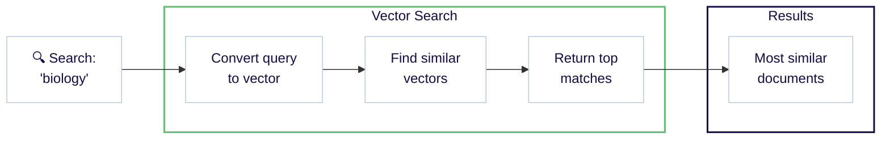
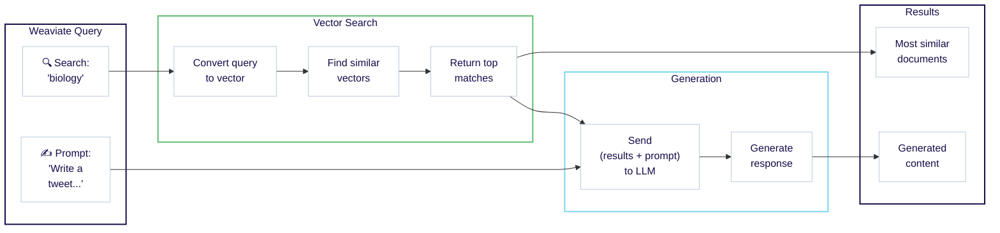

import Tabs from '@theme/Tabs';
import TabItem from '@theme/TabItem';
import SkipLink from '/src/components/SkipValidationLink'

<span class="badge badge--secondary">想定所要時間: 30 分</span> <span class="badge badge--secondary">前提条件: なし</span>
<br/><br/>

:::info 学習内容

このクイックスタートでは、Weaviate Cloud と Cohere を組み合わせて次のことを行う方法を説明します。

1. Weaviate インスタンスをセットアップします。（10 分）
1. データを追加して ベクトル 化します。（10 分）
1. セマンティック検索と 検索拡張生成 (RAG) を実行します。（10 分）

```mermaid
flowchart LR
    %% Define nodes with white backgrounds and darker borders
    A1["Create Weaviate<br> Sandbox"] --> A2["Install client<br> library"]
    A2 --> A3["Connect to<br> Weaviate"]
    A3 --> B1["Define collection<br> (with an inference API)"]
    B1 --> B2["Batch import<br> objects"]
    B2 --> C1["Semantic search<br> (nearText)"]
    C1 --> C2["RAG<br> (Generate)"]

    %% Group nodes in subgraphs with brand colors
    subgraph sg1 ["1\. Setup"]
        A1
        A2
        A3
    end

    subgraph sg2 ["2\. Populate"]
        B1
        B2
    end

    subgraph sg3 ["3\. Query"]
        C1
        C2
    end

    %% Style nodes with white background and darker borders
    style A1 fill:#ffffff,stroke:#B9C8DF,color:#130C49
    style A2 fill:#ffffff,stroke:#B9C8DF,color:#130C49
    style A3 fill:#ffffff,stroke:#B9C8DF,color:#130C49
    style B1 fill:#ffffff,stroke:#B9C8DF,color:#130C49
    style B2 fill:#ffffff,stroke:#B9C8DF,color:#130C49
    style C1 fill:#ffffff,stroke:#B9C8DF,color:#130C49
    style C2 fill:#ffffff,stroke:#B9C8DF,color:#130C49

    %% Style subgraphs with brand colors
    style sg1 fill:#ffffff,stroke:#61BD73,stroke-width:2px,color:#130C49
    style sg2 fill:#ffffff,stroke:#130C49,stroke-width:2px,color:#130C49
    style sg3 fill:#ffffff,stroke:#7AD6EB,stroke-width:2px,color:#130C49
```



Notes:

- ここにあるコード例は自己完結型です。コピー＆ペーストしてご自身の環境でお試しください。
<!-- - Python users can try [our Jupyter notebook](https://github.com/weaviate-tutorials/quickstart/blob/main/quickstart_end_to_end.ipynb) locally or on [Google Colab](https://colab.research.google.com/github/weaviate-tutorials/quickstart/blob/main/quickstart_end_to_end.ipynb). -->
- ローカルホスト環境を使用したい場合は、[Quickstart: locally hosted](./local.md) をご覧ください。

:::

### 必要なもの

最後のステップで 検索拡張生成 (RAG) を行うには、[Cohere](https://dashboard.cohere.com/) アカウントが必要です。無料の Cohere トライアル API キーを使用できます。

別の [モデル プロバイダー](/weaviate/model-providers) をお持ちの場合は、Cohere の代わりにそちらを使用できます。

<hr/>

## ステップ 1: Weaviate のセットアップ

### 1.1 Weaviate データベースの作成

[Weaviate Cloud コンソール](https://console.weaviate.cloud) にアクセスし、無料の Sandbox インスタンスを作成します。

<div style={{position: "relative", paddingBottom: "calc(54.10879629629629% + 50px)", height: 0}}>
  <iframe 
    id="xrgwlygc1p" 
    src="https://app.guideflow.com/embed/xrgwlygc1p" 
    width="100%" 
    height="100%" 
    style={{overflow: "hidden", position: "absolute", border: "none"}} 
    scrolling="no" 
    allow="clipboard-read; clipboard-write" 
    webKitAllowFullScreen 
    mozAllowFullScreen 
    allowFullScreen 
    allowTransparency="true"
  />
  <script src="https://app.guideflow.com/assets/opt.js" data-iframe-id="xrgwlygc1p"></script>
</div>

<br/>

:::note

- クラスターのプロビジョニングには通常 1〜3 分かかります。
- クラスターが準備完了になると、Weaviate Cloud はクラスター名の横にチェックマーク (✔️) を表示します。
- 一意性を確保するため、Weaviate Cloud はサンドボックスクラスター名にランダムなサフィックスを付与します。

:::

import LatestWeaviateVersion from '/\_includes/latest-weaviate-version.mdx';

<LatestWeaviateVersion />

### 1.2 クライアントライブラリーのインストール

Weaviate を操作するには クライアントライブラリー の使用をお勧めします。以下の手順に従って、[Python](../client-libraries/python/index.mdx)、[JavaScript/TypeScript](../client-libraries/typescript/index.mdx)、[Go](../client-libraries/go.md)、[Java](../client-libraries/java.md) の公式クライアントライブラリーをインストールしてください。

import CodeClientInstall from '/\_includes/code/quickstart/clients.install.mdx';

<CodeClientInstall />

### 1.3 Weaviate への接続

これで、ご自身の Weaviate インスタンスに接続できます。接続には次の情報が必要です:

- **REST エンドポイント URL**
- **Administrator API キー**

これらは、下記のインタラクティブ例のように [WCD コンソール](https://console.weaviate.cloud) から取得できます。

:::note

Weaviate バージョン `v1.30` 以降で作成した新しいクラスターでは、デフォルトで [RBAC](/weaviate/configuration/rbac/index.mdx) が有効になっています。これらのクラスターには API キーが含まれていないため、ご自身で API キーを作成し、`admin`、`viewer` もしくはカスタムロールを割り当てる必要があります。 

:::

<div style={{position: "relative", paddingBottom: "calc(54.10879629629629% + 50px)", height: 0}}>
  <iframe 
    id="mk6zxyws6p" 
    src="https://app.guideflow.com/embed/mk6zxyws6p" 
    width="100%" 
    height="100%" 
    style={{overflow: "hidden", position: "absolute", border: "none"}} 
    scrolling="no" 
    allow="clipboard-read; clipboard-write" 
    webKitAllowFullScreen 
    mozAllowFullScreen 
    allowFullScreen 
    allowTransparency="true"
  />
  <script src="https://app.guideflow.com/assets/opt.js" data-iframe-id="mk6zxyws6p"></script>
</div>

<br/>

:::info REST と gRPC エンドポイント

Weaviate は REST と gRPC の両方のプロトコルをサポートしています。Weaviate Cloud でデプロイする場合は REST エンドポイント URL のみを指定すれば、クライアントが自動的に gRPC を設定します。

:::

REST エンドポイント URL と admin API キー を取得したら、サンドボックスインスタンスに接続し、Weaviate を操作できます。

下の例では、Weaviate に接続してクラスターのステータスを確認するなど、基本的な操作を行う方法を示しています。

import ConnectIsReady from '/\_includes/code/quickstart/quickstart.is_ready.mdx'

<ConnectIsReady />

エラーが表示されなければ準備完了です。次のステップでは、この簡単なクラスター ステータス チェックを、より実用的な操作に置き換えていきます。

<hr/>
## ステップ 2: データベースへのデータ投入

まずコレクションを定義し、その後データを追加することで、データベースを投入できます。

### 2.1 コレクションの定義

:::info コレクションとは？

コレクションは、同じデータ構造を共有するオブジェクトの集合で、リレーショナルデータベースのテーブルや NoSQL データベースのコレクションのようなものです。さらに、データオブジェクトの保存方法やインデックス方法を定義する追加設定も含みます。

:::

次の例では、`Question` という _コレクション_ を作成します。

- 取り込み時とクエリ実行時にベクトルを生成するための [Weaviate Embeddings](/weaviate/model-providers/weaviate/embeddings.md) サービス
- 検索拡張生成 (RAG) 用の Cohere [生成 AI 連携](/weaviate/model-providers/cohere/generative.md)

import CreateCollection from '/\_includes/code/quickstart/quickstart.create_collection.mdx'

<CreateCollection />

このコードを実行して、データを追加できるコレクションを作成してください。

:::info どのモデルが使われているの？

コレクション定義でモデルを指定することも可能です。上記の定義ではモデルを指定していないため、これらの連携は Weaviate で定義されたデフォルトモデルを使用します。  
<br/>

詳細は [モデルプロバイダー連携](../model-providers/index.md) をご覧ください。

:::

<details>
  <summary>別のセットアップをご希望ですか？</summary>

Weaviate は非常に柔軟です。別のモデルプロバイダー連携を利用したい場合や、独自のベクトルをインポートしたい場合は、次のガイドをご覧ください。

<div class="row">
  <div class="col col--6 margin-top--xs padding-top--xs">
    <div class="card">
      <div class="card__header">
        <h4>別のモデルプロバイダーを利用したい？</h4>
      </div>
      <div class="card__body">
        AWS、Cohere、Google など他のプロバイダーを使用する方法については、<Link to="#can-i-use-different-integrations">こちら</Link>のセクションをご確認ください。
      </div>
    </div>
  </div>
  <div class="col col--6 margin-top--xs padding-top--xs">
    <div class="card">
      <div class="card__header">
        <h4>オブジェクトベクトルを指定したい？</h4>
      </div>
      <div class="card__body">
        オブジェクトデータと一緒にご自身でベクトルを追加したい場合は、<Link to="/weaviate/starter-guides/custom-vectors">Starter Guide: Bring Your Own Vectors</Link> をご覧ください。
      </div>
    </div>
  </div>
</div>

</details>

### 2.2 オブジェクトの追加

それでは、コレクションにデータを追加しましょう。

次の例では、

- オブジェクトを読み込み、
- バッチ処理を用いて対象コレクション（`Question`）にオブジェクトを追加します。

:::tip バッチインポート

([バッチインポート](../manage-objects/import.mdx)) は複数のオブジェクトを 1 回のリクエストで送信するため、大量データを追加する最も効率的な方法です。詳細は [How-to: Batch import](../manage-objects/import.mdx) ガイドをご覧ください。

:::

import ImportObjects from '/\_includes/code/quickstart/quickstart.import_objects.mdx'

<ImportObjects />

このコードを実行してデモデータを追加してください。

<hr/>

## ステップ 3: クエリ

Weaviate には、適切なデータを見つけるためのさまざまなクエリツールがあります。ここではいくつかの検索を試してみましょう。

### 3.1 セマンティック検索 {#semantic-search}

セマンティック検索は意味に基づいて結果を探します。Weaviate では `nearText` と呼ばれます。

次の例では、`biology` の意味に最も近い 2 件のオブジェクトを検索します。

import QueryNearText from '/\_includes/code/quickstart/quickstart.query.neartext.mdx'

<QueryNearText />

このコードを実行してクエリを行ってください。クエリ結果には `DNA` と `species` のエントリーが見つかりました。

<details>
  <summary>JSON 形式の完全なレスポンス例</summary>

```json
{
  {
    "answer": "DNA",
    "question": "In 1953 Watson & Crick built a model of the molecular structure of this, the gene-carrying substance",
    "category": "SCIENCE"
  },
  {
    "answer": "species",
    "question": "2000 news: the Gunnison sage grouse isn't just another northern sage grouse, but a new one of this classification",
    "category": "SCIENCE"
  }
}
```

</details>

完全なレスポンスを確認すると、`biology` という単語はどこにも含まれていないことが分かります。

それでも Weaviate は生物学関連のエントリーを返しました。これは意味を捉えた _ベクトル埋め込み_ によって実現されています。内部では、セマンティック検索はベクトル、またはベクトル埋め込みによって支えられています。

以下は Weaviate におけるワークフローを示した図です。



:::info ベクトルはどこから来たの？

取り込み時に各オブジェクトに対して **Weaviate Embeddings** サービスがベクトル埋め込みを生成しました。クエリ時には、`biology` も同様にベクトルへ変換されています。

前述のとおり、これは任意です。ご自身でベクトルを提供したい場合は [Starter Guide: Bring Your Own Vectors](/weaviate/starter-guides/custom-vectors.mdx) をご覧ください。

:::

:::tip さらに多様な検索タイプ

Weaviate では多くの検索タイプが利用可能です。例えば、[類似度検索](../search/similarity.md)、[キーワード検索](../search/bm25.md)、[ハイブリッド検索](../search/hybrid.md)、[フィルター検索](../search/filters.md) の How-to ガイドをご参照ください。

:::
### 3.2 検索拡張生成

検索拡張生成（RAG、または 生成検索）は、大規模言語モデル（ LLMs ）などの生成 AI モデルの力と、データベースが持つ最新かつ正確な情報を組み合わせます。

RAG は、_ユーザー クエリ_ と _データベースから取得したデータ_ を組み合わせて、大規模言語モデル（ LLM ）にプロンプトを送ることで機能します。

この図は Weaviate における RAG のワークフローを示しています。



次の例では、同じ検索（`biology`）をツイート生成のプロンプトと組み合わせています。

import QueryRAG from '/\_includes/code/quickstart/quickstart.query.rag.mdx'

<QueryRAG />

:::info Cohere API key in the header

このコードには Cohere API キー用の追加ヘッダーが含まれています。Weaviate はこのキーを使用して Cohere の生成 AI モデルにアクセスし、検索拡張生成（RAG）を実行します。

:::

このコードを実行してクエリを行ってください。以下は一例です（結果は毎回異なる可能性があります）。

```text
🧬 In 1953 Watson & Crick built a model of the molecular structure of DNA, the gene-carrying substance! 🧬🔬

🦢 2000 news: the Gunnison sage grouse isn't just another northern sage grouse, but a new species! 🦢🌿 #ScienceFacts #DNA #SpeciesClassification
```

レスポンスは新規の内容でありながら、どこか見覚えがあるはずです。これは、[セマンティック検索](#semantic-search) セクションで `DNA` や `species` のエントリーを既にご覧いただいたためです。

RAG の強みは、ご自身のデータを変換できる点にあります。Weaviate は、わずか数行のコードで検索と生成を組み合わせられるよう支援します。

<hr/>

## まとめ

このクイックスタート ガイドでは、次のことを行いました。

- Weaviate Cloud 上に Serverless Weaviate サンドボックス インスタンスを作成しました。  
- コレクションを定義し、データを追加しました。  
- 以下を含むクエリを実行しました。  
  - セマンティック検索  
  - 検索拡張生成  

次に何をするかはあなた次第です。以下にいくつかの推奨ステップとリソースを示します。

<hr/>

## 次のステップ

<div class="container margin-top--xs padding-top--xs">
  <div class="row">
    <div class="col col--6 margin-bottom--md">
      <div class="card">
        <div class="card__header">
          <h4>検索の詳細</h4>
        </div>
        <div class="card__body">
          <p>
            <Link to="/weaviate/search">検索の実行方法</Link>、<Link to="/weaviate/search/bm25">キーワード</Link>、<Link to="/weaviate/search/similarity">類似度</Link>、<Link to="/weaviate/search/hybrid">ハイブリッド</Link>、<Link to="/weaviate/search/image">画像</Link>、<Link to="/weaviate/search/filters">フィルター</Link>、<Link to="/weaviate/search/rerank">リランク</Link> 検索などをご覧ください。
          </p>
        </div>
      </div>
    </div>
    <div class="col col--6 margin-bottom--md">
      <div class="card">
        <div class="card__header">
          <h4>データ管理</h4>
        </div>
        <div class="card__body">
          <p>
            <Link to="/weaviate/manage-collections">コレクション管理</Link>、<Link to="/weaviate/manage-objects/create">オブジェクト作成</Link>、<Link to="/weaviate/manage-objects/import">バッチ インポート</Link>、<Link to="/weaviate/manage-collections/multi-tenancy">マルチテナンシー</Link> など、データ管理方法をご覧ください。
          </p>
        </div>
      </div>
    </div>
    <div class="col col--6 margin-bottom--md">
      <div class="card">
        <div class="card__header">
          <h4>RAG</h4>
        </div>
        <div class="card__body">
          <p>
            <Link to="/weaviate/starter-guides/generative">スターター ガイド：検索拡張生成</Link> と <Link to="/academy">Weaviate Academy</Link> の <Link to="/academy/py/standalone/chunking">チャンク化</Link> ユニットをチェックしてください。
          </p>
        </div>
      </div>
    </div>
    <div class="col col--6 margin-bottom--md">
      <div class="card">
        <div class="card__header">
          <h4>ワークショップとオフィスアワー</h4>
        </div>
        <div class="card__body">
          <p>
          さまざまなレベル向けの <Link to="https://weaviate.io/community/events">ワークショップ、オフィスアワー、イベント</Link> を対面およびオンラインで開催しています。ぜひご参加ください！
          </p>
        </div>
      </div>
    </div>
  </div>
</div>

<hr/>

## FAQ とトラブルシューティング

よくある質問や発生しうる問題への回答を以下に示します。

### 質問

#### 異なる統合を使用できますか？

<details>
  <summary>回答を見る</summary>

この例では `Weaviate Embeddings` と `Cohere` 推論 API を使用していますが、他のものも利用できます。

埋め込みや生成 AI の統合を変更したい場合は、次の手順を行ってください。

- 使用中の Weaviate インスタンスに対象の Weaviate モジュールが存在することを確認する  
- ご希望の統合に合わせてコレクション定義を変更する  
- 統合に必要な API キーを正しく使用する（必要な場合）  

詳細は [モデルプロバイダーの統合](../model-providers/index.md) セクションをご覧ください。

</details>
### トラブルシューティング

#### <code>Error: Name 'Question' already used as a name for an Object class</code> が表示される場合

<details>
  <summary>回答を見る</summary>

このエラーは、すでに存在するコレクションを作成しようとしたときに発生することがあります。その場合は、以下の手順に従ってコレクションを削除してください。

import CautionSchemaDeleteClass from '/\_includes/schema-delete-class.mdx'

<CautionSchemaDeleteClass />

</details>

#### コレクションが作成されたか確認する方法

<details>
  <summary>回答を見る</summary>

コレクションが作成されたかどうか不明な場合は、<SkipLink href="/weaviate/api/rest#tag/schema">`schema`</SkipLink> エンドポイントを確認してください。

WEAVIATE_INSTANCE_URL を、お使いのインスタンスの REST エンドポイント URL に置き換えてください:

```
https://WEAVIATE_INSTANCE_URL/v1/schema
```

次のようなレスポンスが返ります:

```json
{
    "classes": [
        {
            "class": "Question",
            ...  // truncated additional information here
            "vectorizer": "text2vec-weaviate"
        }
    ]
}
```

ここで、スキーマに `Question` コレクションが追加されていることを確認できます。

:::note REST & GraphQL in Weaviate

Weaviate では RESTful API と GraphQL API が組み合わさって使用されます。RESTful API エンドポイントはデータの追加やインスタンス情報の取得に、GraphQL インターフェースはデータの取得に利用できます。

:::

</details>

#### データのインポートを確認する方法

<details>
  <summary>回答を見る</summary>

データが正しくインポートされたか確認するには、<SkipLink href="/weaviate/api/rest#tag/objects">`objects`</SkipLink> エンドポイントを参照し、すべてのオブジェクトが取り込まれているかを確認します。

WEAVIATE_INSTANCE_URL を、お使いのインスタンスの REST エンドポイント URL に置き換えてください:

```
https://WEAVIATE_INSTANCE_URL/v1/objects
```

次のようなレスポンスが返ります:

```json
{
    "deprecations": null,
    "objects": [
        ...  // Details of each object
    ],
    "totalResults": 10  // You should see 10 results here
}
```

ここで、`10` 個すべてのオブジェクトがインポートされていることを確認できます。

</details>

#### `nearText` 検索が機能しない場合

<details>
  <summary>回答を見る</summary>

テキストベース ( `nearText` ) の類似検索を行うには、ベクトライザーが有効になっており、コレクションで設定されている必要があります。

ベクトライザーが [こちら](#21-define-a-collection) のように設定されていることを確認してください。

それでも検索が機能しない場合は、[お問い合わせください](#questions-and-feedback)。

</details>

## 質問とフィードバック

import DocsFeedback from '/\_includes/docs-feedback.mdx';

<DocsFeedback/>