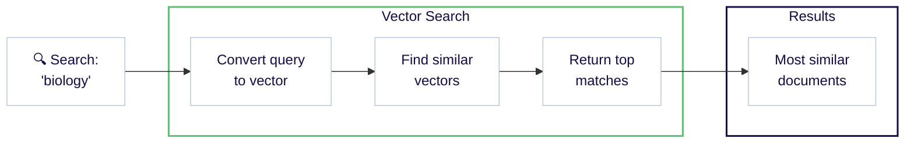
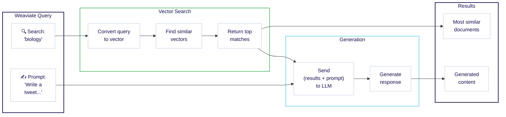

import Tabs from '@theme/Tabs';
import TabItem from '@theme/TabItem';
import SkipLink from '/src/components/SkipValidationLink'

<span class="badge badge--secondary">所要時間: 30 分</span> <span class="badge badge--secondary">前提条件: なし</span>
<br/><br/>

:::info 学習内容

このクイックスタートでは、オープンソースの Weaviate と Ollama を組み合わせて次のことを行います:

1. Weaviate インスタンスをセットアップします。 (10 分)
1. データを追加し、ベクトル化します。 (10 分)
1. セマンティック検索と検索拡張生成 (RAG) を実行します。 (10 分)

```mermaid
flowchart LR
    %% Define nodes with white backgrounds and darker borders
    A1["Run Weaviate<br> with Docker"] --> A2["Install client<br> library"]
    A2 --> A3["Connect to<br> Weaviate"]
    A3 --> B1["Define collection<br> (with Ollama)"]
    B1 --> B2["Batch import<br> objects"]
    B2 --> C1["Semantic search<br> (nearText)"]
    C1 --> C2["RAG<br> (Generate)"]

    %% Group nodes in subgraphs with brand colors
    subgraph sg1 ["1\. Setup"]
        A1
        A2
        A3
    end

    subgraph sg2 ["2\. Populate"]
        B1
        B2
    end

    subgraph sg3 ["3\. Query"]
        C1
        C2
    end

    %% Style nodes with white background and darker borders
    style A1 fill:#ffffff,stroke:#B9C8DF,color:#130C49
    style A2 fill:#ffffff,stroke:#B9C8DF,color:#130C49
    style A3 fill:#ffffff,stroke:#B9C8DF,color:#130C49
    style B1 fill:#ffffff,stroke:#B9C8DF,color:#130C49
    style B2 fill:#ffffff,stroke:#B9C8DF,color:#130C49
    style C1 fill:#ffffff,stroke:#B9C8DF,color:#130C49
    style C2 fill:#ffffff,stroke:#B9C8DF,color:#130C49

    %% Style subgraphs with brand colors
    style sg1 fill:#ffffff,stroke:#61BD73,stroke-width:2px,color:#130C49
    style sg2 fill:#ffffff,stroke:#130C49,stroke-width:2px,color:#130C49
    style sg3 fill:#ffffff,stroke:#7AD6EB,stroke-width:2px,color:#130C49
```



注意:

- ここに掲載しているコード例は自己完結型です。ご自身の環境にコピー & ペーストしてお試しください。
<!-- - Python users can try [our Jupyter notebook](https://github.com/weaviate-tutorials/quickstart/blob/main/quickstart_end_to_end.ipynb) locally or on [Google Colab](https://colab.research.google.com/github/weaviate-tutorials/quickstart/blob/main/quickstart_end_to_end.ipynb). -->
- クラウドベースのリソースを使用したい場合は、[クイックスタート: クラウドリソース](./local.md) をご覧ください。
:::

<!-- Vectors are mathematical representations of data objects, which enable similarity-based searches in vector databases like Weaviate. -->

### 前提条件

始める前に、お使いのマシンに [Docker](https://docs.docker.com/get-started/get-docker/) と [Ollama](https://ollama.com/download) をインストールしてください。

次に、`nomic-embed-text` と `llama3.2` の各モデルをダウンロードするために、以下のコマンドを実行します。

```bash
ollama pull nomic-embed-text
ollama pull llama3.2
```

Weaviate と言語モデルはローカルで実行します。少なくとも 8GB、可能であれば 16GB 以上の RAM を搭載した最新のコンピューターを推奨します。

<hr/>

## ステップ 1: Weaviate のセットアップ

### 1.1 Weaviate データベースの作成

次のコードをプロジェクトディレクトリにある `docker-compose.yml` というファイルに保存します。

```yaml
---
services:
  weaviate:
    command:
    - --host
    - 0.0.0.0
    - --port
    - '8080'
    - --scheme
    - http
    image: cr.weaviate.io/semitechnologies/weaviate:||site.weaviate_version||
    ports:
    - 8080:8080
    - 50051:50051
    volumes:
    - weaviate_data:/var/lib/weaviate
    restart: on-failure:0
    environment:
      QUERY_DEFAULTS_LIMIT: 25
      AUTHENTICATION_ANONYMOUS_ACCESS_ENABLED: 'true'
      PERSISTENCE_DATA_PATH: '/var/lib/weaviate'
      ENABLE_API_BASED_MODULES: 'true'
      ENABLE_MODULES: 'text2vec-ollama,generative-ollama'
      CLUSTER_HOSTNAME: 'node1'
volumes:
  weaviate_data:
...
```

以下のコマンドを実行して、Docker で Weaviate インスタンスを起動します。

```bash
docker-compose up -d
```

### 1.2 クライアントライブラリーのインストール

Weaviate を操作するには [クライアントライブラリー](../client-libraries/index.mdx) の利用を推奨します。以下の手順に従って、公式クライアントライブラリー ( [Python](../client-libraries/python/index.mdx)、[JavaScript/TypeScript](../client-libraries/typescript/index.mdx)、[Go](../client-libraries/go.md)、[Java](../client-libraries/java.md) ) のいずれかをインストールしてください。

import CodeClientInstall from '/_includes/code/quickstart/clients.install.mdx';

<CodeClientInstall />

### 1.3 Weaviate への接続

これで Weaviate インスタンスに接続できます。

以下の例では、Weaviate に接続し、クラスターのステータスを確認する基本的な操作を行います。

import ConnectIsReady from '/_includes/code/quickstart/local.quickstart.is_ready.mdx'

<ConnectIsReady />

エラーが表示されなければ、次へ進む準備ができています。次のステップでは、この簡単なステータスチェックをより実用的な操作に置き換えていきます。

<hr/>

## ステップ 2: データベースの投入

データベースにデータを投入するには、まずコレクションを定義し、その後データを追加します。

### 2.1 コレクションの定義

:::info コレクションとは
コレクションは、同じデータ構造を共有するオブジェクトの集合で、リレーショナルデータベースにおけるテーブルや NoSQL データベースにおけるコレクションと同様の概念です。さらに、データオブジェクトの保存方法とインデックス方法を定義する追加設定も含まれます。
:::

次の例では、`Question` という *collection* を作成します。構成内容は以下のとおりです。
  - Ollama の [埋め込みモデル統合](../model-providers/ollama/embeddings.md) を使用し、`nomic-embed-text` モデルで取り込み時とクエリ時にベクトルを生成
  - Ollama の [生成 AI 統合](../model-providers/ollama/generative.md) を使用し、`llama3.2` モデルで検索拡張生成 (RAG) を実行

import CreateCollection from '/_includes/code/quickstart/local.quickstart.create_collection.mdx'

<CreateCollection />

このコードを実行して、データを追加できるコレクションを作成します。

<details>
  <summary>別のセットアップをご希望ですか？</summary>

Weaviate は非常に柔軟です。別のモデルプロバイダー統合を利用したい場合や、ご自身でベクトルをインポートしたい場合は、以下のガイドをご覧ください。

<div class="row">
  <div class="col col--6 margin-top--xs padding-top--xs">
    <div class="card">
      <div class="card__header">
        <h4>別のモデルプロバイダーを利用したい場合</h4>
      </div>
      <div class="card__body">
        AWS、Cohere、Google など、他のプロバイダーを利用する方法については <Link to="#can-i-use-different-integrations">こちら</Link> をご覧ください。
      </div>
    </div>
  </div>
  <div class="col col--6 margin-top--xs padding-top--xs">
    <div class="card">
      <div class="card__header">
        <h4>オブジェクトベクトルを指定したい場合</h4>
      </div>
      <div class="card__body">
        ご自身でベクトルを追加したい場合は、<Link to="/weaviate/starter-guides/custom-vectors">スターターガイド: ベクトルを持ち込む</Link> をご覧ください。
      </div>
    </div>
  </div>
</div>

</details>
### 2.2 オブジェクトの追加

これでコレクションにデータを追加できるようになりました。

次の例では、
- オブジェクトを読み込み、
- バッチ処理を使用して対象コレクション ( `Question` ) にオブジェクトを追加します。

:::tip Batch imports
[バッチインポート](../manage-objects/import.mdx) は、複数のオブジェクトを 1 回のリクエストで送信するため、大量データを追加する最も効率的な方法です。詳しくは [ハウツー: バッチインポート](../manage-objects/import.mdx) ガイドをご覧ください。
:::

import ImportObjects from '/_includes/code/quickstart/local.quickstart.import_objects.mdx'

<ImportObjects />

このコードを実行してデモデータを追加します。

<hr/>

## ステップ 3: クエリ

Weaviate は、目的のデータを見つけるためのさまざまなクエリツールを提供しています。ここではいくつかの検索を試してみましょう。

### 3.1 セマンティック検索

セマンティック検索は意味に基づいて結果を見つけます。Weaviate では `nearText` と呼ばれます。

次の例では、`biology` に最も近い意味を持つ 2 つのオブジェクトを検索します。

import QueryNearText from '/_includes/code/quickstart/local.quickstart.query.neartext.mdx'

<QueryNearText />

このコードを実行してクエリを実行します。クエリの結果として、`DNA` と `species` のエントリが見つかりました。

<details>
  <summary>JSON 形式の完全なレスポンス例</summary>

```json
{
  {
    "answer": "DNA",
    "question": "In 1953 Watson & Crick built a model of the molecular structure of this, the gene-carrying substance",
    "category": "SCIENCE"
  },
  {
    "answer": "species",
    "question": "2000 news: the Gunnison sage grouse isn't just another northern sage grouse, but a new one of this classification",
    "category": "SCIENCE"
  }
}
```

</details>

完全なレスポンスを確認すると、`biology` という単語がどこにも含まれていないことが分かります。

それでも、Weaviate は生物学関連のエントリを返すことができました。これは意味を捉える *ベクトル埋め込み* によって実現されています。裏側では、セマンティック検索はベクトル、つまりベクトル埋め込みによって動作しています。

以下は Weaviate におけるワークフローを示す図です。



:::info Where did the vectors come from?
インポート時、Weaviate はローカルでホストされた Ollama モデルを使用して各オブジェクトのベクトル埋め込みを生成しました。クエリ時には、Weaviate は同様にクエリ ( `biology` ) をベクトルに変換します。

これは必須ではありません。独自のベクトルを提供したい場合は、[Starter Guide: Bring Your Own Vectors](/weaviate/starter-guides/custom-vectors.mdx) をご覧ください。
:::

:::tip More search types available
Weaviate は多様な検索に対応しています。たとえば [類似度検索](../search/similarity.md)、[キーワード検索](../search/bm25.md)、[ハイブリッド検索](../search/hybrid.md)、[フィルタ付き検索](../search/filters.md) のハウツーガイドをご覧ください。
:::

### 3.2 検索拡張生成

検索拡張生成 ( RAG )、別名 生成検索 は、大規模言語モデル ( LLM ) などの生成 AI モデルのパワーと、データベースの最新かつ正確な情報を組み合わせた手法です。

RAG は、*ユーザークエリ* と *データベースから取得したデータ* を組み合わせて大規模言語モデル ( LLM ) にプロンプトを送ることで動作します。

次の図は Weaviate における RAG のワークフローを示しています。



次の例では、同じ検索 ( `biology` ) とツイートを生成するプロンプトを組み合わせています。

import QueryRAG from '/_includes/code/quickstart/local.quickstart.query.rag.mdx'

<QueryRAG />

このコードを実行してクエリを行います。以下は一例のレスポンスです (実際のレスポンスは異なる場合があります)。

```text
🧬 In 1953 Watson & Crick built a model of the molecular structure of DNA, the gene-carrying substance! 🧬🔬

🦢 2000 news: the Gunnison sage grouse isn't just another northern sage grouse, but a new species! 🦢🌿 #ScienceFacts #DNA #SpeciesClassification
```

レスポンスは新しい内容でありながら見覚えがあるはずです。これは、[セマンティック検索](#31-セマンティック検索) のセクションで `DNA` と `species` のエントリを確認済みだからです。

RAG の強みは、自分のデータを変換できる点にあります。Weaviate は、検索と生成をわずか数行のコードで組み合わせられるようサポートします。

<hr/>

## まとめ

このクイックスタートガイドでは、次のことを行いました:

- Weaviate Cloud 上に Serverless Weaviate サンドボックスインスタンスを作成しました。
- コレクションを定義し、データを追加しました。
- 以下を含むクエリを実行しました。
    - セマンティック検索
    - 検索拡張生成 ( RAG )

次に何をするかはあなた次第です。以下にいくつかの推奨ステップとリソースを示します。

<hr/>

## 次のステップ

Weaviate についてさらに学ぶために、以下の追加リソースをお試しください。

<div class="container margin-top--xs padding-top--xs">
  <div class="row">
    <div class="col col--6 margin-bottom--md">
      <div class="card">
        <div class="card__header">
          <h4>検索をもっと知る</h4>
        </div>
        <div class="card__body">
          <p>
            <Link to="/weaviate/search">検索方法</Link> では、<Link to="/weaviate/search/bm25">キーワード</Link>、<Link to="/weaviate/search/similarity">類似度</Link>、<Link to="/weaviate/search/hybrid">ハイブリッド</Link>、<Link to="/weaviate/search/image">画像</Link>、<Link to="/weaviate/search/filters">フィルタ付き</Link>、<Link to="/weaviate/search/rerank">リランク</Link> 検索などを紹介しています。
          </p>
        </div>
      </div>
    </div>
    <div class="col col--6 margin-bottom--md">
      <div class="card">
        <div class="card__header">
          <h4>データ管理</h4>
        </div>
        <div class="card__body">
          <p>
            <Link to="/weaviate/manage-collections">コレクションの管理</Link>、<Link to="/weaviate/manage-objects/create">オブジェクトの作成</Link>、<Link to="/weaviate/manage-objects/import">バッチインポート</Link>、<Link to="/weaviate/manage-collections/multi-tenancy">マルチテナンシー</Link> などの方法をご覧ください。
          </p>
        </div>
      </div>
    </div>
    <div class="col col--6 margin-bottom--md">
      <div class="card">
        <div class="card__header">
          <h4>RAG</h4>
        </div>
        <div class="card__body">
          <p>
            <Link to="/weaviate/starter-guides/generative">Starter guide: 検索拡張生成</Link> と、<Link to="/academy">Weaviate Academy</Link> の <Link to="/academy/py/standalone/chunking">チャンク化</Link> ユニットをチェックしてください。
          </p>
        </div>
      </div>
    </div>
    <div class="col col--6 margin-bottom--md">
      <div class="card">
        <div class="card__header">
          <h4>ワークショップ & オフィスアワー</h4>
        </div>
        <div class="card__body">
          <p>
          対面およびオンラインで開催する <Link to="https://weaviate.io/community/events">ワークショップ、オフィスアワー、イベント</Link> にぜひご参加ください。
          </p>
        </div>
      </div>
    </div>
  </div>
</div>

<hr/>
## FAQ とトラブルシューティング

一般的なご質問や想定される問題への回答を以下にまとめました。

### 質問

#### 異なるインテグレーションを使用できますか？

<details>
  <summary>回答を見る</summary>

この例では、`OpenAI` 推論 API を使用していますが、他のものも利用できます。

埋め込みや生成 AI のインテグレーションを変更したい場合は、以下を行ってください。
- 使用している Weaviate インスタンスで対象モジュールが利用可能であることを確認する  
- コレクション定義を編集し、希望するインテグレーションを設定する  
- 必要に応じて、インテグレーション用の正しい API キーを使用する  

詳細は [モデルプロバイダーのインテグレーション](../model-providers/index.md) セクションをご覧ください。

</details>

### トラブルシューティング

#### <code>Error: Name 'Question' already used as a name for an Object class</code> が表示された場合

<details>
  <summary>回答を見る</summary>

Weaviate にすでに存在するコレクションを作成しようとすると、このエラーが表示されることがあります。  
その場合は、以下の手順でコレクションを削除してください。

import CautionSchemaDeleteClass from '/_includes/schema-delete-class.mdx'

<CautionSchemaDeleteClass />

</details>

#### コレクション作成を確認する方法

<details>
  <summary>回答を見る</summary>

コレクションが作成済みかどうか不明な場合は、<SkipLink href="/weaviate/api/rest#tag/schema">`schema`</SkipLink> エンドポイントを確認してください。

WEAVIATE_INSTANCE_URL をお使いの REST エンドポイント URL に置き換えて実行します。

```
https://WEAVIATE_INSTANCE_URL/v1/schema
```

次のような結果が返ります。

```json
{
    "classes": [
        {
            "class": "Question",
            ...  // truncated additional information here
            "vectorizer": "text2vec-openai"
        }
    ]
}
```

ここで、`Question` コレクションが追加されていることを確認できます。

:::note Weaviate における REST と GraphQL
Weaviate では RESTful API と GraphQL API の両方を使用します。  
RESTful API エンドポイントはデータの追加やインスタンス情報の取得に、GraphQL インターフェースはデータの取得に利用します。
:::

</details>

#### データインポートを確認する方法

<details>
  <summary>回答を見る</summary>

データのインポートが成功したかどうかは、<SkipLink href="/weaviate/api/rest#tag/objects">`objects`</SkipLink> エンドポイントで全オブジェクトが取り込まれているかを確認してください。

WEAVIATE_INSTANCE_URL をお使いの REST エンドポイント URL に置き換えて実行します。

```
https://WEAVIATE_INSTANCE_URL/v1/objects
```

次のような結果が返ります。

```json
{
    "deprecations": null,
    "objects": [
        ...  // Details of each object
    ],
    "totalResults": 10  // You should see 10 results here
}
```

ここで `10` 件すべてのオブジェクトがインポートされていることを確認できます。

</details>

#### `nearText` 検索が機能しない場合

<details>
  <summary>回答を見る</summary>

テキストベース (`nearText`) の類似検索を行うには、コレクションにベクトライザーが有効化・設定されている必要があります。

ベクトライザーが [こちら](#21-define-a-collection) のように設定されているかご確認ください。

それでも検索が機能しない場合は、[お問い合わせください](#questions-and-feedback)。

</details>


## 質問とフィードバック

import DocsFeedback from '/_includes/docs-feedback.mdx';

<DocsFeedback/>