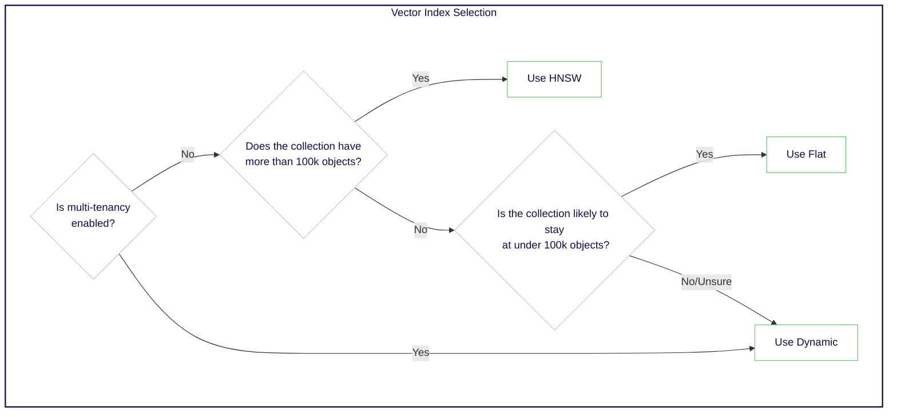
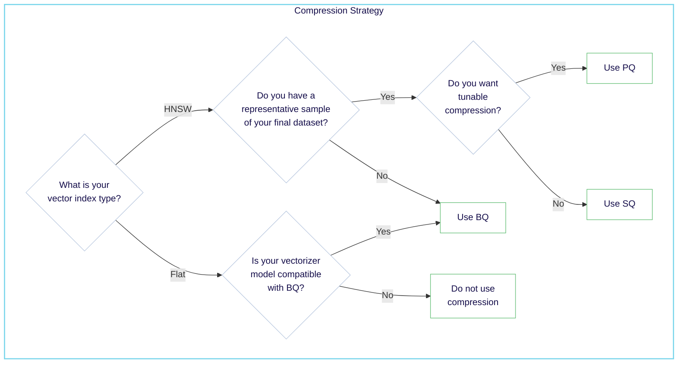
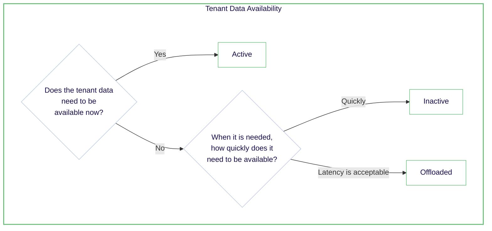

Weaviate は、検索速度・検索精度およびリコール・システムリソースコストのバランスを取るための柔軟なリソース管理機能を提供します。

本ガイドでは、効果的にリソースを割り当てるための概要を説明します。

- **[ストレージ階層（ホット・ウォーム・コールド）](#storage-tiers---temperatures)**
- **[ベクトルインデックスタイプ](#vector-index-types)**
- **[ベクトル圧縮](#vector-compression)**
- **[テナント状態](#tenant-states)**
- **[ヒント](#tips)**

:::tip Resource management Tips

- 理由がない限り、まずは動的な [index type](#vector-index-types) を使用してください。
- 多少の精度低下が許容できる場合は、[vector compression](#vector-compression) を検討しましょう。
    - クエリ速度が向上します。
    - HNSW インデックスではメモリ使用量が削減されます。
- ストレージの過度なプロビジョニング、特に *ホット* ストレージを避けましょう。
    - [tenant states](#tenant-states) を活用してコストを削減できますか？
    - [vector compression](#vector-compression) でメモリ使用量を抑えられますか？

:::

## ストレージ階層 - 温度

ストレージリソースは、[*ホット*](#-hot)・[*ウォーム*](#-warm)・[*コールド*](#-cold) の 3 つの階層で分類されます。各階層には異なるパフォーマンス特性とコストがあります。

| Tier     | Vector   Index Type | Vector   Compression | Tenant State  | Storage    | Performance           | Cost      |
|----------|-------------------|--------------------|---------------|------------|-----------------------|----------|
| 🟥 Hot   | HNSW              | PQ, SQ, BQ         | Active        | Memory | Fastest                | High     |
| 🟨 Warm  | Flat              | BQ                 | Active        | SSD       | Slower                 | Moderate |
| 🟦 Cold  | Any               | Any                | Inactive      | Cloud     | Resource not available | Low      |

### 🟥 ホット

- メモリ使用量を示します  
- 最速かつ最も高価  
- 主に [`HNSW`](./indexing.mdx#hnsw-indexes) ベクトルインデックスにより実現  
- 常に利用可能（Active）  
- スケール拡大に伴いコストが急激に増加  

### 🟨 ウォーム

- ディスク（SSD）に保存されたデータを示します  
- [ホット](#-hot) 階層より遅いが低コスト  
- [flat](./indexing.mdx#flat-indexes) ベクトルインデックス、オブジェクトデータ、および [転置インデックス](./indexing.mdx#inverted-indexes) により実現  
- 常に利用可能（Active）  
- データ増加に伴うコスト増はホット階層より緩やか  

### 🟦 コールド

import OffloadingLimitation from '/_includes/offloading-limitation.mdx';

<OffloadingLimitation/>

- クラウドストレージに保存されたデータを示します  
- 最も遅く最安価な階層  
- 主に [offloaded tenants](#tenant-states) により実現  
- リソースは利用不可（Inactive）  
- アクセスには [reactivation](#tenant-states) が必要  

## リソース管理の主要要因

Weaviate での効果的なリソース管理は、パフォーマンス・コスト・データ可用性のバランスを取ることです。主な調整レバーは以下のとおりです。

- **[ベクトルインデックスタイプ](#vector-index-types)**: オブジェクト数と望ましいパフォーマンスに基づき適切なインデックスタイプを選択します。  
- **[ベクトル圧縮](#vector-compression)**: 精度をある程度犠牲にしてメモリ使用量を削減し、クエリ性能を向上させます。  
- **[テナント状態](#tenant-states)**: テナントの状態を管理してコストとパフォーマンスを調整します。  

### ベクトルインデックスタイプ

インデックスタイプの選択は、パフォーマンスとリソース使用量に大きく影響します。Weaviate は以下のインデックスタイプをサポートしています。

| Index Type | Resource Usage | Performance | Suitable for      | Description |
|------------|----------------|-------------|-------------------|-------------|
| HNSW       | 🟥 Hot         | Fast        | Any object count  | メモリベースで高速なインデックス（[詳細](./indexing.mdx#hnsw-indexes)） |
| Flat       | 🟨 Warm        | Medium      | &lt;~10k objects    | ディスクベースの総当たりインデックス（[詳細](./indexing.mdx#flat-indexes)） |
| Dynamic    | Depends        | Depends     | Any object count  | 指定閾値で flat から HNSW へ自動移行するインデックス（[詳細](./indexing.mdx#dynamic-indexes)） |

インデックスタイプは、オブジェクト数と要求される性能に応じて決定します。マルチテナントコレクションの目安は次のとおりです。

どのインデックスタイプを使用するか迷う場合は、動的インデックスタイプから始めると良いでしょう。オブジェクト数に基づき flat から HNSW へ自動で移行します。

- [スターターガイド: インデックス](./indexing.mdx)  
- [How-to: ベクトルインデックスタイプの設定](../../manage-collections/vector-config.mdx#set-vector-index-type)  

### ベクトル圧縮

ベクトル圧縮は、ベクトルを量子化して小さい表現に変換し、サイズを削減する技術です。

これによりメモリ使用量を削減したり、ディスクから読み込むデータ量を減らして性能を向上させたりできます。その代償として検索品質が低下する場合があります。

Weaviate がサポートするベクトル圧縮方法は次のとおりです。

| Compression Method        | Index Type | Requires Training | Description |
|---------------------------|------------|-------------------|-------------|
| Product Quantization (PQ) | HNSW       | Yes               | 各ベクトルを整数ベースのセントロイド配列に変換（[詳細](../../concepts/vector-quantization.md#product-quantization)） |
| Binary Quantization (BQ)  | HNSW, Flat | No                | 各ベクトル次元をビットに変換（[詳細](../../concepts/vector-quantization.md#binary-quantization)） |
| Scalar Quantization (SQ)  | HNSW       | Yes               | 各ベクトル次元を整数に量子化（[詳細](../../concepts/vector-quantization.md#scalar-quantization)） |
| Rotational Quantization (RQ) | HNSW    | No                | ベクトルを回転後、整数に量子化（[詳細](../../concepts/vector-quantization.md#rotational-quantization)） |

圧縮方法を選択する際の目安は次のとおりです。

迷う場合は、代表的なサンプルデータセットが用意できるなら scalar quantization から始めると良いでしょう。

- [スターターガイド: ベクトル圧縮](./compression.mdx)  
- [How-to: ベクトル圧縮の設定](../../configuration/compression/index.md)  
### テナント状態

マルチテナントコレクションを使用すると、分離されたデータサブセットを効率的に管理できます。すべてのテナントは同じスキーマと設定を共有します。

Weaviate は、以下のテナント状態をサポートします。

| テナント状態 | CRUD とクエリ | ベクトルインデックス | 転置インデックス | オブジェクトデータ | アクティブ化までの時間 | 説明 |
|--------------|--------------|---------------------|------------------|-------------------|------------------------|------|
| アクティブ (デフォルト) | **はい** | Hot/Warm | Warm | Warm | なし | テナントは利用可能です |
| インアクティブ | **いいえ** | Warm | Warm | Warm | 速い | テナントはローカルに保存されていますが利用できません |
| オフロード済み | **いいえ** | Cold | Cold | Cold | 遅い | テナントはクラウドストレージに保存されており利用できません |

*Hot* なテナントは *warm* ストレージへ非アクティブ化することでメモリ使用量を削減でき、また任意のテナントを *cold* ストレージへオフロードしてメモリとディスク使用量を削減できます。必要に応じて、どのテナントでも再アクティブ化できます。

アクセス頻度が高くないテナントを非アクティブ化し、ほとんどアクセスされないテナントをオフロードする戦略を検討してください。

- [スターターガイド: テナント状態](./tenant-states.mdx)
- [ハウツー: テナントオフロードを設定する](/deploy/configuration/tenant-offloading.md)
- [ハウツー: テナント状態を管理する](../../manage-collections/tenant-states.mdx)

## ヒント

### ベストプラクティス

- 新しいコレクションでは、まず動的 [インデックス種類](#vector-index-types) を使用してください。これはマルチテナントコレクションで特に有用で、各テナントが最適なインデックス種類を利用できるようにします。  
- [ベクトル圧縮](#vector-compression) 技術を使用して、ストレージとクエリ性能を最適化してください。特に大規模なコレクションやテナントで効果的です。  
- インデックス種類や圧縮方式を変更する際は、性能が要件を満たしていることを確認するために十分なテストを実施してください。  

### よくある落とし穴

- ホットストレージの過剰割り当て: すべてのデータをホットストレージに保持すると不要なコストが発生します。どのデータが本当に最速のアクセスを必要としているかを定期的に評価してください。  
- 成長計画の欠如: データの増加を想定していないと性能問題につながります。常にスケーラビリティを考慮してリソース管理戦略を設計してください。  
- 不適切なテナント管理: マルチテナント環境で [非アクティブテナントのオフロード](#tenant-states) を忘れるとリソースが浪費されます。利用パターンに基づきテナント状態を管理する自動化プロセスを導入してください。  
- 量子化手法、モデル、データの不一致: 圧縮技術を使用する際は、量子化手法がモデル ( 例:  BQ ) と互換性があり、学習用データが十分かつ代表的であること ( 例:  PQ, SQ ) を確認してください。  

## 関連ページ

- [スターターガイド: 圧縮](./compression.mdx)
- [スターターガイド: インデックス作成](./indexing.mdx)
- [スターターガイド: テナント状態](./tenant-states.mdx)
- [コンセプト: ベクトルインデックス](../../concepts/indexing/vector-index.md)
- [コンセプト: ベクトル量子化](../../concepts/vector-quantization.md)
- [コンセプト: マルチテナンシー](../../concepts/data.md#multi-tenancy)
- [ハウツー: ベクトルインデックス種類を設定する](../../manage-collections/vector-config.mdx#set-vector-index-type)
- [ハウツー: ベクトル圧縮を設定する](../../configuration/compression/index.md)
- [ハウツー: マルチテナンシー操作を実行する](../../manage-collections/multi-tenancy.mdx)
- [ハウツー: テナント状態を管理する](../../manage-collections/tenant-states.mdx)

## 質問とフィードバック

import DocsFeedback from '/_includes/docs-feedback.mdx';

<DocsFeedback/>