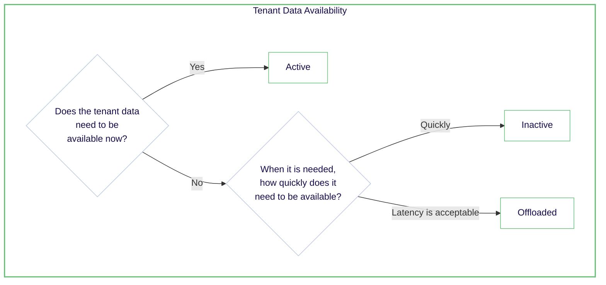

マルチテナントコレクションを使用すると、同じスキーマと設定でデータの分離されたサブセットを効率的に管理できます。Weaviate は次のテナント状態をサポートしています。

| テナント状態            | CRUD とクエリ | ベクトルインデックス | 転置インデックス | オブジェクトデータ | 有効化までの時間 | テナントの説明 |
|------------------------|--------------|---------------------|------------------|-------------------|-----------------|----------------|
| Active (デフォルト)    | **はい**      | Hot/Warm            | Warm             | Warm              | なし            | 利用可能 |
| Inactive              | **いいえ**    | Warm                | Warm             | Warm              | 速い            | 利用不可、ローカルに保存 |
| Offloaded             | **いいえ**    | Cold                | Cold             | Cold              | 遅い            | 利用不可、クラウドに保存 |

テナント状態管理の戦略は、コストとパフォーマンスのバランスを取るのに役立ちます。理由は次のとおりです。HNSW インデックスを持つアクティブテナントはもっとも高価な *hot* リソースを使用します。一方、オフロードされたテナントはもっとも安価な *cold* リソースを使用します。

:::info Tenant state propagation
テナント状態の変更がクラスタ全体に伝搬するまでに時間がかかることがあります。特にマルチノードクラスタでは顕著です。

 

たとえば、オフロードされたテナントを再アクティブ化しても、データがすぐに利用可能になるとは限りません。同様に、テナントをオフロードしても、データが直ちに利用不可になるとは限りません。これは [テナント状態が最終的に整合性を保つ](../../concepts/replication-architecture/consistency.md#tenant-states-and-data-objects) ため、変更がクラスタ内のすべてのノードに伝搬する必要があるためです。
:::

### テナント状態とリソース使用量

*Hot* のテナントは *warm* ストレージに非アクティブ化してメモリ使用量を削減でき、どのテナントも *cold* ストレージにオフロードしてメモリとディスク使用量を削減できます。逆に、必要に応じてどのテナントも再アクティブ化できます。

したがって、頻繁にアクセスされないテナントを非アクティブ化し、ほとんどアクセスされないテナントをオフロードする戦略を検討してください。

例として、各ベンダーごとにテナントを分けた e-commerce プラットフォームを考えてみましょう。ホリデーセール中は人気の電子機器ベンダーのテナントを迅速にアクセスできるようアクティブのままにし、一方で季節限定ベンダー（例: ７月のクリスマス装飾）のテナントはリソース節約のため *cold* ストレージへオフロードできます。

テナント状態が異なるインデックスタイプとどのように連携するかを理解することは、効果的なリソース管理戦略を策定するうえで重要です。以下で詳しく見ていきましょう。

### テナント状態とインデックスタイプ

テナント状態管理の戦略はインデックスタイプに結び付いています。インデックスタイプがテナントで使用されるリソースを決定するためです。たとえば、HNSW インデックスタイプを持つテナントは *hot* リソースを使用し、flat インデックスタイプを持つテナントは *warm* リソースを使用します。

マルチテナントコレクションが動的インデックスタイプに設定されている場合、一部のテナントは *warm* ストレージ（flat インデックス）、他のテナントは *hot* ストレージ（HNSW インデックス）に格納されることがあります。その結果、HNSW インデックスを持つテナントを効果的に管理することがリソース使用量にもっとも大きな影響を与える可能性があります。

以下のガイドラインに従ってテナント状態を選択することをお勧めします。

どのテナントを非アクティブまたはオフロードできるか不明な場合は、一定期間アクセスされていないテナントを非アクティブ化し、さらに長期間アクセスされていないテナントをオフロードする戦略を検討してください。

## ハンズオン

Weaviate でテナントオフロードを実践するためのリソースを紹介します。

### テナントオフロードの設定

テナントオフロードを使用するには、オフロードモジュールを構成する必要があります。 
（[How-to: Configure tenant offloading](/deploy/configuration/tenant-offloading.md) を参照）

### テナント状態の更新

テナント状態は `active`、`inactive`、`offloaded` の間でいつでも切り替えられます。 
（手順とコード例は [How-to: Manage tenant states](../../manage-collections/tenant-states.mdx) を参照）

### テナントの自動アクティベーション

コレクションを設定して、アクセス時に（inactive と offloaded の）テナントを自動的にアクティブ化できます。 
これにより、リソース使用量とパフォーマンスのバランスを取ることができます。 
（手順とコード例は [How-to: Auto-activate tenants](../../manage-collections/tenant-states.mdx#automatically-activate-tenants) を参照）

## 質問とフィードバック

import DocsFeedback from '/_includes/docs-feedback.mdx';

<DocsFeedback/>